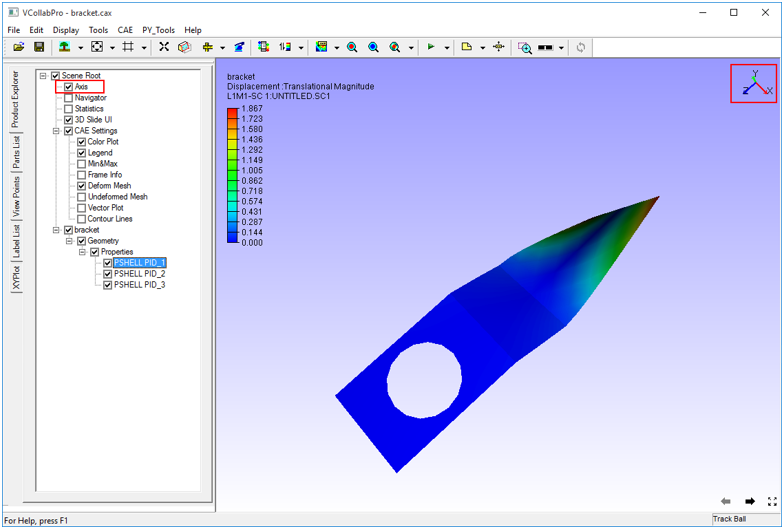

Axis
=======

The **Axis** command displays Axis triad in the top right corner of the viewer. This option is enabled by default.

Users can show or hide the Axis triad. Axis triad rotates when the model rotates.

Shortcut key : **Shift + A**

**Steps to enable or disable axis visibility**

- Click **Display | Axis** Or Press **Shift + A** Or

- Click **Axis** in Product Tree (Product Explorer Window) Or

- Click **Show/Hide | Axis** under right click viewer context menu.

            |image1|
- User can move the axis triad and place anywhere in the viewport using move labels icon.

- To move axis triad, enable Move Labels icon

- Click on the axis triad and drag it.

- Release the mouse button to set it.

