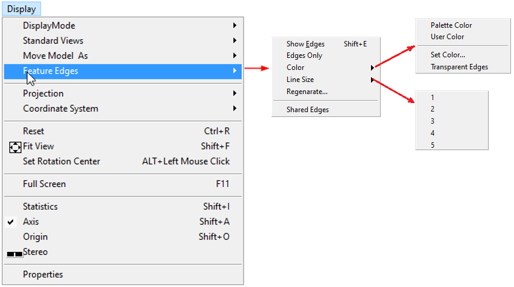
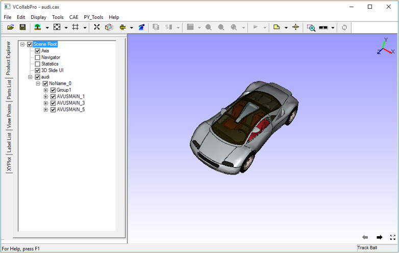
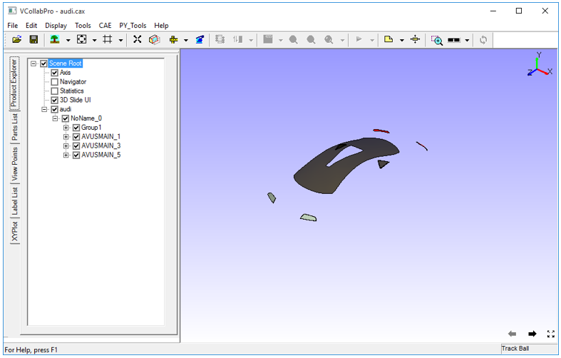
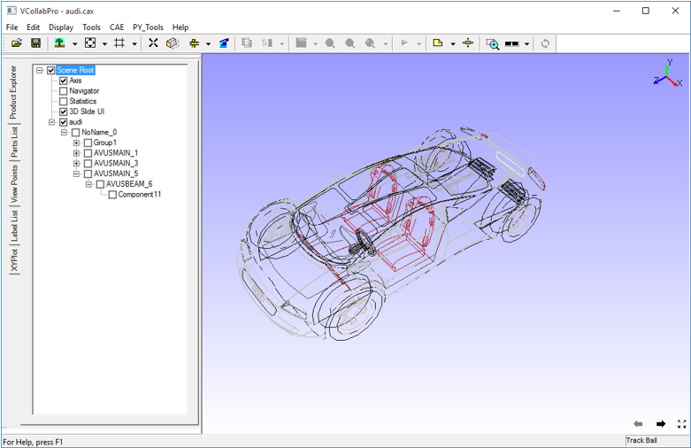
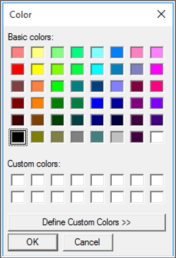
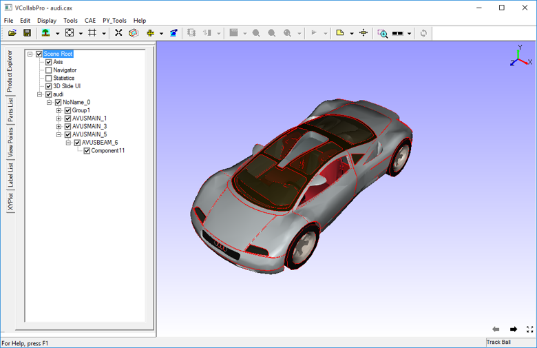
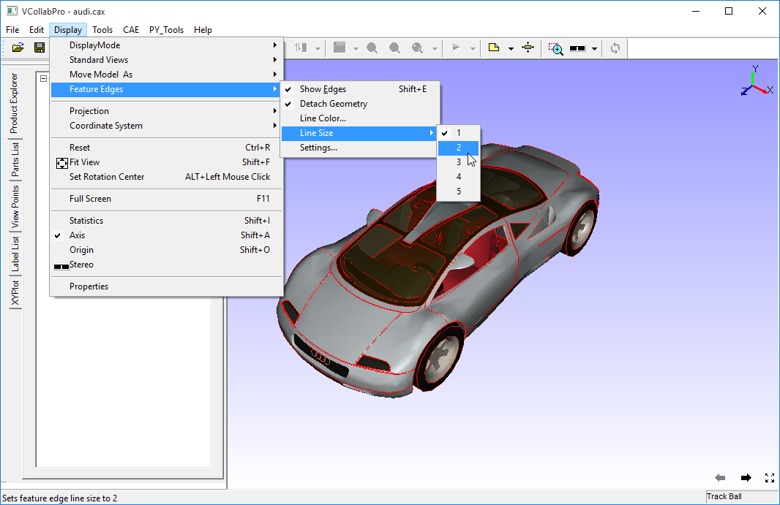
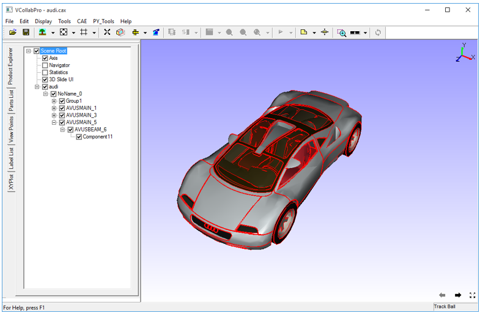
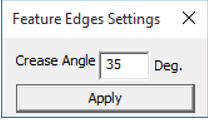
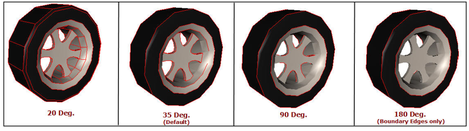

Feature Edges
==============

The Feature Edges option found in the Display Menu helps to view feature edges with or without model.

    |image1|

The various options available under Features Edges are explained below.

============================ =====================================================================

**Show Edges**                Shows/Hides Feature Edges

**Edges Only**                Displays the model only with Feature Edges

**Color**                     Allows user to set user color or palette color. User can set transparency also.

**Line Size**                 Set line width between 1 to 5.

**Regenerate..**              Allows user to Change crease angle and regenerate feature edges.

**Shared Edges**              Allows user to show or hide feature edges shared between parts.

============================ =====================================================================

**Steps to display feature edges**

- Click **Display |Features Edges| Show Edges**.
- It shows feature edges in default color.

      |image2|

- Feature Edges are visible depending upon the visibility of part by default
- If you hide a part, feature edges of that part will also be hidden.

      |image3|

**Edges Only**

- To view feature edges only, click **Display | Feature Edges | Edges Only.**
- Users can view the feature edges .

    |image4|

**Changing Line Color**

- User can set user color or palette color.
- To change the user color, click **Display | Feature Edges | Color | Set Color...**
- Select a color in the dialog box and click **OK**

    |image5|
 
    |image6|

**Changing Line Size**

- To increase the line size to 2, click **Display | Feature Edges | Line Size | 2**

    |image7|

- The visibility of feature edges is improved by changing line size to 2 as below.

    |image8|

**Changing Crease Angle**

Feature edges depend on the crease angle between two triangles. Number of edges increases as the crease angle decreases. Default crease angle 35 degrees.

- Change the crease angle by going to  **Display | Feature Edges | Regenerate....**

    
   |image9|

- Some edges appear or disappear based on the crease angle as shown in the images below.

    |image10|

