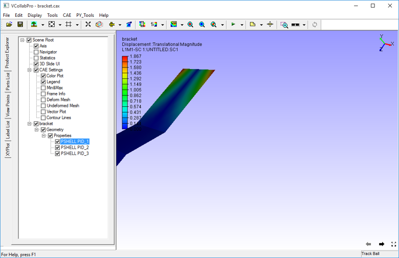
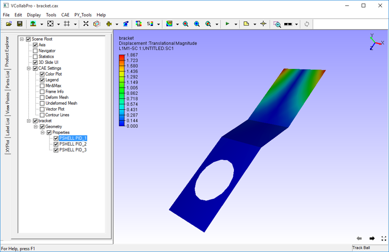

Fit View
=========

The **Fit View** option fits the whole model into user view. 

Click **Display| Fit View** or use the shortcut key: **Shift +F**

Example:

Before Fit View

   |image1|

After Fit View

   |image2|

