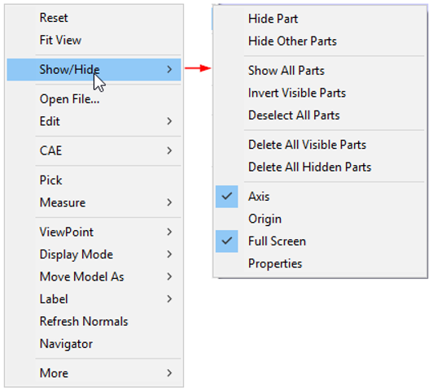
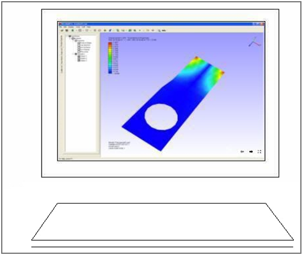
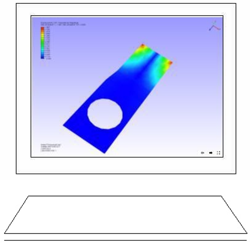

Full Screen
====================

The **Full Screen** command maps the view port to monitor screen. If user wants to view scene alone on the screen, this command helps to draw view port on the whole Monitor Screen.

**Steps to enable and toggle Full Screen**

- Click **Display | Full Screen**  Or use shortcut key, **F11** 
- Right click to open the viewer context menu and click **Show/Hide | Full Screen**

  |image1|

   **OR**

- Click the Full Screen icon located in the bottom right corner of the viewer window.

  Example:

  Before 

   |image2|

   After

   |image3|

