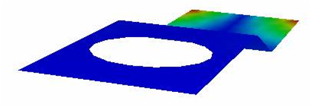
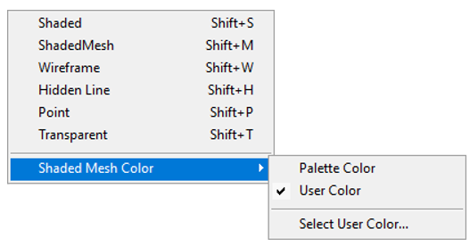
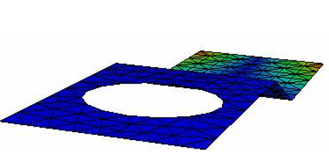
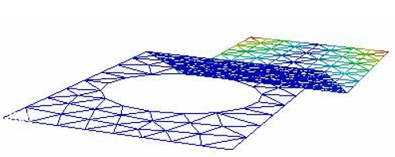
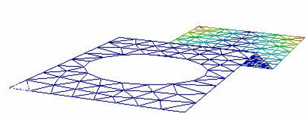

Display Mode
=================

Display mode allows users to view the model in any one of the following modes.

- Shaded (default)
- Shaded Mesh
- Wire Frame
- Hidden Line
- Point
- Transparent

**Shaded Mode**

Model surfaces will be displayed with smooth shadings and contour color information.

Shortcut key: **Shift +  S**

    |image1|

**Shaded Mesh**

Applies mesh on the shaded model. Shaded mesh color can be changed by using **Display | Display Mode | Shaded Mesh Color** options.

Users can set vertex color to the shaded mesh lines or set a single color. Shortcut key : Shift + M

     |image2|

     |image3|

**Wire Frame Model**

Displays the model with  mesh lines without any shading. Shortcut key : Shift + W

    |image4|

 **Hidden Line**

This is similar to wire frame model except that hidden lines are also removed from the scene. Shortcut key : **Shift + H**

   |image5|

**Point**

Displays only the Nodal points. There are no edges or face sets. Shortcut key : Shift + P

   |image6|

**Transparent**

Displays model with shading similar to Shaded Mode along with transparency on each surface. Shortcut-key: **Shift + T**
 
   |image7|

**Note:** Default transparency percentage is 93%. Users can edit transparency percentage using **Transparency**  **option in Edit | Options** panel.

.. |image6| image:: JPGImages/display_Point.png
.. |image7| image:: JPGImages/display_Transparent.png
                                       