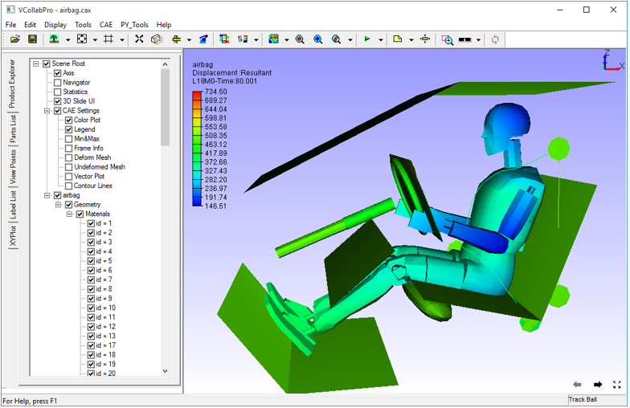

Coordinate System
==================

VCollab Pro users can switch to  YZ and XZ coordinate systems using the coordinate system option from the default XY coordinate system.

      |image1|

The three coordinate systems are explained below.

========= ==========================================================================================
**XY**      X is the horizontal axis and Y is the vertical axis. 
            Z axis should point towards the viewer in front view.

**XZ**      X is the horizontal axis and Z is the vertical axis. 
            Y axis should point towards the  viewer in front view.

**YZ**      Y is the horizontal axis and Z is the vertical axis. 
            X axis should point towards the viewer in front view.

========= ==========================================================================================

The following images show a model in all the coordinate systems.

**XY Coordinate System**

       |image2|

**XZ Coordinate System**

       |image3|

**YZ Coordinate System**
    
       |image4|

