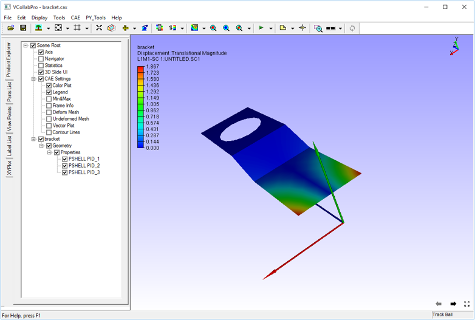
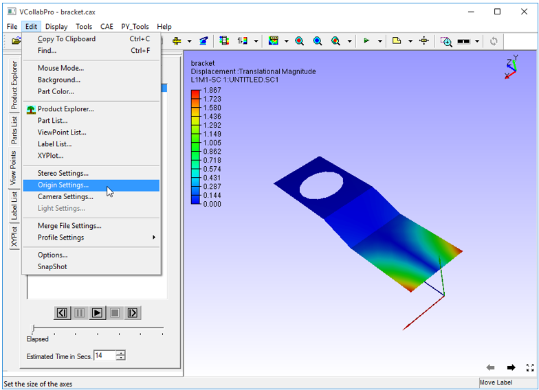
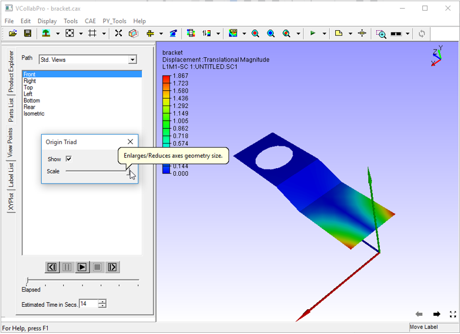

Origin
=======

The **Origin** command displays the origin axis triad in the viewer.

**Steps to enable Origin axis**

- Click **Display | Origin** or use shortcut key, **Shift + O**

            |image1|

- To change origin axis settings, go to **Edit | Origin Settings.**

            |image2|

            |image3|

 