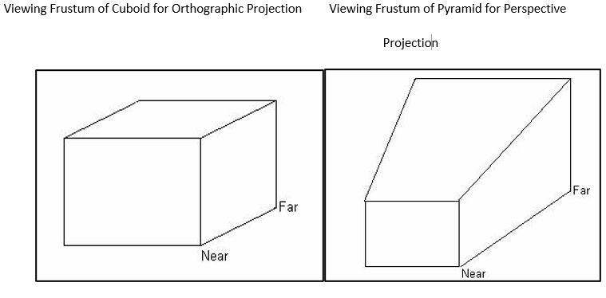
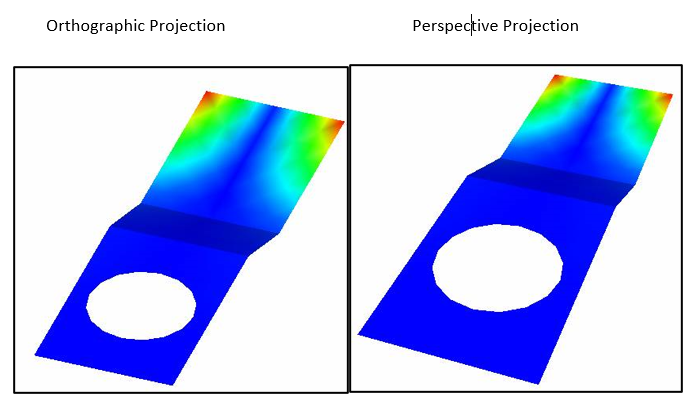

Projection
==============

VCollab Pro users can  view a model in two standard projection modes using the **Projection** option found in the Display menu. The two standard projection modes available are:

- **Orthographic Projection:** Parallel projection where the viewing frustum is cuboid.
- **Perspective Projection:** Projection for perception through the lens of the human eye where the 
  viewing frustum is pyramid.

**Steps to choose projection mode**

- Click **Display | Projection**
- Click either **Perspective** or **Ortho.**

  |image1|

  |image2|

