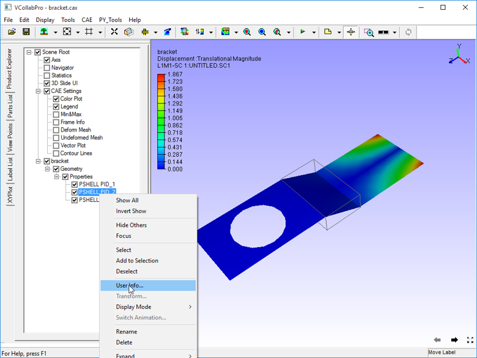
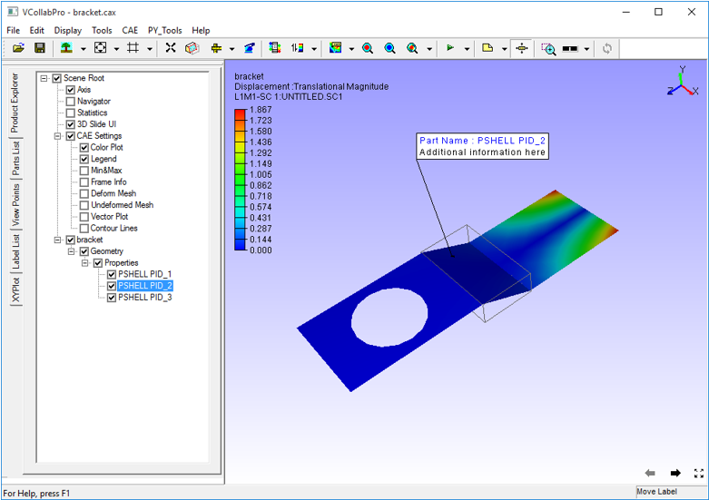

Properties
=============

The **Properties** option displays part properties and other user information during mouse over.

**Steps to Display Part Properties**

 - Click **Display -> Properties** to  update mouse mode to display properties.
 - Move the mouse over any part.
 - The part name and other properties if available are displayed
 - Click on a part to fix the label as an annotation to the part.

     |image1|

**Adding Information**

1.Using Edit Notes option

 - Click any part.
 - A permanent label is annotated with the same information to the part.
 - Double click the label to add more information.
 - Enter more information in the **Edit Notes** dialog box
 - Click **OK**.

       |image2|

       |image3|

Using **User Info** option.

 - Double click on any part in the model.
 - See the selected part in the product explorer window.
 - Open the context menu by right clicking on that part.
 - Select **User Info.**

       |image4|

       |image5|

 - Enter additional information for that part in the User Info dialog box.
 - Click **OK.**

 - Click **Display -> Properties.** 
 - Move the mouse over any part to see part name and other properties.
 

        |image6|
 

.. |image2| image:: JPGImages/display_Properties_Edit_Notes.png

.. |image5| image:: JPGImages/display_Properties_UserInfo_Panel.png

             
