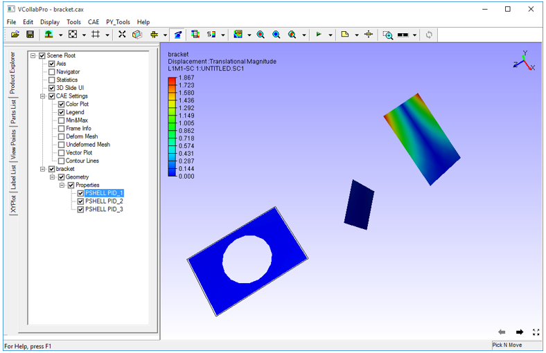
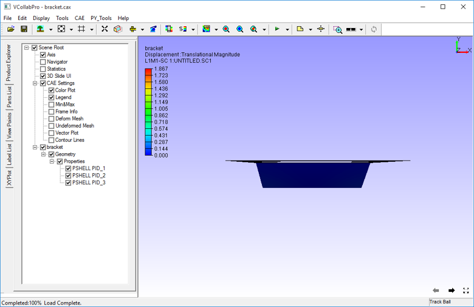

Reset
=========

**Reset** option found in the display menu is used to reset a scene to a predefined standard front 
view In VCollab Pro, users can:

- Load a model and observe the view
- Transform the model
- Explore the model
- Pick and drop a part

After doing any of the above, click **Display | Reset or Ctrl+R** to reassemble all geometries and display front view.

**Example:**

**Initial view**

      |image1|

**After Pick and Move**

      |image2|

**After Reset**

      |image3|

