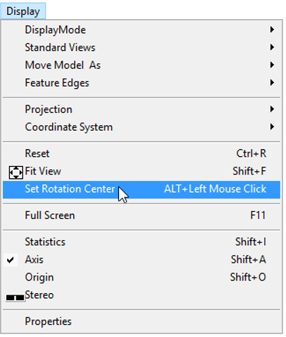
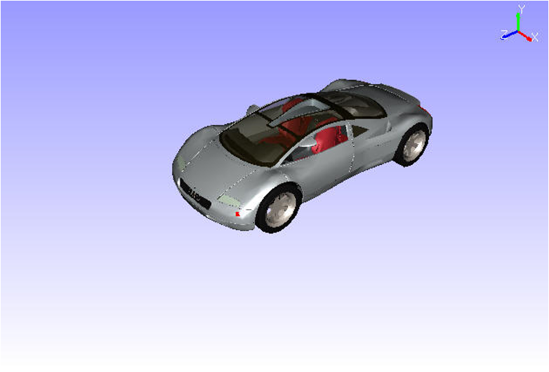

Set Rotation Center
====================

The Set Rotation Center option  helps users to set a rotation center for  the model by picking a point in the model.

**Steps to Set Rotation Center**

- Click **Display | Set Rotation Center** or use the shortcut key, **Alt + Mouse Left Button** 

         |image1|

- The current rotation center of the model is displayed in red.
- Click on any other point on the model to be the new rotation center.

         |image2|

- Now rotate the model and notice the changes.

         |image3|

**Reset**

Right click to open the context menu and click **Reset** to set the model centre as rotation center. **Reset** will reset not only the rotation center, but also all viewing functionality parameters to defaults.

**Note:**

VCollab Pro provides independent rotation about model bounding center for merged models. Click here  for more details. 

.. |image3| image:: JPGImages/SetRotationMovie.gif

