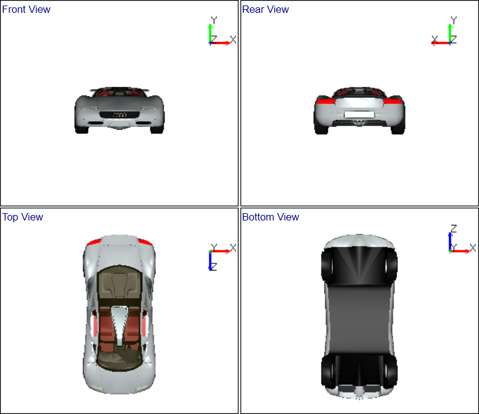

Standard Views
=================

VCollab Pro users can view the models in any of the following predefined standard views.

   |image1|

- Front View			
- Rear View
- Top View
- Bottom View
- Left Side View
- Right Side View and     
- Isometric View

**Steps to view standard views**

- Click **Display|Standard Views**
- Select any one of the predefined views to view.

**Standard views**

  |image2|

  |image3|

                                       
