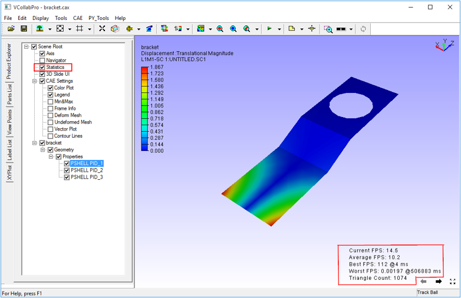

Statistics
==============

The **Statistics** command displays performance data like:

- Current Frame Rate (FPS)
- Average Frame Rate
- Best of Frame Rates.
- Worst of Frame Rates.
- Total triangle count in the model

**Step:** Click **Display | Statistics** or use shortcut key, **Shift + I**

The statistics data is displayed in the right bottom corner of the viewer.

  |image1|

