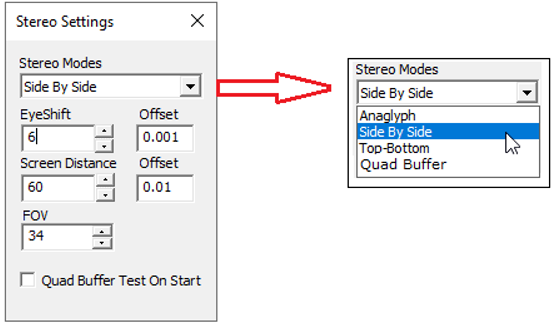
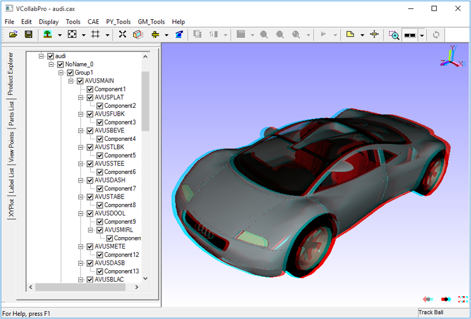

Stereo
=======

The **Stereo** option is used to enhance 3-Dimensional perception of an image and is enabled only when the user’s system has a graphics card that supports stereo mode.

In addition to the graphics card, synchronized monitors or special glasses are also needed to alternate the view between frames. 

**Settings**

        |image1|

The various fields and option available under Stereo Settings panel are explained below

============================== ===================================================================

 **EyeShift**                    Distance between eyeballs of the user in centimeters 
                                 (approximately 6 cm). For better stereo, it can be adjusted to 
                                 a specific user. 

 **Offset**                      Incremental offset for eyeshift.
                          
 **Screen Distance**             Distance between viewer and screen in centimeter. For 
                                 desktop users, it is approximately 60 centimeters. For a small 
                                 conference, it has to be adjusted based on room size.
                           
                                 Eg. This value has to be set 200 to 300 centimeters distance 
                                 between screen and middle of conference room. It depends 
                                 on room size. 

**Offset**                       Incremental offset for screen distance.

**FOV**                          Field of view needed.

**Quad Buffer Test on Start**   Check this box, to test the graphics card that supports the 
                                quad buffer when the application is launched next time. 
                                Based on the test, Quad buffer stereo (active shutter glass) 

                                will be supported by this application VCollabPro,

============================== ===================================================================
                           

**Types**

- Anaglyph 
- Side by Side
- Top-Bottom
- Quad Buffer Stereo( Only when graphics card supports OpenGL quad buffer)

**Anaglyph Stereo**

- This is a very low cost stereo solution that results in color loss.
- Users need Anaglyph stereo glasses to view the 3-Dimensional model.
- Pressing down the key **'A'** toggles between enabling and disabling Anaglyph stereo mode.

**Required Hardware**

Red-Blue or Red-Green or Red-Cyan passive color glasses. 

**Anaglyph Stereo Image**

    |image2|

**Top-Bottom and Side by Side**

Top-Bottom and Side by Side are used in gaming hardware that support passive stereo. Compared to Active stereo this is an economical solution but results in a resolution loss of 50%.

To use 3D TV/Monitor in side by side mode, connect the 3D monitor and set side by side options in both VCollab Pro and  TV/monitor. 

**Hardware Requirements:**

- Passive circular polarized stereo monitor. 
- Circular polarized stereo eyeware.

**Quad Buffer Stereo**

- This is the recommended mode for engineering solutions with full resolution
- Users need **Active Shutter glasses** to view the 3-Dimensional model
- Users can increase or decrease eye shift value.
- Pressing down  **'Q'** key toggles between enabling and disabling Quad buffer stereo.

**Note:** If the environment variable VCOLLAB_FORCE_STEREO  is set as TRUE, VCollab Pro will not check for stereo while starting. It assumes the GPU has Quad Buffer stereo. 

**Warning:** If GPU doesn't have QuadBuffer in OpenGL driver, setting the above environment variable will cause the application to  crash while starting. Removing that environment variable will avoid crash. 

**Hardware Required :**

#. OpenGL Quad Buffer Supported Stereo Card.  
  
   For More Hardware Vendor specific Info

   http://www.nvidia.com/object/quadro_stereo_technology.html 

   http://www.nvidia.com/object/quadro_pro_graphics_boards.html 

   Other than nVidia, AMD also makes 3 pin din stereo cards.

    - ATI Radeon® HD 5000 series GPUs 
    - AMD Radeon® HD 6000 series GPUs
    - AMD Radeon® HD 7000 series GPUs
    - AMD A-Series APUs
#. 120Hz Supported Monitor/Projector 

   Some monitors are listed in these links:

   http://www.pymolwiki.org/index.php/Stereo_3D_Display_Options 

   http://www.blurbusters.com/faq/120hz-monitors/

#. LCD Shutter Stereo Glass And Stereo Emitter. 

   3D Stereo Emitter that has to be connected externally with the GPU.
 
   http://www.nvidia.com/object/product-geforce-3d-vision2-wireless-glasses-kit-us.html

For more information, please refer to Stereo Settings Page under Edit menu.
       

