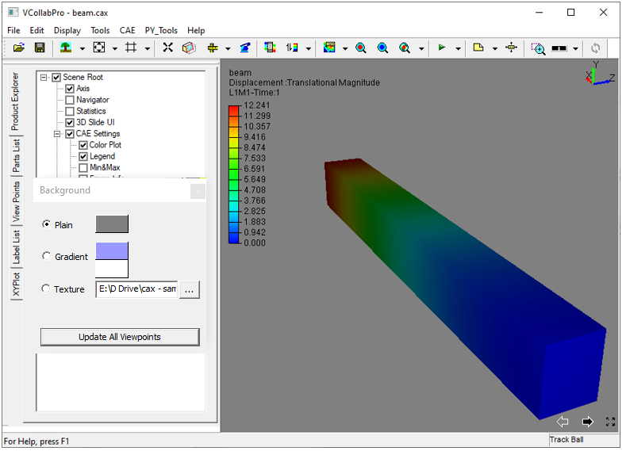
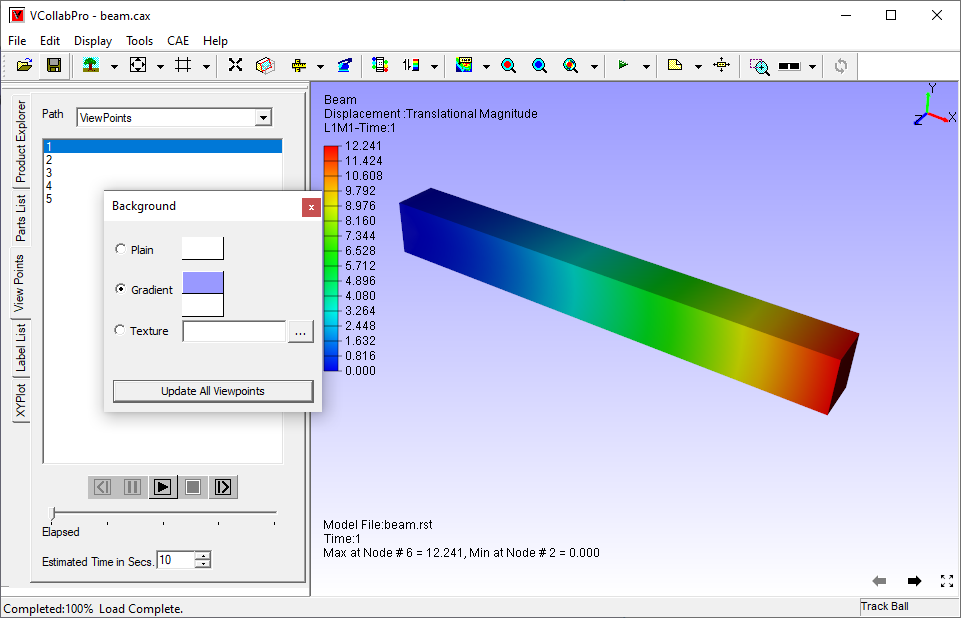

Background Color
================

This Command allows users to modify background color as shown below.

**Background panel**

     |image1|
+-------------+-------------------------------------------------------------------------+
| Plain       |  Sets a plain color                                                     |
+-------------+-------------------------------------------------------------------------+
| Gradient    |  Sets a gradient texture between two colors.                            |
+-------------+-------------------------------------------------------------------------+
| Texture     |  Sets an image as background.                                           |
+-------------+-------------------------------------------------------------------------+
| Texture Mode|  Allows user to change the mode into center, stretch, tile and fitView. |
+-------------+-------------------------------------------------------------------------+
| Update All  |  This option updates all the viewpoints with selected background mode.  |
| Viewpoints  |  It prompts and warns the user that once set, it cannot be reverted.    |
+-------------+-------------------------------------------------------------------------+
**Steps toset plain background**

- Click **Edit | Background** which opens up background dialog
- Ensure that option **Plain** is checked.
- Click on the default background color displayed in the dialog box which opens up a color picker 
  dialog box as shown below.

    |image2|

- Choose any basic color displayed. Click **OK.**
- To select more colours, click **Define Custom Colors >>**  in the Color dialog box

   |image3|

- Define any color.
- Click **OK** and view the new background as below.

   |image4|

**Steps to set gradient background**

- Click **Edit | Background** which opens up background dialog box
- Check the **Gradient** option in the background dialog box.
- Choose two colors 
- View the change in viewer as below.

   |image5|

**Steps to set a texture image background**

     -  Click **Texture** option.                                          
     -  Click right most file browser button.                              
     -  It pops up file browser dialog.                                    
     -  Select an image file  and click Open..                                              

          |image6|
                                                           
     -  Texture Mode' option decides whether the image should be centered or stretched or tiled or fit to view. 'Center' option is the default.             
     -  User can select any of these options *Center*, *Stretch*, *Tile* and *Fit View". 
     -  The applied texture background is shown as below.

          |image7|

