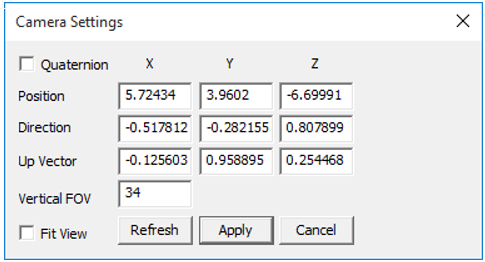
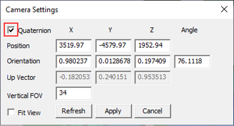

Camera Settings
===============

VCollab users can change the camera view orientation by modifying the camera attributes in **Camera Settings.**

Camera Settings Panel
---------------------

    |image1|

    |image2|

The various controls and fields available under Camera Settings are explained below.

    +-----------------------------------+-----------------------------------+
    | **Quaternion**                    | Toggles to Axis & Angle           |
    |                                   | attributes.                       |
    +-----------------------------------+-----------------------------------+
    | **Position**                      | Allows user to modify camera      |
    |                                   | position coordinates.             |
    +-----------------------------------+-----------------------------------+
    | **Direction/Orientation**         | Allows user to modify camera      |
    |                                   | direction vector/ orientation     |
    |                                   | axis and angle in case of         |
    |                                   | quaternion option.                |
    +-----------------------------------+-----------------------------------+
    | **Up Vector**                     | Allows user to modify camera Up   |
    |                                   | vector.                           |
    +-----------------------------------+-----------------------------------+
    | **Vertical FOV**                  | This refers to camera 'Vertical   |
    |                                   | Field of View' in case of         |
    |                                   | Perspective.                      |
    +-----------------------------------+-----------------------------------+
    | **Fit View**                      |  Helps to fit the model to        |
    |                                   |  the viewing window.              |
    |                                   |                                   |
    |                                   |                                   |
    |                                   |                                   |
    +-----------------------------------+-----------------------------------+
    | **Refresh**                       | Updates the current camera        |
    |                                   | attribute to this dialog.         |
    |                                   |                                   |
    +-----------------------------------+-----------------------------------+
    | **Apply**                         | Click to apply all the attributes |
    |                                   | to the camera.                    |
    +-----------------------------------+-----------------------------------+

    Note:

     - Up vector should be perpendicular to Direction vector.  If not, a projected vector defined 
       by the user as Up vector will be applied.
     - A new field, Angle, is enabled if the **Quaternion** option is selected.

**Steps to change camera attributes**

 - Click **Edit| Camera Settings**
 - Enter camera position as X, Y and Z coordinates.
 - Enter **Vertical FOV** to change the field of view.
 - There are two ways to change the camera orientation by specifying:

   **Direction** and **Up** vectors.

   -  Provide direction and up vectors in the corresponding fields.

   **Axis** and **Angle** of camera orientation.

   -  Check the **Quaternion** option.

   -  In the **Orientation** field, provide axis of rotation 
      x, y and z fields.

   -  Provide angle of degrees in the last field, **Angle**.

-  Click **Apply** to see the change in camera view.

-  Check **Fit View** to see the entire model in the scene with modified direction. Camera 
   position may be different from user defined position in Fit View mode.

   
