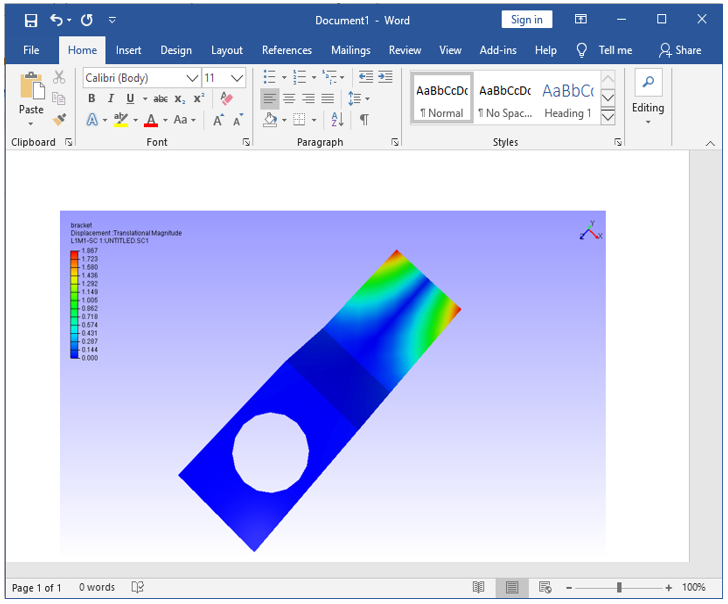

Copy to Clipboard
====================

This command copies current view as image buffer to the Clipboard. Users can paste the copied image buffer into Microsoft Office packages like:

- MS Word
- MS Excel
- MS PowerPoint
- MS FrontPage
- MS Paint, etc. 

**How to copy current view to Clipboard and paste in a document?**

- Click **Edit | Copy To Clipboard.**
- Paste in any software which accepts image pasting.

       |image1|

