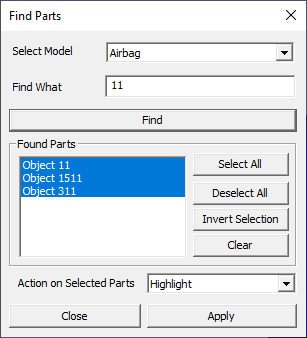
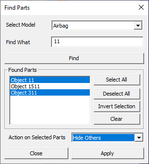

Find Part
=========

This option helps user to select the part or group of parts by name.

Shortcut key : **Ctrl + F**

**Find Parts Panel**

 |image0|

 +-------------------------+----------------------------------------+
 |**Select Model**         |User can select a Model and find the    |
 |                         |parts                                   |
 +-------------------------+----------------------------------------+
 |**Find What**            |User can enter a part name to select    |
 |                         |the particular part or partial text to  |
 |                         |select group of parts.                  |
 +-------------------------+----------------------------------------+
 |**Find**                 |Finds part names according to search    |
 |                         |options.                                |
 +-------------------------+----------------------------------------+
 |**Found Parts**          |Lists the parts found and allows user   |
 |                         |to select.                              |
 +-------------------------+----------------------------------------+
 |**Select All**           |Selects all parts in the list           |
 +-------------------------+----------------------------------------+
 |**Deselect All**         |Deselects all parts in the list         |
 +-------------------------+----------------------------------------+
 |**Invert Selection**     |Inverts the selection in the list.      |
 +-------------------------+----------------------------------------+
 |**Clear**                |Clears the list.                        |
 +-------------------------+----------------------------------------+
 |**Action on Selected     |Allows user to select an action to be   |
 |Parts**                  |applied on the part selection in        |
 |                         |the viewer.                             |
 +-------------------------+----------------------------------------+
 |**Close**                |Closes the dialog.                      |
 +-------------------------+----------------------------------------+           

**How to find and select the parts by name?**

-  Load a cax file.
-  Click *Edit \| Find Part...* option
-  It pops up the find part panel.

   |image1|

-  Enter a hint for part names in find text box.
   for better accuracy.
-  Clikcing *Find* button, lists all the part names found.
-  User can further filter on the list by manual selection or deselection.
-  Select an action in the drop down  to be applied only for selected parts.
-  Click *Apply*.

  
