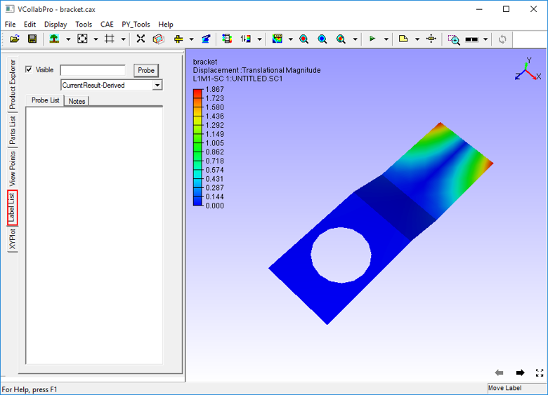
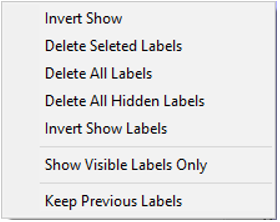
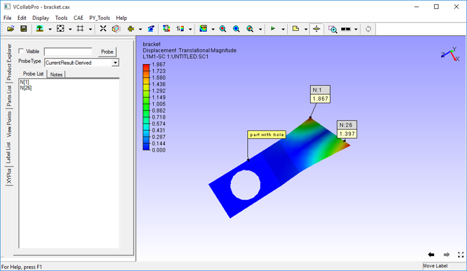
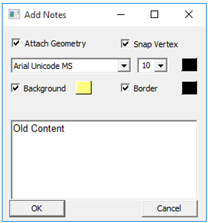
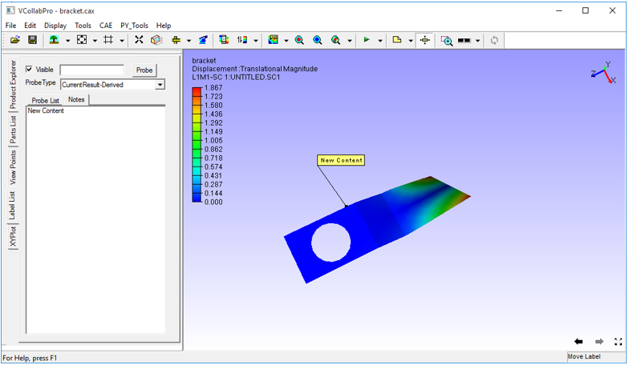
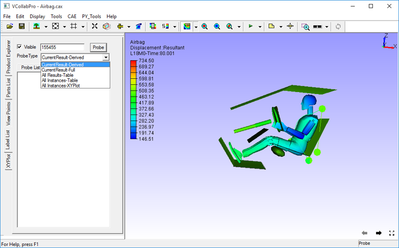
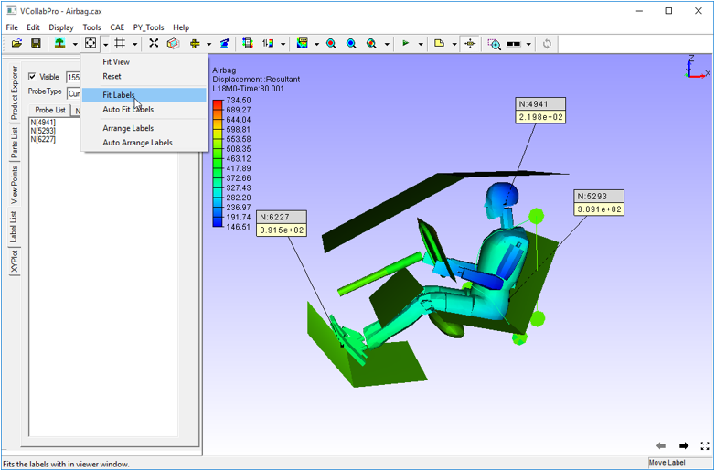
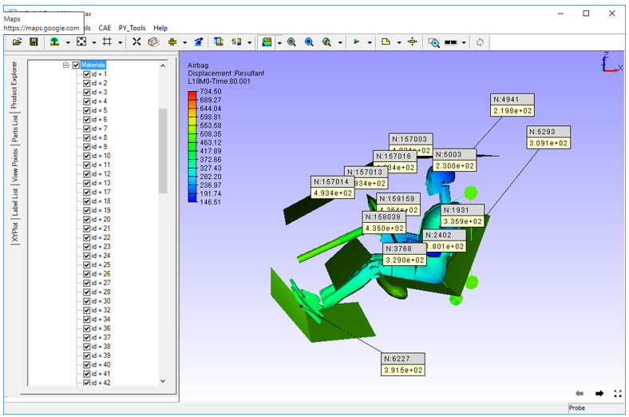
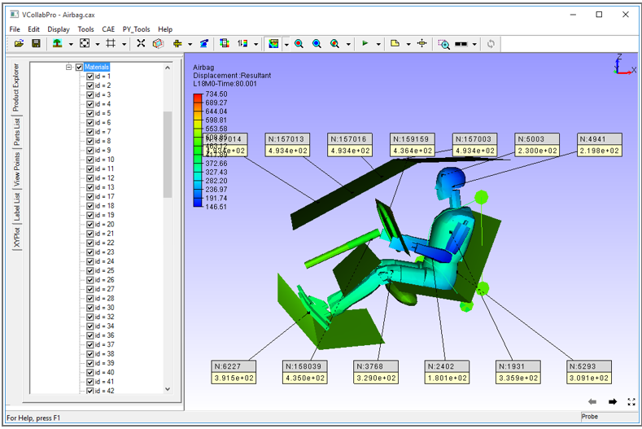

***********
Label List
***********

Label list panel displays the list of probe labels and user notes\ **.**
Users can view, edit or delete the labels and even fit the labels inside
the viewer. This tab can be accessed from the left span of VCollab Pro.

Label List Panel
################

|image1|

Context Menu
************

On right clicking a node in the Label List, the context menu appears as
shown below

|image2|

The controls available in the Label List panel are explained in the
table below.

   +------------------------------+--------------------------------------+
   | **Visible**                  | Enables or disables visibility of    |
   |                              | the selected items in the label list |
   +------------------------------+--------------------------------------+
   | **Probe**                    | Probes results for node id entered   |
   |                              | in ID edit box                       |
   +------------------------------+--------------------------------------+
   | **Probe List**               | Displays list of all probed labels   |
   +------------------------------+--------------------------------------+
   | **Notes**                    | Displays list of all user notes      |
   |                              | (annotations)                        |
   +------------------------------+--------------------------------------+
   |                              |        Context Menu Options          |
   +------------------------------+--------------------------------------+
   | **Invert Show**              | Toggles in displaying between        |
   |                              | visible and hidden labels            |
   +------------------------------+--------------------------------------+
   | **Delete Selected Labels**   | Deletes selected labels from the     |
   |                              | panel                                |
   +------------------------------+--------------------------------------+
   | **Delete All Labels**        | Deletes all labels                   |
   +------------------------------+--------------------------------------+
   | **Delete All Hidden Labels** | Deletes all hidden labels            |
   +------------------------------+--------------------------------------+
   | **Invert Show Labels**       | Toggles labels visibility            |
   +------------------------------+--------------------------------------+
   | **Show Visible labels only** | Shows only those labels whose        |
   |                              | attached geometry position is        |
   |                              | visible.                             |
   +------------------------------+--------------------------------------+
   | **Keep Previous Labels**     | Keeps previous labels visible. By    |
   |                              | default, they disappear.             |
   +------------------------------+--------------------------------------+

Steps to view Label List
************************

   -  Click **Edit \| Label List** Or Open Label List tab from the left
      span of VCollab Pro.

   -  Click **Probe List** to view probed labels as below.

   |image3|

   -  Click **Notes** to view the list of notes.

   |image4|

Steps to add and edit Notes
***************************

   To Add Note,

   -  Click **Tools \| Add Notes** to open the Add Note dialog box.

   -  Enter a note in the edit box and click **OK**

   |image5|

   |image6|

   -  Click a point in the viewer to attach the note to it.

   -  Click a point on the part to which label needs to be attached.

   To Edit a note,

   -  Open Label List panel

   -  Go to **Notes** tab in the panel.

   -  Double click the note to be edited. The **Edit Notes** dialog box
      with open. Edit the note with new content and click **OK**

   ..

   |image7|

   -  After editing, the new content is seen in the note

   |image8|

Steps to probe results for known IDs
************************************

   -  Enter a known ID in the ID edit box.

   -  Select a probe type from the drop down menu.

   |image9|

   -  Click **Probe** to probe results.

   -  A message box will appear for wrong node ID.

Steps to Fit labels inside viewer
*********************************

 There are three options to fit the labels inside the viewer,

 1) **Fit the labels manually**: This method can be used to fit the
    labels into the viewport, whenever it is necessary.

   -  Click **Fit Labels** option in “Tools \| Labels/Notes”

   |image10|

   -  The labels are then Fit and appear in the scene (for only one time)

   |image11|

 2) **Auto Fit the labels**

   -  By default this option is unchecked. If it is checked, all labels
      automatically come into the scene and will not move beyond the
      view port.

 3) **Arrange Labels**

   -  If there are many labels, they overlap each other and become
      difficult to read

   -  To avoid labels overlapping, Use **Arrange labels** option.

   -  It lists half of labels above the model and other half below the
      model in a readable order.

   The following images show labels before and after the ‘\ **Arrange
   Labels**\ ’ option.

   **Before**

      |image12|

   **After**

      |image13|

.. |image7| image:: JPGImages/edit_LabelList_Editnotes.png

.. |image11| image:: JPGImages/edit_LabelList_FitLabel_Example.png

