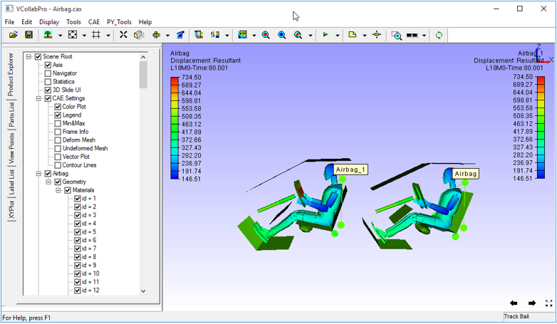

Merge Settings
===============
When two models are being merged in VCollab Pro, the **Merge Settings** allow the user to indicate where and how the merged model should be placed. By default, the model to be merged is placed in the same position where it was modeled.  

There are following options available for placement of the model to be merged:

- **As Is :** This option places  the merged model without any transformations. If a CAX file with 
  the same geometry is being merged, it will overlap with  the existing model.
- **Left:** This option places the model being merged  to the left of the existing model.
- **Right:** This option places the model being merged  to the right of the existing model. 
- **Top:** This option places the model being merged above the existing model.
- **Bottom:** This option places the model being merged below the existing model.
- **Custom Transform-Relative:** Users can set transformation values that are relative to current 
  model transformations.
- **Custom Transform-Absolute:** Users can set transformation values that are absolute and not 
  relative to existing models.

**Merge Settings Panel**

   |image1|

The various fields and controls present in the Merge Settings panel are explained below.

**Show Model Labels** - Displays a label for each model after loading merged models. 

**Custom Position** - This section is enabled when Custom- Transform Relative and Custom- Transform Absolute options are selected. 

**Apply Current Settings** - Applies Current model settings to the merged model.

**Note:** VCollab Pro provides independent rotation for merged models. Click here  for more details.

**Example for merge setting :**

   |image2|

     