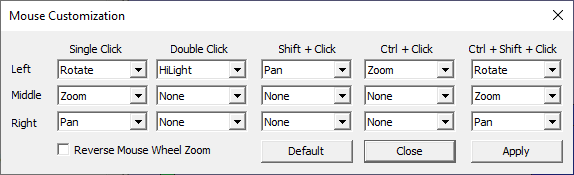
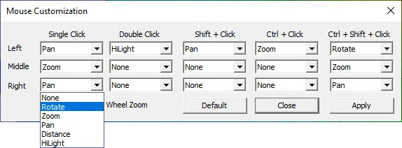

Mouse Mode
=============

The Mouse Mode command allows users to customize mouse buttons for motion models. Following are the default buttons, assigned for important functions.

+-----------------------------+-------------------------------------+
|| Left Mouse Click & Drag    |    Rotation                         |
+-----------------------------+-------------------------------------+
|| Middle Mouse Click & Drag  |    Zoom in or out                   |
+-----------------------------+-------------------------------------+
|| Right Mouse Click & Drag   |    Pan                              |
+-----------------------------+-------------------------------------+
|| Left Mouse Double Click    |    Highlight a part                 |
+-----------------------------+-------------------------------------+
|| Right Mouse Click          |    Drop down menu                   |
+-----------------------------+-------------------------------------+

**Mouse Customization Panel**

|image1|

*Reverse Mouse Wheel Zoom* - User can customize the zooming direction  for forward as well as backward scroll.

**How to customize mouse buttons with different interactive motion model functions?**

- Click **Edit | MouseMode** to open the Mouse Customization dialog box as shown below.
- Click the drop down box provided for **Left Single Click**, it will display all possible functions.
- Select **Pan** function.

  |image2|

- Click the drop down list provided for **Right Single Click,** it will displays all possible functions.

  |image3|

- Select **Rotate.** Now both the  Rotation and Pan functions are interchanged for the mouse buttons.

  |image4|

- Click **Apply** to enable these changes in viewer motion model. 

