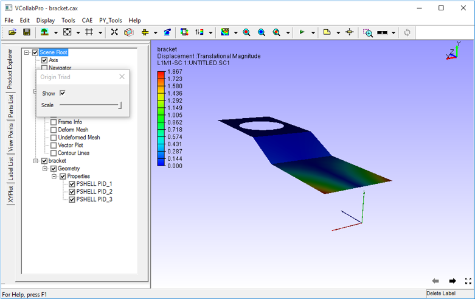

Origin Triad Settings
=====================

VCollab users can change axis of the model being viewed through origin settings. 

**Steps to enable Origin axis**

- Click **Edit | Origin Settings** to open **Origin Triad** dialog box as shown below
- Check the option **Show** to view axis.

                                                                                                                                                                                       
 |image1|                                                          
  
- Move  the scale slider to scale the origin axis as required. 

 |image2|

.. |image1| image:: JPGImages/edit_OriginSettings_Show .png
