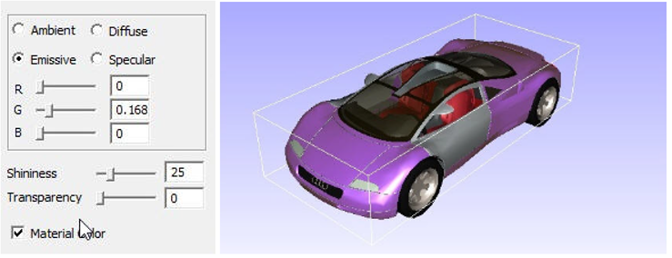

Part Color
===========

Users can edit material color of the part(s) selected using the **Part Color** option under the **Edit** menu.

**Part Color Editor Panel**
   
 |image1|

The following properties can be modified. All property values vary in the range of 0 to 1 except shininess.

=============== ================================================================================
Ambient          Specifies the amount of light a surface should reflect. To change the 
                 property against ambience, users need to select the same and reset 
                 the values using the RGB slider

Diffuse          Specifies the amount of light the surface reflects depending on the  
                 angle of the surface with respect to the light source. 
                 To change the property against diffuse, users need to select the 
                 same and reset the values  using the RGB slider

Emissive         Specifies the amount of light produced by a glowing object. To 
                 change the property against emissive, user need to select the same 
                 and reset the values  using the RGB slider

Specular         Specifies the color for highlighting an object. To change the property 
                 against Specular, user need to select the same and reset the values 
                 using the RGB slider

Shininess        Specifies the degree of the surface shine with values ranging from 0 
                 to 128. If the value is set to 0 the surface is without shine and if it’s 
                 set to 128, the surface is polished.  

Transparency     Specifies the transparency of the object. If the value is set to 0, the 
                 surface is opaque and when set to 1, the surface is transparent.  

Material Color   Check this material color box to apply default material color on the 
                 selected parts.

=============== ================================================================================

**Steps to apply or remove material color**

- Double click on a part of a model to open up a context menu

      |image2|

- Click **Display Mode | Color Plot.**
- It applies or removes material color.

     |image3|

**Steps to change part material color**

- Load a CAX model.
- Select a part by double clicking on the part which highlights the part with its bounding box.
- Click **Edit | Part Color** as shown below

     |image4|

- Check **Material color** checkbox to remove and apply material color.
- Change the **Ambient** color using slider controls and note the change concurrently.

     |image5|

- Select the **Diffuse** option and change the color using slider controls as shown below.

     |image6|

- Select **Emissive**  option and change the color using slider controls  as shown below.

     |image7|

- Select the **Specular** option and change the color using slider controls as shown below.

     |image8|

- Change the **Shininess** as using the shininess slider control as shown below. 

     |image9|

.. |image3| image:: JPGImages/edit_PartColor_MaterialColor_Applied.png 

