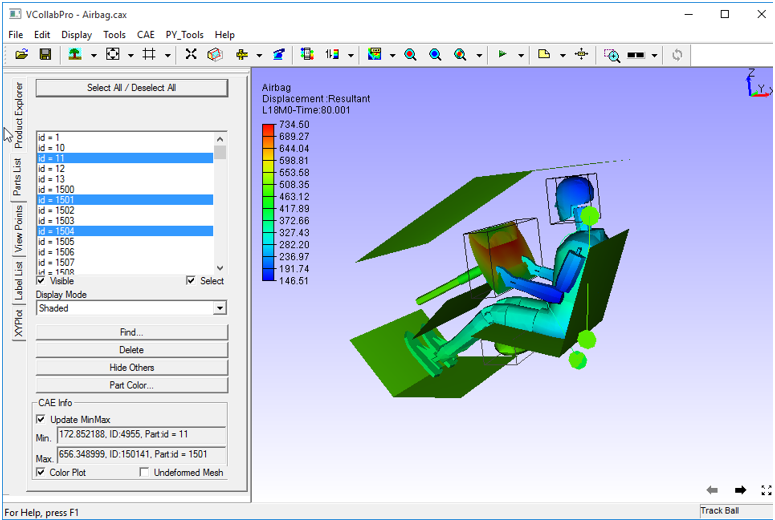
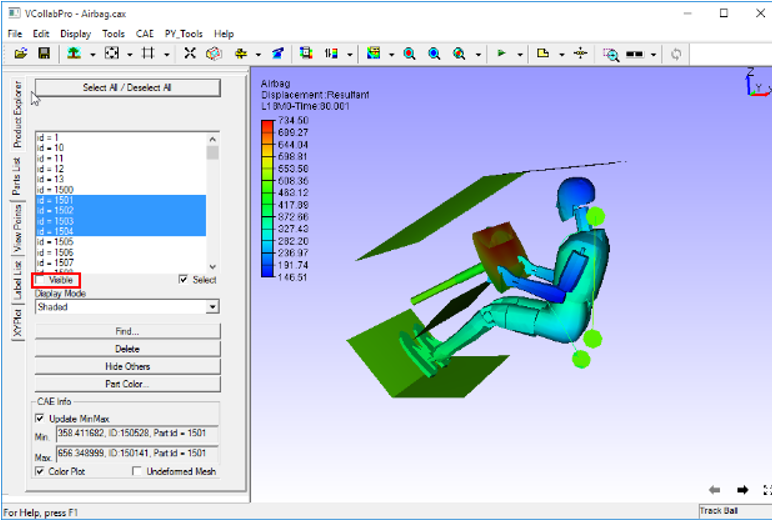
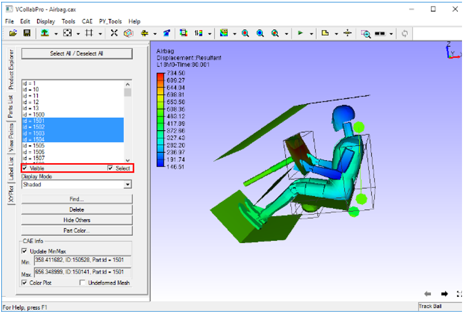
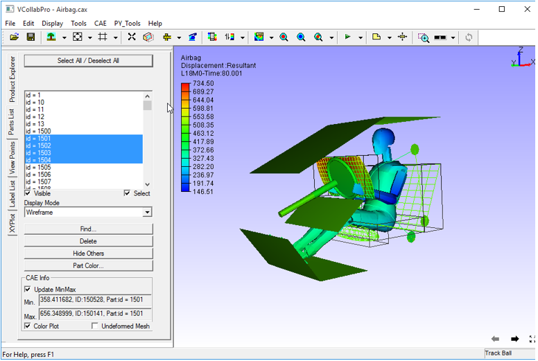
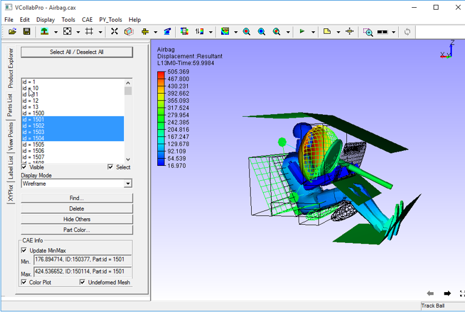
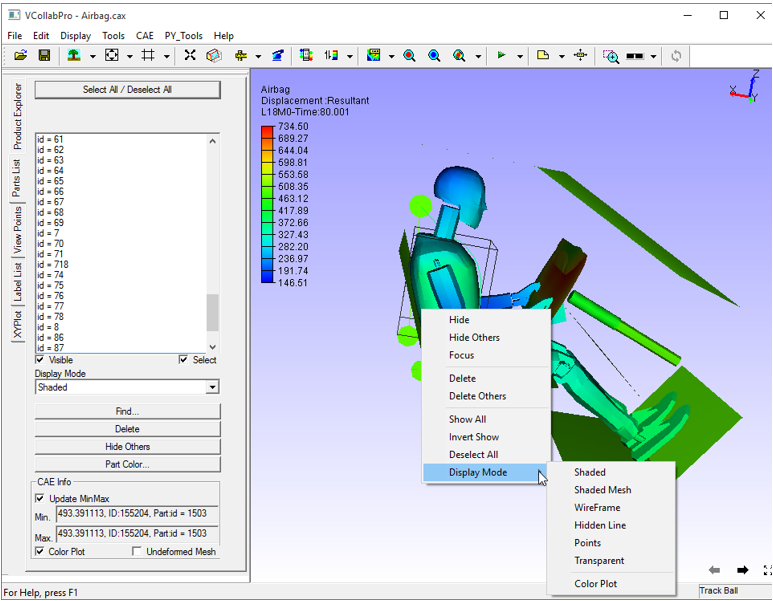

Part List
=================
This command helps users to change individual part properties. Part List panel can be accessed from the left span of VCollab Pro.

 
**Part List Panel**

 |image1|

 The controls available in the part list panel are as follows:

 ================================= ===============================================================
 **Select All / Deselect All**        Selects or deselects all parts.
 
 **List box**                         Lists all part names.
 
 **Visible**                          Toggles visibility to selected parts in the list
 
 **Select**                           Selects and highlights parts in the viewer
 
 **Display Mode**                     Allows user to select and apply a display mode to the parts 
                                      selected.
 
 **Find...**                          Links to Edit | Find. Allows users to search parts by name.
 
 **Delete**                           Deletes parts that are  highlighted/selected in the viewer. 
 
 **Hide Others**                      Hides all parts except the parts highlighted in the viewer
 
 **Part Color**                       Links to Edit | Part Color.  Allows users to edit part color 
                                      material.
 
 **Update MinMax**                    Displays the min and max values for selected parts in the 
                                      list  

 **Color Plot**                       Applies or removes contour color for the selected parts in 
                                      the list
 
 **Undeformed Mesh**                  Shows / Hides undeformed mesh for the selected parts in the 
                                      list
 ================================= ===============================================================

**Steps to set visibility for a part(s)**

- Click **Edit|Part List.**
- Select a part or some parts.
- Check /uncheck **Visible** to show/hide the parts selected.

     |image2|

**Steps to highlight or select a part(s) of the model**

- Open **Part List** panel.
- Select one or more parts 
- Check **Highlight** to highlight the parts selected.

     |image3|

**Steps to set display mode for part(s)**

- Open **Part List** panel.
- Select one or more parts 
- Select any display mode (Wireframe in the below example) from the drop down list to be applied 
  to the parts selected.

   |image4|

**Steps to view undeformed mesh of a part(s)**

- Open **Part List** panel.
- Select some parts on the model
- Click **Undeformed Mesh** checkbox to display undeformed mesh.

   |image5|

**Steps to access and modify part level properties in the viewer**

- Double click on a part in the viewer to open the context menu

   |image6|

The following operations can be carried out for the selected parts

   - Hide the part
   - Hide all parts except this one.
   - Focus on the part.
   - Delete the part.
   - Delete all parts except this one.
   - Show all parts
   - Show the parts which are hidden
   - Deselect all parts
   - Show / Hide color plot.

    
                               
