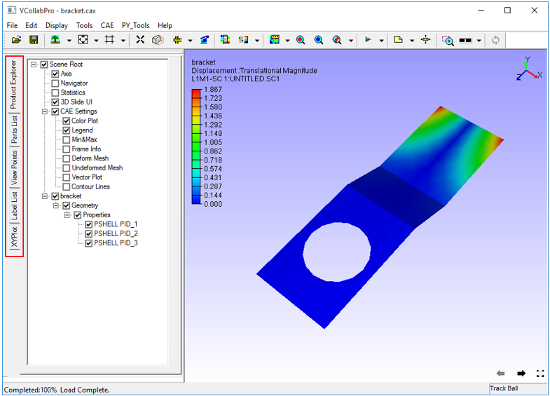
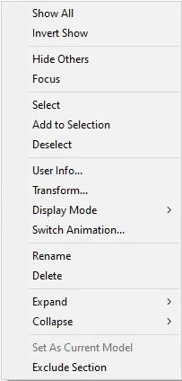
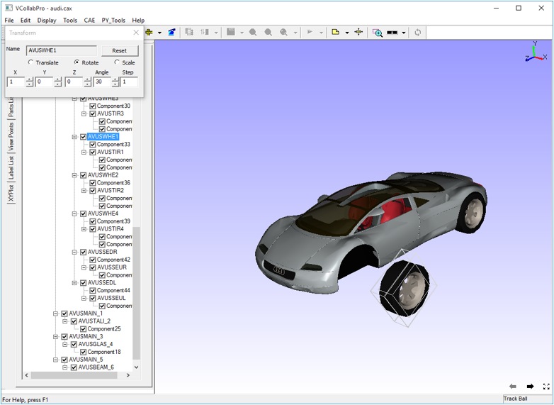
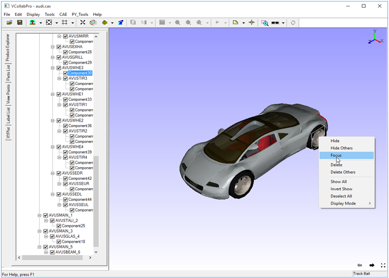

Product Explorer
=================

Product Explorer found in the left span of the VCollab screen,  lets users to explore a product model through a hierarchical set up of nodes. Using product explorer, users can,

- Hide and show  a part or group of parts
- Highlight a part or group of parts
- Transform a part or group of parts
- Seek or focus a part or group of parts
- Delete a part or group of parts
- Show/hide a CAE property

**Left Span of VCollab Pro Layout**

The left span contains four tabs -  **Product Explorer, Part List, ViewPoints, Label List** and **XYPlot.**

Product Explorer is the default active tab.

 |image1|

The various options available under **Scene Root** as seen in the Product Explorer tree are: 

=============== ================================================================================
**Axis**            Shows/Hides the axis triad at the top right corner

**Navigator**       Navigator	Shows/Hides the navigator in the right part of viewer

**Statistics**      Shows/Hides graphical or rendering statistics in the bottom right corner

**3D Slide UI**     Shows/Hides viewpoint slide UI in the bottom right corner

=============== ================================================================================

**Context Menu**

 On right clicking a node in the product explorer, the context menu appears as shown below

       |image2|

 +--------------------------+----------------------------------------------------------------------------------+
 | **Show All**             |     Shows all parts independent of selection                                     |
 +--------------------------+----------------------------------------------------------------------------------+
 | **Invert Show**          |    Hides visible parts and Shows invisible parts                                 |
 +--------------------------+----------------------------------------------------------------------------------+
 | **Hide others**          |      Hides all parts except current selection                                    |
 +--------------------------+----------------------------------------------------------------------------------+
 | **Focus**                |      Sets focus on the selected part or group                                    |
 +--------------------------+----------------------------------------------------------------------------------+
 | **Select**               |      Selects the part by highlighting its bounding box                           |
 +--------------------------+----------------------------------------------------------------------------------+
 | **AddtoSelection**       |      Adds to the selection list by highlighting parts bounding box               |
 +--------------------------+----------------------------------------------------------------------------------+
 | **Deselect**             |     Deselects current selection                                                  |
 +--------------------------+----------------------------------------------------------------------------------+
 | **User Info**            |     Lets users add information to the part selected.                             |
 +--------------------------+----------------------------------------------------------------------------------+
 | **Transform**            |     Allows users to apply any transformation to the group node. Not applicable   |
 |                          |     for leaf node or individual part.                                            |
 +--------------------------+----------------------------------------------------------------------------------+
 | **Display Mode**         |    Applies one of the following display modes to the current selection.          |
 |                          |                                                                                  |
 |                          |    +-----------------+---------------------------------------------------------+ |
 |                          |    | Shaded          |  Smooth shade                                           | |
 |                          |    +-----------------+---------------------------------------------------------+ |
 |                          |    | Shaded Mesh     |  Smooth shade with mesh                                 | |
 |                          |    +-----------------+---------------------------------------------------------+ |
 |                          |    | Wireframe       |  Model as edges                                         | |
 |                          |    +-----------------+---------------------------------------------------------+ |                
 |                          |    | HiddenLine      |  Wireframe in which, hidden lines removed               | |   
 |                          |    +-----------------+---------------------------------------------------------+ |
 |                          |    | Point           |  Model as points                                        | |
 |                          |    +-----------------+---------------------------------------------------------+ |
 |                          |    | Transparent     |  Semi-transparent Model                                 | |
 |                          |    +-----------------+---------------------------------------------------------+ |
 |                          |    | Set Random Color| Model parts with random colors                          | |
 |                          |    +-----------------+---------------------------------------------------------+ |
 |                          |    | Set Color       | Allows user to define a color to the part selected      | |               
 |                          |    +-----------------+---------------------------------------------------------+ |
 |                          |                                                                                  |
 +--------------------------+----------------------------------------------------------------------------------+
 | **Switch Animation**     |    Switch into animation mode. Shows a part per frame as in the product tree.    |
 |                          |    Click the option again to stop the animation.                                 |
 +--------------------------+----------------------------------------------------------------------------------+
 | **Rename**               |     Rename the group or part name.                                               |
 +--------------------------+----------------------------------------------------------------------------------+
 | **Delete**               |     Deletes selected part or group of parts from the scene and product tree      |
 +--------------------------+----------------------------------------------------------------------------------+
 | **Expand**               |     Allows user to expand the group to levels, All, Level 1, Level 2 and Level 3.|
 +--------------------------+----------------------------------------------------------------------------------+
 | **Collapse**             |     Allows user to collapse the group to level, All /Level 1/ Level 2/ Level 3.  |
 +--------------------------+----------------------------------------------------------------------------------+              
 | **Set As Current Model** |    Allows user to set this model as Current CAE Model.                           |
 +--------------------------+----------------------------------------------------------------------------------+          
 | **Exclude Section**      |    Allows user to exclude the selected parts from cut-section.                   |
 +--------------------------+----------------------------------------------------------------------------------+

**Steps to Hide/Show a Part**

- Check or uncheck the option in product tree to show or hide a part respectively.
- Since Object 2 is unchecked, it is hidden in the scene below.

   |image3|

**Steps to highlight a Part**

- Select a part or part component in the product tree.
- Right click to open the context menu

   |image4|

- Click **Select.**  
- The part will be highlighted with bounding box.
- Click other parts and add them to highlight using **Add to selection** in context menu.

**Steps to transform a group node or group of parts in the tree**

- Load a CAX model that contains groups of parts. 

   |image5|

- Select any group node or group of parts
- Right click and select **Transform** in the context menu.

    |image6|

**Translate**

- Select **Translate** in the Transform dialog box.
- Increase or decrease the X,Y,Z axes values as required.
  
    |image7|

**Rotate**

- Select **Rotate** in Transform dialog box
- Enter 1,0,0 or 0,1,0 or 0,0,1 for X, Y, Z  to rotate about the X,Y and Z axes respectively.

     |image8|

- Increase or decrease **Angle** value to rotate.
- Increase **Step** value for a quick transform.

**Scale**

- Select **Scale** in Transform dialog box
- Enter scale factor in X, Y, Z text boxes to scale in X, Y, Z axes respectively.

     |image9|

- Click **Reset** to reset the parts to its original position.

**Steps to seek/ focus a part among groups**

- Select a part in the viewer

   |image10|

- Right click and select **Focus** to fit the part to the view port. The focus on the part is seen as below.

   |image11|

**Delete a part or group of parts**

- Select a part node or group node in product tree 
- Right click on the node to open the context menu
- Click **Delete.**

   |image12|

- There is no Undo option available for deletion. Hence a confirmation message pops up.

   |image13|

- Click **Yes** to confirm
- The part or group of parts are then deleted from the scene and product tree.

   |image14|

To delete a part instead of a group of parts, the double click context menu in the viewer can also be used

- Double clicking on a part to open up the context menu in the viewer
- Click **Delete**

    |image15| 

- A confirmation message open up. Click **Yes**

    |image16|

- The part is then deleted from the scene and product tree

    |image17|

- Users can save the remaining parts as a CAX file. Deleted parts cannot be saved in CAX.

**Using CAE switch on/off properties**

- Users can switch on or off any CAE property listed in the following table: 

============================ ===================================================================
 Color Plot                   Applies color plot to the Model or Removes it

 Legend                       Shows/Hides the Color Palette

 Min & Max                    Shows/Hides Min and Max values and its attached IDs in the label
 
 Frame Info                   Shows/Hides frame information in the bottom left corner of the 
                              viewer.

 Deform Mesh                  Applies or Removes deformation
 
 Undeformed Mesh              Shows /Hides Undeformed mesh

 Vector Plot                  Shows/Hides Vector Plot

 Contour Lines                Shows/Hides Contour Lines
============================ ===================================================================

**How to exclude parts from cut section clipping?**

- Load a cax file
- Switch on section plane.
- Click a part name in product explore, which is clipped by section plane.
- Open context menu using right mouse click inside product explorer panel.
- Click 'Exclude Section'
- The selected part is visible now and not clipped by section plane.
- Repeat the step for other required parts.
- Click or uncheck the option 'Exclude Section' again to include the part again.
.. note::
 - To exclude or include, this function is applied for only one selected part in the product explorer.

.. |image3| image:: JPGImages/edit_ShowHide_Part.png

.. |image7| image:: JPGImages/edit_TransformWheel.png

.. |image13| image:: JPGImages/edit_TranfromDelete_Dialoge.png
.. |image14| image:: JPGImages/edit_DeletedTranform_Group.png
.. |image15| image:: JPGImages/edit_DeleteTransform_part2.png
.. |image16| image:: JPGImages/edit_TranfromDelete_Dialoge.png
.. |image17| image:: JPGImages/edit_DeletedPart2.png

    
     
