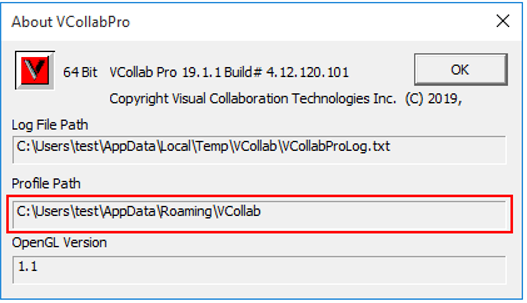
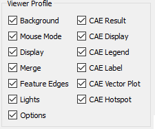
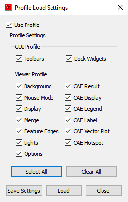
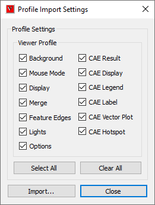

Profile Settings
=================

VCollab Pro users can set, export and import profile configurations (a range of user selected settings) using **Profile Settings** in the Edit Menu. User defined profile configurations can be  stored and retrieved using these settings. 

      |image1|

The options available inside Profile Settings are explained below.

============================== =================================================================== 
**Load Profile**                 It is used to select features that to be applied while loading. Pops up 'Profile Load Settings' dialog. 

**Save Profile**                 It is used to set what settings should be saved into profile. Pops up 'Profile Save Settings' dialog.

                                 Note: It will save only current selected features. Other non selected features configuration are kept as it was.

**Import Profile**               It used to apply profile from external profile file. Pops up 'Profile Import Settings' dialog. 

**Export Profile**               It is used to save current configuration in to a profile file. the saved profile file can be imported into some other session or other computer.

============================== ===================================================================  

Profile Features
----------------
                                           
                                                                          
       |image21|                                                           
                                                                          
=============================== ======================================
**Feature**                        **Fields Profiled**

**Background**                      Background Mode, Background,
                                    Colors
                                    Background Texture Path
                                    Background Texture Mode

**Mouse Mode**                      Mouse Click
                                    Mouse Alt + Click
                                    Mouse Shift + Click
                                    Mouse Ctrl + Click
                                    Mouse Shift + Ctrl + Clicks

**Options**                         
                                    Animate Zoom
                                    PPT Auto
                                    PPT Origin
                                    PPT Size
                                    Use Plain Background In PPT
                                    Probe On MouseMove
                                    Start On CAE Animation Control Launch
                                    Update Normal On Animation   

**Display**                         
                                    Origin Show
                                    Origin Percentage
                                    Move Model As Mode
                                    Detail Cull Percentage
                                    Line Thickness 
                                    Perspective Mode 
                                    Coordinate System 
                                    Axis
                                    Statistics
                                    Navigator
                                    View Point GUI
                                    Geometry Line Size
                                    Geometry Point Size  

**Merge**                           
                                   
                                    Merge Position
                                    Apply Current Settings
                                    Merge Custom Translation
                                    Merge Custom Rotation
                                    Merge Custom Scale
                                    Show Data Set Labels
                                    Combined Palette
                                    Multi Palette
                                    Hide Other Dataset 

**Feature Edges**                   Show Feature Edges
                                    Detach Geometry and Edges
                                    Feature Edge Color
                                    Feature Edge Size  

**CAE Result**                      
                                    Result Name
                                    Instance Name
                                    Derived Type Name   

**CAE Display**                     Color Plot
                                    Legend
                                    Deform Mesh
                                    Undeformed Mesh
                                    Min and Max
                                    Contour Lines 

**CAE Legend**                      
                                    Reverse Legend
                                    Scientific
                                    Precision
                                    Discrete
                                    Legend Colors
                                    No Result Color
                                    Display of Frame Info
                                    Legend Placement
                                    Contour Line User Color
                                    Contour Line Mode  

**CAE Label**                        
                                    Auto Arrange Labels
                                    Arrange Label Mode
                                    Label Font Name
                                    Label Background Color
                                    Label Text Color
                                    Label Border Color
                                    Label Background
                                    Label Border
                                    Label Font Size
                                    Label Size
                                    Label Line Color
                                    Label Line Width
                                    Keep Previous Probe
                                    Auto Update
                                    Label Info
                                    ID Display  

**CAE Vector Plot**                 Vector Plot Arrow Size
                                    Vector Plot Arrow Style
                                    Vector Plot Deform
                                    Vector Plot Detach Geometry
                                    Vector Plot User Color Mode
                                    Vector Plot User Vector Colors
                                    Vector Plot Node Position As
                                    Vector Direction
                                    Vector Plot Auto Scale
                                    Vector Plot Scale Factor   

**CAE Hotspot**                     
                                    Hotspots Count
                                    Visible Surface
                                    Keep Previous Label
                                    Hotspot Zones
                                    Top & Bottom hotspots Border Colors
                                    Mark Min Max
                                    Probe Type
                                    Template
                                    Hotspot Viewpoints All Std. Views
                                    Hotspot Viewpoints Hotspot Per Page
                                    Hotspot Viewpoints Part Regions
                                    Hotspot Compare
                                    Hotspot Compare Mode
                                    Hotspot Show All Connections
                                    Hotspot Compare With
                                    Hotspot All Model Reference                                                                                                                                                                                                            

=============================== ====================================== 

.. note::                                                                 
                                                                          
       #. Some profile settings are saved in application session profile  
          as well as cax file as viewpoints. In that case, viewpoint      
          settings are preferred to profile settings. For example,        
                                                                          
          -  Load a cax file in VCollab Pro.                              
          -  Create a viewpoint with vector plot OFF.                     
          -  Switch ON the vector plot.                                   
          -  Enable profile option using 'Edit \| Profile Settings \|     
             Save Profile'.                                               
          -  It pops up 'Profile Save Settings' dialog.                   
          -  Check CAE Vector Plot.                                       
          -  Click Save button.                                           
          -  Close the application.                                       
          -  Now vector plot - OFF is stored in cax file as viewpoint.    
          -  Vector plot - ON is stored in Application Profile settings.  
          -  Open VCollab Pro again.                                      
          -  Load the saved cax file.                                     
          -  Pro loads the cax file with user defined viewpoint.          
          -  Even though, vector plot is ON in profile settings, vector   
             plot is OFF because of user defined viewpoint.               
                                                                          
       #. If user profile directory is of Unicode characters, profile     
          settings cannot be saved. This can be avoided by setting        
          environment variable VCOLLAB_PROFILE_PATH with ascii character  
          path.                                                           
                                                                          
             -  Warning message pops up if the path is of Unicode         
                characters as below.                                      
                                                                          
                |image3|                                                  
                                                                          
**How to set and revoke session profile?**
                     
                                                                          
    -  Select 'Profile \| Load Profile...' option in the viewer context   
       menu.                                                              
                                                                          
    -  It pops up 'Profile Load Settings'.                                
                                                                          
       |image4|                                                           
                                                                          
    -  User can check and uncheck the options.                            
                                                                          
    -  Click OK.                                                          
                                                                          
    -  Select 'Profile \| Save Profile...' option in the viewer context   
       menu.                                                              
                                                                          
    -  It pops up 'Profile Save Settings' dialog.                         
                                                                          
       |image5|                                                           
                                                                          
    -  Select the options as user require.                                
                                                                          
    -  Click 'Save' button to save the settings.                          
                                                                          
    -  As per profile load settings, the model will be loaded.            
                                                                          
**How to export and import profile settings files?**
        
                                                                          
    -  User can export and import profile settings into external file.    
                                                                          
    -  Select 'Profile \| Export Profile...' option in the viewer context 
       menu.                                                              
                                                                          
    -  It pops up 'Profile Export Settings' dialog.                       
                                                                          
       |image6|                                                           
                                                                          
    -  Select the features and provide a file name.                       
                                                                          
    -  Click file browser button. and select the file type either as .ini 
       or .json.                                                          
                                                                          
    -  Click Export button.                                               
                                                                          
    -  To import, select 'Profile \| Import Profile...' option in the     
       viewer context menu.                                               
                                                                          
    -  It pops us 'Profile Import Settings' dialog.                       
                                                                          
       |image7|                                                           
                                                                          
    -  Select the feature as required.                                    
                                                                          
    -  Select the profile file using the file browser button.             
                                                                          
    -  Click Import button.                                               
                                                                          
    -  Settings from file are applied.                                    
                                                                          
                                                                          

Profile files location
----------------------

Profile path is displayed in  **Help | About VCollab Pro...**

        |image2|

.. |image1| image:: JPGImages/edit_Profile_SettingsPanel.png

.. |image3| image:: JPGImages/Profile_Save_Warning.png

.. |image5| image:: JPGImages/Profile_Save_Settings.png
.. |image6| image:: JPGImages/Profile_Export_Settings.png

          
