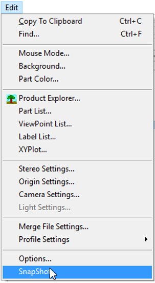

Snapshot
=================
VCollab Pro stores user defined views and named views into a list. VCollab Pro uses this list to redo and undo operations.

There are three operations possible:

#. Click **Edit|SnapShot** to push or add a view into the view array. The last view that is pushed 
   becomes the current view in the array. (Shortcut key - 'Ctrl + W')

    |image1|

#. Undo operation. (Shortcut key - 'Ctrl +Z').

#. Redo operation. (Shortcut key - 'Ctrl +Y').

**Note:**

VCollab Pro is able to redo and undo 100 operations at maximum.

