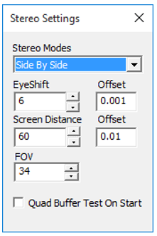

Stereo Settings
===============

VCollab Pro users can modify eye shift value for stereo mode using Stereo Settings found in the Edit Menu.  
                                                                                                                                                                                       
 |image1|                                                          
  
The various controls and options available under Stereo Settings are explained below.    
                                                                
 +--------------------------------+--------------------------------+ 
 | **Stereo Modes**               | Sets specified stereo mode     | 
 +--------------------------------+--------------------------------+
 | **Eye Shift**                  | Approximate distance between   |
 |                                | viewers eye ball in            |             
 |                                | centimeters.                   |
 +--------------------------------+--------------------------------+
 | **Screen Distance**            | Approximate distance between   |
 |                                | viewer and screen in           |
 |                                | centimeters.                   |
 +--------------------------------+--------------------------------+
 | **FOV**                        | Viewing angle 50 to 70 degree  |
 |                                | is recommended.                |
 +--------------------------------+--------------------------------+
 | **Quad Buffer Test On Start**  | If checked, before the start of|
 |                                | the next session of VCollab    |
 |                                | Pro, GPU will be tested        |
 |                                | for Quad Buffer Support.       |
 |                                | Quad Buffer will be listed ,   | 
 |                                | along with other stereo modes  |
 |                                | if GPU supports Quad Buffer.   |
 |                                |                                |
 +--------------------------------+--------------------------------+                                                                    
                                                                      
**Note:**                                                             
                                                                      
   This version of VCollab Pro supports only single channel stereo. The 3D DLP (Digital Light Processing) projectors that do not support single channel stereo, expect left and right images on two independent windows, which are then connected to two output cables from GPU. The current version of VCollab Pro renders left and right images in the same window.   
                        
                                                                      
**Stereo Modes**                                                      
                                                                      
-  Active                                                             
                                                                      
   -  Quad Buffer                                                     
                                                                      
-  Passive                                                            
                                                                      
   -  Side By Side (Left-Right)                                       
   -  Top-Bottom                                                      
   -  Anaglyph                                                        
                                                                      
    |image2|                                                          
                                                                      
    +--------------------------------+--------------------------------+
    | **Anaglyph**                   | Passive stereo that requires   |
    |                                | red and cyan glasses for       |
    |                                | red and cyan glasses for       |
    |                                |                                |
    +--------------------------------+--------------------------------+
    | **Side By Side**               | Passive Stereo in Left Right   | 
    |                                | format. Passive stereo glasses |
    |                                | and 3D monitor/3D TV are       |
    |                                | required for viewing..         |
    +--------------------------------+--------------------------------+
    | **Top - Bottom**               | Passive Stereo in Top-Bottom   |
    |                                | format. Passive stereo glasses |
    |                                | and 3D monitor/3D TV are       |
    |                                | required for viewing.          |
    +--------------------------------+--------------------------------+
    | **Quad Buffer**                | Active Stereo. Requires OpenGL |
    |                                | Quad buffer supported graphics |
    |                                | card, active stereo glasses    |
    |                                | with emitter. Also requires    |
    |                                | 120hz refresh rate supported   |
    |                                | display system                 |
    |                                | (monitor/projector)            |
    +--------------------------------+--------------------------------+     

**Steps to edit Eye Shift values**                                                                
                                                                      
- Click **Edit | Stereo Settings** to open **Stereo Settings** dialog box.
- Increase or decrease the eye shift values as needed
                                                      
                                                                      
**Stereo Support in Desktop**                                         
                                                                      
    +---------------+---------------+---------------+---------------+ 
    |               | Quad Buffer   | Side by Side  | Anaglyph      | 
    |               |               | / Top-Bottom  |               | 
    +---------------+---------------+---------------+---------------+ 
    | Special GPU   | Required with | Not required  | Not required  | 
    |               | quad buffer   |               |               | 
    |               | support       |               |               | 
    +---------------+---------------+---------------+---------------+ 
    | Refresh Rate  | 120Hz         | 60Hz(regular) | 60Hz(regular) | 
    | of Monitor    |               |               |               | 
    +---------------+---------------+---------------+---------------+ 
    | Eyeware       | LCD Shutter   | Polarized     | Red-Blue/Red- | 
    |               | Glass         | Glass         | Green/Red-Cya | 
    |               |               |               | n             | 
    +---------------+---------------+---------------+---------------+ 
    | Emitter       | Required      | Not Required  | Not Required  | 
    +---------------+---------------+---------------+---------------+ 
    | Visual        | High, Used in | Medium, Used  | Color loss,   | 
    | Quality       | engineering   | in            | Used in paper | 
    |               | solutions     | entertainment | medium        | 
    +---------------+---------------+---------------+---------------+ 
    | Resolution in | Outputs in    | Half          | Full          | 
    | Full HD       | Full HD       | resolution is | resolution    | 
    | Monitor       | resolution    | lost          |               | 
    +---------------+---------------+---------------+---------------+ 
    | Filter in     | No filter is  | Polarized     | No filter     | 
    | monitor       | needed        | filter comes  | needed        | 
    |               |               | along with    |               | 
    |               |               | monitor       |               | 
    +---------------+---------------+---------------+---------------+ 
    | Minimum cost  | ~$1000        | ~$500         | ~$1           | 
    | for Hardware  |               |               |               | 
    +---------------+---------------+---------------+---------------+ 
                                                                      
**Stereo Support in 3D TV**                                           
                                                                      
- Some of the 3D TVs  support stereo in active mode and some in passive mode.
- VCollab Pro works on both, using Top-Bottom or Left-Right (side by side) mode. No Quad buffer 
  GPU is needed in laptop or desktop.
- UHD is recommended. Even if it loses half resolution, 2K in each frame is good enough to get 
  good visualization
                  
                                                                
    +---------------------+---------------------+---------------------+
    |                     | **Active Stereo     | **Passive Stereo    |
    |                     | TV**                | TV**                |
    +---------------------+---------------------+---------------------+
    | **Eyeware**         | LCD shutter glass   | Polarized glass     |
    +---------------------+---------------------+---------------------+
    | **VCollab Pro       | T-B / L-R           | T-B /L-R            |
    | Stereo Mode**       |                     |                     |
    +---------------------+---------------------+---------------------+
    | **Quad buffer       | Not required        | Not Required        |
    | Stereo card in      |                     |                     |
    | Laptop/Desktop**    |                     |                     |
    +---------------------+---------------------+---------------------+
    | **Screen Sharing    | Will support        | Will Support        |
    | through WiDi**      |                     |                     |
    +---------------------+---------------------+---------------------+
    | **Display connected | Will support        | Will Support        |
    | thru HDMI**         |                     |                     |
    +---------------------+---------------------+---------------------+                                                                    
                                                                      
**Stereo Support in Projectors**
                                                                      
 -  Traditional Projectors with external emitter                       
                                                                      
 -  Built in Emitters                                                  
                                                                      
 -  Duel Projectors                                                    
                                                                      
                                                              
    +---------------+---------------+---------------+---------------+ 
    |               | **External**  | **Built In**  | **Dual        | 
    |               |               |               | Projector**   | 
    +---------------+---------------+---------------+---------------+ 
    | **Refresh     | 120 Hz        | 120 Hz        | 60 Hz         | 
    | Rate          |               |               |               | 
    | Required**    |               |               |               | 
    +---------------+---------------+---------------+---------------+ 
    | **VCollab Pro | Quad Buffer   | Quad          | L-R/T-B       | 
    | Stereo Mode** |               | Buffer/L-R/T- |               | 
    |               |               | B             |               | 
    +---------------+---------------+---------------+---------------+ 
    | **Emitter**   | Need to be    | Built In      | Can support   | 
    |               | purchased     |               | passive using | 
    |               |               |               | polarized     | 
    |               |               |               | filters       | 
    +---------------+---------------+---------------+---------------+ 
    | **Eyeware**   | Shutter Glass | Shutter Glass | Polarized     | 
    |               |               |               | Glass         | 
    +---------------+---------------+---------------+---------------+ 

