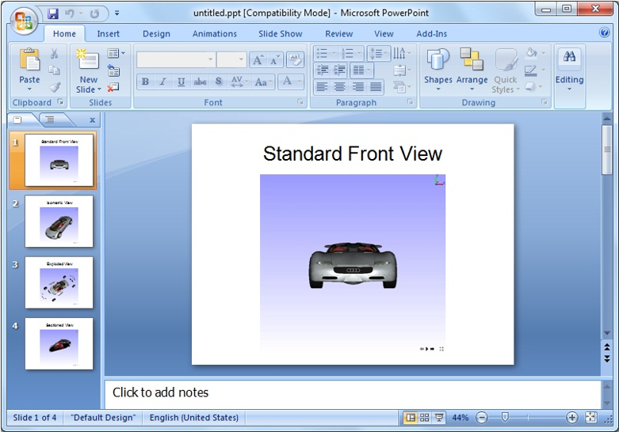

***************
View Point List
***************
In VCollab Pro, users can define and create different viewpoints (.vpt files)  for different types of views on a given model. These views can be retrieved through  viewpoint states. A viewpoint story can also be built which can be exported into a PPT file. Creating these animated paths or walk-through models helps users to gain better insights on a model.

The first user defined viewpoint is the default viewpoint that is seen when the model is loaded. When a user exports the viewpoints to a VPT file, all the existing viewpoints are saved in it. 

A view point state may contain

- Notes
- Annotation
- Display mode
- Probed CAE result labels
- Pick and move part state
- Exploded view
- Measurements
- Cut section
- CAE result information.
- Merged models view.
- Background Mode and Image.

.. note::
	Standard Views
	   - These viewpoints are not stored in a CAX file.
	   - All standard views are generated by default.
	   - Users can add and update viewpoints using the Capture Camera option in the context menu.
	   - Only viewing position and orientation are saved. Other states are not saved.
	   - These viewpoints can be saved through profile and cannot be saved in CAX file.

Viewpoints Panel
################

Viewpoints panel is one of the tabs on the left span of VCollab Pro.

                      |image1| 

 ============================== =============================================================
  **Path**                        Lists all the paths added by the user
 
 **Elapsed**                      Denotes the elapsed time to complete animation of a path
 
 **Estimated Time in Secs**       Displays estimated time. Users can edit this value.
 
 ============================== =============================================================  

Context Menu for Viewpoints
***************************

                      |image2|

 ============================== =============================================================
  **Add ViewPoint**                Adds current view to current path
 
 **Rename Viewpoint**              Allows user to rename viewpoint
 
 **Insert Viewpoint**              Inserts a viewpoint just before current viewpoint
 
 **Delete Viewpoint**              Deletes current viewpoint
 
 **Update Viewpoint**              Lets the user change the scene and update the same to existing 
                     
                                   viewpoint.
 
 **Capture Camera**               Capture a viewpoint using  camera view and save it as 
                                  viewpoint.It captures viewing position and orientation 
                                  and applies the same. CAE  states are ignored.  Viewpoints 
                                  in 'Std. Views' viewpath  contain capture camera viewpoints only
 
 **Animate Path**                 Animate Path	Animates the path
 
 **Stop**                         Stops animation
 
 **Slide Show**                   Switches viewpoint animation into slide show mode
 
 **Apply State**                  Applies or Skips CAE states during viewpoint animation
 
 **Apply View**                   Skips applying view/orientation if this flag is unchecked. Flag 
                                  is  checked by default
 
 **Loop Animation**               Enables continuous animation play
 
 **Add Path**                     Adds new viewpath
 
 **Rename path**                  Allows user to rename the viewpath
 
 **Delete path**                  Deletes current path
 
 **Export Image As**              Exports all viewpoint states as PowerPoint file or as VPT file
 
 **Import ViewPoints**            Imports viewpoints from external VPT or CAX file or VCollab 
                                  supported python scripts to run
 
 **Export ViewPoints**            This option helps users to export 
 
                                   - All viewpoints as images into a PPT(\*.ppt) file.
                                   - All viewpoints in a VPT (\*.vpt) file.
                                   - Filtered parts and results into a new CAX (\*.cax) file.
 								  
                                        - Parts or Geometry and Results available 
                                          across all viewpoints will be saved into CAX.
                                        - Other parts and results will not be saved.
 
 **AddVisibleLabelViewPt...**   This option is applicable only if the selected viewpoint contains 
                                CAE  probed labels. In the selected viewpoint, labels of attached 
                                positions that are not visible in the current view are suppressed. 
                                The suppressed labels are taken to a new viewpoint during hotspot 
                                generation. 
 
                                  - This option is used to modify/split a viewpoint 
                                    in such a way that multiple viewpoints can be 
                                    created with visible hotspots.
                                  - Users need to select a viewpoint and change the 
                                    view by using rotate / zoom / section options 
                                    such that a set of hotspot labels are visible.
                                  - Thereafter, 'Add Visible Label ViewPoint' option  
                                    helps to create a new viewpoint with only 
                                    visible hotspots in this modified view. The 
                                    remaining hotspots will remain in the original viewpoint.
                                  - By repeating these steps users can create 
                                    multiple viewpoints without missing any 
                                    hotspot.
 
 **Edit Mode**                   Selecting a viewpoint clears current view information. 
                                 Accidental selection of viewpoint may result in loss of current 
                                 scene information. To avoid this the user will be prompted 
                                 before the new viewpoint is applied.
 
 **Auto Backup**                 This option helps to take backup of viewpoints during creating 
                                 or updating viewpoints. If the user forgets to save viewpoints 
                                 into CAX, he can retrieve the viewpoints created using this 
                                 option. A VPT file with CAX file name will be created and 
                                 updated. This file will be saved in **%VCOLLAB_TEMP%\VCollab.**
 ============================== ============================================================= 

Steps to create viewpoint states
********************************

- Load a CAX Model.
- Add notes through **Tools | Label/Notes | Add Notes** option 
- Click **Edit | Viewpoints** List.
- Right click on the **Viewpoints** panel to open the context menu

             |image3|

- Click Add **View Point** which opens up the **Add View Path** dialog box if no view path exists.

             |image4|

- Enter a Path name,say ‘Path1’ .
- Click **OK** to open up **Add View Point** dialog.

             |image5|

- Enter a view point name, say ‘ViewPoint-01’ .
- The current view with the Notes will be stored in the viewpoint by the name ‘ViewPoint-01’. Path 
  name and view point name will be displayed.
- Follow the above steps to create more view points with different states.

            |image6|

Animating Viewpoints
********************

If multiple viewpoints are created, they can be played as animation

- Right Click on Viewpoints Panel.
- Click **Animate path.** The animation will start playing

Steps to retrieve a viewpoint state
***********************************

- Click on the Viewpoints tab.
- Click on a view point and notice that the stored viewpoint state is retrieved and applied on 
  viewer.
- Below is a movie, which shows different viewpoint states with detailed information in each 
  state.

              |image7|

Steps to navigate viewpoints
****************************

Users can navigate viewpoints in four ways.

- Using Viewpoints panel in the left span,

   - Click on a viewpoint in the list and view
   - Move the viewpoint animation slider
   - Click previous and next icons in the viewpoint animation control icons 

- Using Right click context menu,

  - Right Click inside the viewer to open the context menu
  - Click Viewpoints | Next View  or Viewpoints | Previous View

- Using Navigation icons in toolbar,
   
  - Click Previous and Next icons in the toolbar to browse viewpoints.

- Using Navigation icons located at rightmost bottom corner of the viewer window,

  - Click Previous and Next icons available inside the viewer to view slides or viewpoints.

Steps to export all viewpoint states as images in PowerPoint
************************************************************

  - Right click to open the viewpoints context menu.

           |image8|
  - Click Export Image As | PowerPoint....
  - Enter a filename in the save file browser dialog and click Save
  - Click Yes to provide a template or No to continue without template.
  - All the viewpoint states are inserted as images into PowerPoint.
  - First slide is left as an empty page for the title of the presentation if template is provided 
    as shown below.

         |image9|

  - If a viewpoint contains CAE Animation state, animation will be captured as an animated gif in the PPT file.

Steps to export viewpoints
**************************

         - Right click inside the viewpoints panel.
         - Select **Export Viewpoints** from the context menu.
         - It opens up the file browser dialog box.
         - Select file type as **.vpt** to store viewpoints
         - Select file type as **.ppt** to store viewpoints states into ppt image slides.
         - Click **Save.**

Steps to Import Viewpoints
**************************

- Right click inside the viewpoints panel to open the context menu
- Click **Import viewpoints**
- It opens up the file browser dialog box.
- Select any **.cax** or **.vpt** file to import view points.
- Click **Open** and observe that view paths are imported.

.. |image1|  image:: JPGImages/edit_ViewpointsPanel.png
.. |image2|  image:: JPGImages/edit_ContextMenuforViewpoints.png

.. |image4|  image:: JPGImages/edit_AddView_PathDialog.png
.. |image5|  image:: JPGImages/edit_AddView_PointDialog.png
.. |image6|  image:: JPGImages/edit_ViewPoint-01Example.png
.. |image7|  image:: JPGImages/edit_ViewPoint-02Example.png

                                                        
