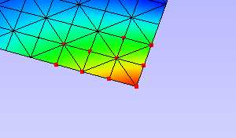
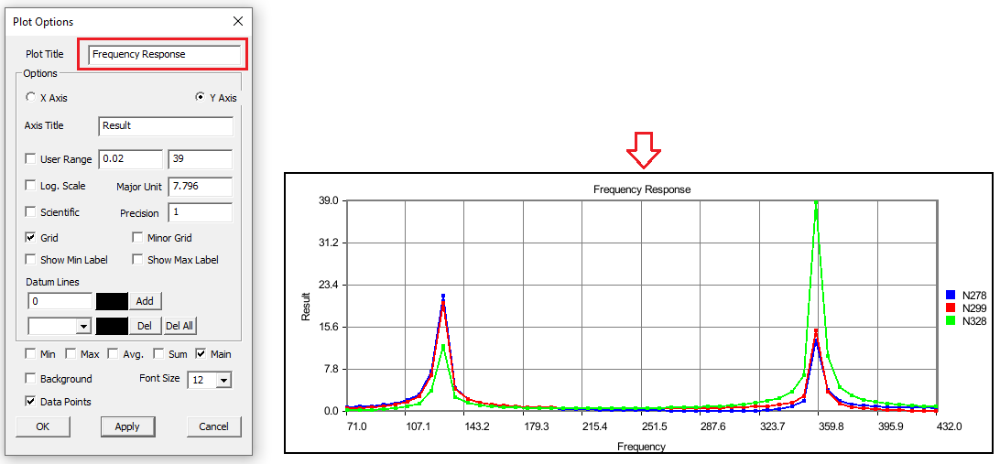
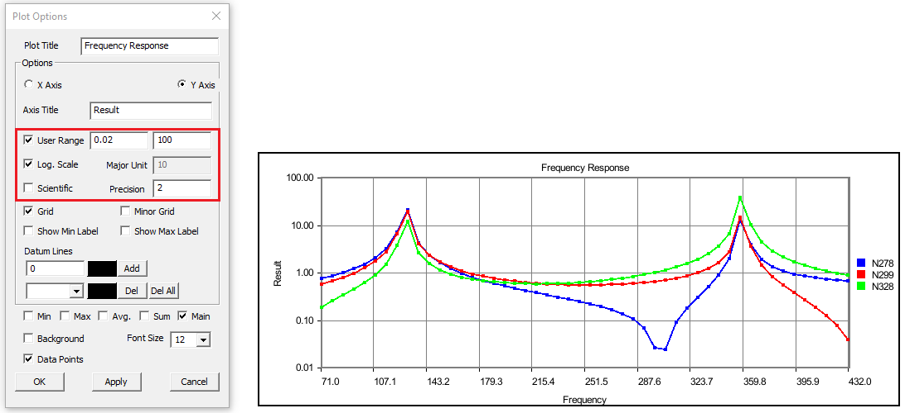
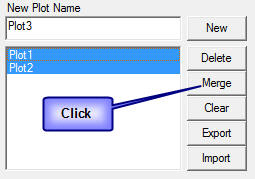
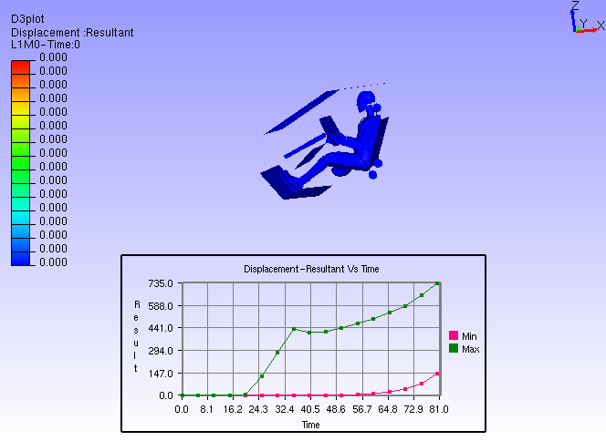

XYPlot
========

The XYPlot panel is available in the left span of VCollab Pro. Users can
create, export and import XY data and graphs. XYPlot can be accessed
through the Edit Menu, or through the shortcut in the toolbar.

   1. Edit \| XYPlot… 2. Toolbar

   |image1|

XYPlot Types
------------

1. IDs Path

2. Transient

3. Min Max

4. Force Deflection

5. Harmonic

XYPlots are classified into **Editable and Non-Editable**. Imported and
Merged Plots are always **non-editable**.

.. **Quick links**

.. -  `XYPlot Panel`_

.. -  `Step to create an XYPlot`_

.. -  `Plot Options Panel`_

.. -  `Steps to add datum lines`_

.. -  `Steps to select, move and resize the plot`_

.. -  `Steps to merge plots`_

.. -  `Steps to export and import XYPlot data`_

.. -  `Steps to edit XYPlot curve color`_

.. -  `XYPlot Data File Format`_

.. -  `Steps to Import LSDyna binout data into VCollab XYPlot`_

.. -  `Importing History Data`_

.. -  `History Plot Panel`_

.. -  `Steps to import history plot (*.json) files`_

.. -  `History file format (JSON)`_

.. note:

   -  XYPlot is applicable only for **Nodal** Results. Elemental results will not be displayed in the viewer.

   -  In case of a transient plot, a maximum of first 500 node IDs or curves are considered for plotting. Remaining IDs are ignored.

IDs Path Plot
*************

 In this plot,

   X axis : IDs Path or CAE Result

   Y axis: CAE Result

   Inputs : ID sets, Instances. A Node ID set or path is a sequential
   list of IDs.

 Users can define multiple paths or ID sets. One curve corresponds to one
 ID set per instance.

 They can fix the instance and vary the ID path to understand how each
 path varies against the sequence. Similarly, users can keep the ID path
 fixed and vary the selection of instances to understand how the
 sequential path varies between instances on time steps. Users also have
 the option to vary both ID path and selection of instances.

 |image2|

Transient Plot
**************

 In this plot,

   X axis: Time/Frequency/Instance Number/ CAE Result.

   Y axis: CAE Result.

   Input: Node ID sets. Instances.

 Each curve refers to a nodal ID and how its CAE result varies over time
 or frequency or instances.

 |image3|

Min Max Plot
************

 In this plot,

   X axis: Time/Frequency/Instance Number/ CAE Result.

   Y axis: CAE Result.

   Input: Instances.

 Min curve refers to the minimum of CAE results over the instances.

 Max curve refers to the maximum of CAE results over the instances.

 .. note:

    Minimum and maximum values are computed from the results of visible
    parts.

 So the min/max curves will vary according to visible parts.

  |image4|

Force Deflection Plot
*********************

 In this plot,

   X axis: Maximum of displacement result.

   Y axis: Sum of reaction forces.

   Input: Node ID sets, Instances.

 A force deflection plot represents one Node ID set, sum of forces of
 Node ID set list and how it varies over the maximum displacement of Node
 ID set over instances. This type of plot will be listed only if the CAE
 model contains **Displacement** and **Reaction Force** results.

 This is a special case of transient plot. A set of IDs are considered as
 input to this plot. For each instance or time step, Reaction Force /
 Force Loads and Displacement values of these IDs are considered. The
 maximum displacement values for all instances provide the range for the
 X axis. Sum of Reaction Force values is considered for the Y axis. This
 plot contains a single curve.

 For example, let the number of instances be 4. Let the ID's selected be
 { ID1, ID2, ID3}. The following table provides **Reaction Force** and
 **Displacement** values of these IDs over the instances.

  
  +------------+---------+---------+----------+----------------------+------------+-----------+----------+---------------------+
  |            | **ID1** | **ID2** | **ID3**  | **Sum(ID1+ID2+ID3)** | **ID1**    | **ID2**   | **ID3**  | **Max(ID1,ID2,ID3)**|
  |            |         |         |          |                      |            |           |          |                     |
  |            |         |         |          |                      |            |           |          |                     |
  |            |         |         |          |                      |            |           |          |                     |
  +------------+---------+---------+----------+----------------------+------------+-----------+----------+---------------------+
  | **T1**     | U11     | U12     | U13      | F1                   | V11        | V12       | V13      | D1                  |
  |            |         |         |          |                      |            |           |          |                     |
  +------------+---------+---------+----------+----------------------+------------+-----------+----------+---------------------+
  | **T2**     | U21     | U22     | U23      | F2                   | V21        | V22       | V23      | D2                  |
  |            |         |         |          |                      |            |           |          |                     |
  +------------+---------+---------+----------+----------------------+------------+-----------+----------+---------------------+
  | **T3**     | U31     | U32     | U33      | F3                   | V31        | V32       | V33      | D3                  |
  |            |         |         |          |                      |            |           |          |                     |
  +------------+---------+---------+----------+----------------------+------------+-----------+----------+---------------------+
  | **T4**     | U41     | U42     | U43      | F4                   | V41        | V42       | V43      | D4                  |
  |            |         |         |          |                      |            |           |          |                     |
  +------------+---------+---------+----------+----------------------+------------+-----------+----------+---------------------+

  ..

   X Axis Range = Min/Max (D1,D2,D3,D4);

   Y Axis Range = Min/Max (F1,F2,F3,F4);

   In other words, the data points of the curve are as follows,

   { (D1,F1), (D2,F2), (D3,F3), (D4,F4) }.

   |image5|

Harmonic Plot
*************

 In this plot,

   X axis: Angle (0 to 360)

   Y axis: Complex Derived Result

   Input: Node ID sets, Instances.

 This plot is applicable only for complex Eigen results. Harmonic plot
 displays the variation of any complex results with respect to angle (=
 ωt). Using this plot, users can identify the angle for which a derived
 result is maximum.

 |image6|

 .. note:

  A vertical timeline (datum) is updated and displayed during CAE
  transient animation in Transient and Min Max plots.

XYPlot Panel
------------

 |image7|

 The various controls and fields available in the XYPlot panel are:
 
  +----------------------+----------------------------------------------+
  | **Plot Name**        | Enter plot name                              |
  +----------------------+----------------------------------------------+
  | **New**              | Creates an empty XYPlot template. The newly  |
  |                      | created plot will appear in the list box     |
  +----------------------+----------------------------------------------+
  | **Delete**           | Deletes the selected plots                   |
  +----------------------+----------------------------------------------+
  | **Merge**            | Merges selected plots into a new XYPlot      |
  +----------------------+----------------------------------------------+
  | **Clear**            | Clears current graph data                    |
  +----------------------+----------------------------------------------+
  | **Export**           | Exports the graph table data into a comma    |
  |                      | separated file. (csv)                        |
  +----------------------+----------------------------------------------+
  | **Import**           | Imports the comma separated file in the      |
  |                      | specified format                             |
  +----------------------+----------------------------------------------+
  | **Model**            | Allows the user to select a CAE model        |
  +----------------------+----------------------------------------------+
  | **Plot Type**        | Possible plot types for the selected CAE     |
  |                      | model will be listed. Users can select one   |
  |                      | of them                                      |
  +----------------------+----------------------------------------------+
  | **Variants**         | Defines the X and Y axis variants.           |
  +----------------------+----------------------------------------------+
  | **Result**           | Users can select a possible result for X/Y   |
  |                      | axis                                         |
  +----------------------+----------------------------------------------+
  | **Derived**          | Users can select a derived scalar type       |
  +----------------------+----------------------------------------------+
  | **Complex**          | Users can select complex components of       |
  |                      | results and enter angle in degrees. This     |
  |                      | option is applicable and enabled for complex |
  |                      | eigen data result                            |
  +----------------------+----------------------------------------------+
  | **Add**              | Opens up a Node ID set dialog to define Node |
  |                      | ID sets. Defined Node ID set names are       |
  |                      | appended to the XYPlot panel as well in the  |
  |                      | opened panel.                                |
  +----------------------+----------------------------------------------+
  | **Nodesets**         | Allows user to select nodesets from CAE      |
  |                      | Nodeset Manager from a pop up dialog.        |
  |                      | User can select only if nodesets are         |
  |                      | available                                    |
  +----------------------+----------------------------------------------+
  | **Select ID set**    | Users can select multiple Node ID sets       |
  +----------------------+----------------------------------------------+
  | **Select Instances** | Users can select multiple instance names.    |
  +----------------------+----------------------------------------------+
  | **Skip**             | Users can filter and select instances by     |
  |                      | skipping a specified number in case of huge  |
  |                      | instance list.                               |
  +----------------------+----------------------------------------------+

**Steps to create an XYPlot**

1. Open XYPlot from the left span or click **Edit \| XYPlot**

2. Enter the XYPlot name in the text box.

   |image8|

3. Click **New**.

4. Make sure that an empty XYPlot is displayed in the viewer and plot
   name is appended in the list box.

5. Select a CAE model from the **Model** drop down list.

   |image9|

6. Select the **plot type** you wish to build.

7. Select the variants for X and Y axes. An X variant may be a CAE
   result or result attribute.

   Y variant should be of CAE result.

8. If the result is complex, please select complex component **Real,
   Imaginary, Magnitude,**

   **Phase and Angle**.

   |image10|

9. Select the appropriate derived scalar for both axes.

10. Click **Add** to define the ID sets.

    |image11|

11. It opens up the **ID Set** dialog box.

    |image12|

    Users have the following options to provide Node ID set.

 -  **Enter** the known Node IDs in the text box separated by commas,

 -  **Pick** the Node IDs in the viewer,

 -  Provide a **file** which contains Node IDs

 -  Use **Rect** for window selection on the model

 -  Get CAE probed or **hotspot** labels.

12. To pick the Node ID from the viewer, enable the **Pick** push button.

13. Click Nodes in the viewer. Node ID points are highlighted with red color. Node IDs are appended to the text box in the dialog for each click.

    |image13|

    All points are connected by a line to show the sequence or path.

    |image14|

14. To select by window, click **Rect** which enables mouse mode for window selection. Click and drag to define the window on the model using
    the left mouse button.

    |image15|

    All node IDs within the window are highlighted as red spots.

    |image16|

15. Click **Hotspots** to bring all IDs for probed or hotspot labels that exist

16. Enter an ID set name.

17. Click **Add** to create the ID set

    |image40|

18. The newly created ID set is listed in the XYPlot panel.

19. Select the ID sets required for your plot. ID set selection is not required for Min Max XYPlot.

20. Select the Instances required for the plot. If the instance list is too large for selection, users can filter using the **Skip** option.

    |image18|

21. **Skip** option skips every nth instance between every consecutive selection. Where n is the number entered by the user in the **Skip**
    text.

    |image19|

22. Click **Apply** to construct the XY Plot with the above information and display it in the viewer.

Plot Options Panel
******************

The **Plot Options** button found in the XYPlot panel opens up the below
panel

   |image20|

The fields and controls available in the Plot Options panel is
explained below

+--------------------+------------------------------------------------+
| **Plot Title**     | Displays plot title which can be edited        |
+--------------------+------------------------------------------------+
| **Axes Title**     | Displays axes title which can be edited        |
+--------------------+------------------------------------------------+
| **User Range**     | Allows user to enter min and max value         |
+--------------------+------------------------------------------------+
| **Log Scale**      | Toggles between Logarithmic and Decimal Scale  |
|                    | for the selected axis.                         |
+--------------------+------------------------------------------------+
| **Major Unit**     | Major unit for axis tick mark                  |
+--------------------+------------------------------------------------+
| **Scientific**     | Toggles between Scientific and Decimal format  |
+--------------------+------------------------------------------------+
| **Precision**      | Allows users to change the precision value in  |
|                    | the format.                                    |
+--------------------+------------------------------------------------+
| **Grid**           | Displays axis grid                             |
+--------------------+------------------------------------------------+
| **Show Min Label** | Displays the minimum result data point in a    |
|                    | label                                          |
+--------------------+------------------------------------------------+
| **Show Max Label** | Displays the maximum result data point in a    |
|                    | label                                          |
+--------------------+------------------------------------------------+
| **Datum Lines**    | Allows users to enter a value within the axis  |
|                    | range to render a datum or reference line.     |
|                    |                                                |
|                    | A color can be defined for each datum line.    |
+--------------------+------------------------------------------------+
| **Add**            | User defined datum value and color is          |
|                    | validated and added to the list.               |
+--------------------+------------------------------------------------+
| **Del**            | Deletes the datum line selected in the list.   |
+--------------------+------------------------------------------------+
| **Del All**        | Deletes all datum lines.                       |
+--------------------+------------------------------------------------+
| **Min**            | Shows/Hides a curve with minimum of all y axis |
|                    | values against x axis invariant values.        |
+--------------------+------------------------------------------------+
| **Max**            | Shows/Hides a curve with maximum of all y axis |
|                    | values against x axis invariant values.        |
+--------------------+------------------------------------------------+
| **Sum**            | Displays a curve with sums of all y axis       |
|                    | values against x axis invariant values.        |
+--------------------+------------------------------------------------+
| **Avg**            | Shows/Hides a curve with an average of all y   |
|                    | axis values against x axis invariant values.   |
+--------------------+------------------------------------------------+
| **Main**           | Shows/Hides the actual curves                  |
+--------------------+------------------------------------------------+
| **Background**     | Allows users to select background color and    |
|                    | set it.                                        |
+--------------------+------------------------------------------------+
| **Font Size**      | Allows users to change font size.              |
+--------------------+------------------------------------------------+
| **Data Points**    | Show/ Hide data points                         |
+--------------------+------------------------------------------------+

**Steps to modify the XYPlot style**

-  Create a plot and construct with CAE data

-  XYPlot can be modified with text formats

-  Click **Plot Options** in the XYPlot panel Or Use "Ctrl + Double
   Click" to open up **XYPlot Options** dialog box.

   |image21|

-  Change the plot titles.

   |image22|

-  Change Y axis **user range, major unit** and **precision values**.

   |image23|

-  Change X Axis range, **major unit** and **precision** values.

   |image24|

-  **Grids** for each axis can be switched on/off.

-  Click **Sum, Max, Min** and **Average** options and uncheck main.

   |image25|

-  All these special curves can be seen in stippled lines. Sum curve
   will be seen in dark brown, Max curve in Red, Min Curve in blue
   and Average curve in magenta.

-  If there is a large variation between curves then **log. scale** can
   be used for corresponding axis.

-  **Scientific format** can be used when tick mark texts are lengthy.

-  Enable **Background** to set background color.

**Steps to add datum lines**

-  Select either X or Y axis.

-  Enter a value, which is within the range.

-  Select a color corresponding to datum value from the color window.

-  Click **Add**.

-  Datum line and color will be added and rendered imJPGImagestely and is
   added to datum list combo box

-  Repeat the steps to add more datum lines.

-  Select a datum line to be deleted by its value and click **Del**

-  Click **Del All** to delete all datum lines for the axis.

-  Datum lines are drawn in stipple lines by default.

-  VCollab stores all datum lines into viewpoint and CAX.
   Below is a sample plot with datum lines for each axis.

   |image26|

**Steps to select, move and resize the plot**

-  Click a plot name in the plot list of XYPlot panel Or Double click
   the plot in the viewer |image27|

-  The XYPlot will be highlighted and ready for moving resizing.

-  Move mouse cursor over plot. Mouse cursor will change to |image28|.
   Drag the mouse to move the plot.

-  Move the mouse to the plot edges and notice that mouse cursor symbol
   is changing to |image29|\ Click and drag the mouse with the resize
   symbol to resize the plot.

-  Double click to select plot regions.

   |image30|

-  Selected region can be resized.

**Steps to merge plots**

-  Select XYPlots in the plot list panel.

   |image31|

-  Click **Merge**.

-  A new Non-Editable plot is created and appended in the list. All
   dialog controls will be disabled for the non-editable merged plot.

   |image32|

   The same plot is displayed and highlighted in the viewer.

   |image33|

**Steps to export and import XYPlot data**

-  Select XYPlots from the plot list.

-  Click **Export** which opens up file-save dialog.

-  Enter a filename.

-  Plot name is suffixed to the file name. Each plot is exported as one
   csv file.

   To load existing plot files,

-  Click **Import** which opens the file browser dialog with file type
   .csv by default. VCollab supports csv files and LSDyna binout data
   files.

-  The CSV file should be in a particular format as explained later in
   this module.

-  Select all the XYPlot CSV files and click open.

-  All plots are imported as **Non-Editable** plots as it does not
   contain CAE information.

-  Change the File type in the file browser dialog as binout to import
   LSDyna binout data.

**Steps to edit XYPlot curve color**

-  Select the XYPlot.

   |image34|

-  Double click on the Plot Legend rectangle to highlight it.

   |image35|

-  Click on the color palette box to open Curve Edit dialog.

   |image41|

-  Edit the curve name if required.

-  Click the color window to edit curve color.

   |image36|

XYPlot Data File Format
***********************

This is a comma separated value (CSV) file and can be viewed in spread sheets.

**Format 1 - VCOLLAB_XYPLOT_FILE_CSV_X_SINGLE**

 In this format, x axis values are same for all curves. First column refers to X axis and other columns refers to curve Y axis values.

 +----------+------------------+--------------------------------------+
 | Line 1   | File Type Header | VCOLLAB_XYPLOT_FILE_CSV_X_SINGLE     |
 +----------+------------------+--------------------------------------+
 | Line 2   | Titles (Optional)| #Titles,<plot_title>,<x-axis_tile>,  |
 |          |                  | <y-axis_title>                       |
 +----------+------------------+--------------------------------------+
 | Line 3   | Column Headers   | <X axis Invariant>,<Curve1           |
 |          |                  | Name>,<Curve 2 Name>, ...,           |
 +----------+------------------+--------------------------------------+
 | Line 4   | Value 1          | <val>,<val>,<val>,...,               |
 +----------+------------------+--------------------------------------+
 | Line 5   | Value 2          | <val>,<val>,<val>,...,               |
 +----------+------------------+--------------------------------------+
 | Line ... | Value ..         | <val>,<val>,<val>,...,               |
 +----------+------------------+--------------------------------------+
 | Line N   | Value N          | <val>,<val>,<val>,...,               |
 +----------+------------------+--------------------------------------+
 |          |                  | <EOF>                                |
 +----------+------------------+--------------------------------------+

 **Example :**

 +-------------------------------------+
 |    VCOLLAB_XYPLOT_FILE_CSV_X_SINGLE |
 |                                     |
 |    Time,Node1, Node2, Node3,        |
 |                                     |
 |    0.0, 0.0, 0.5, 0.023,            |
 |                                     |
 |    0.1, 2.0, 0.35,1.023,            |
 |                                     |
 |    0.25,3.0,0.023,2.653,            |
 |                                     |
 |    0.302, 4.0,0.02,2.023,           |
 |                                     |
 |    0.43,13.0,0.5,1.023,             |
 |                                     |
 |    0.5,17.0,1.5, 2.023,             |
 +-------------------------------------+
 

**Format 2 - VCOLLAB_XYPLOT_FILE_CSV_X_SINGLE_ATTRIBUTE**

  Here one more column is introdouced to track the data points based on its attribute values. This will be useful to compare two different curve positions for a given attribute. Attribute can be time, frequency, angle, etc.

 +----------+------------------+------------------------------------------------+
 | Line 1   | File Type Header | VCOLLAB_XYPLOT_FILE_CSV_X_SINGLE_ATTRIBUTE     |
 +----------+------------------+------------------------------------------------+
 | Line 2   | Titles (Optional)| #Titles,<plot_title>,<x-axis_tile>,            |
 |          |                  | <y-axis_title>                                 |
 +----------+------------------+------------------------------------------------+
 | Line 3   | Column Headers   | <Attribute_Name>, <X axis Invariant>,          |
 |          |                  | <Curve1 Name>,<Curve 2 Name>, ...,             |
 +----------+------------------+------------------------------------------------+
 | Line 4   | Value 1          | <attrib_val>,<val>,<val>,<val>,...,            |
 +----------+------------------+------------------------------------------------+
 | Line 5   | Value 2          | <attrib_val>,<val>,<val>,<val>,...,            |
 +----------+------------------+------------------------------------------------+
 | Line ... | Value ..         | <attrib_val>,<val>,<val>,<val>,...,            |
 +----------+------------------+------------------------------------------------+
 | Line N   | Value N          | <attrib_val>,<val>,<val>,<val>,...,            |
 +----------+------------------+------------------------------------------------+
 |          |                  | <EOF>                                          |
 +----------+------------------+------------------------------------------------+

 **Example :**
 
 +---------------------------------------------------------+
 | | VCOLLAB_XYPLOT_FILE_CSV_X_SINGLE_ATTRIBUTE            |
 | | Time, Displacement, Velocity1, Velocity2, Velocity3,  |
 | | 0.0, 0.0, 0.5, 0.023,0.12,                            |
 | | 0.1, 2.0, 0.35,1.023,2.56,                            |
 | | 0.25,3.0,0.023,2.653,3.27,                            |
 | | 0.302, 4.0,0.02,2.023,4.7,                            |
 | | 0.43,13.0,0.5,1.023,9.34,                             |
 | | 0.5,17.0,1.5, 2.023,11,                               |
 +---------------------------------------------------------+
 
 
 **Format 3 - VCOLLAB_XYPLOT_FILE_CSV_X_MULTIPLE**

 This format contains multiple curves without any constant X axis invariant. As there is no common relation curve datapoints, each curve is written one after the other in two columns. 

 +----------+------------------+------------------------------------------------+
 | Line 1   | File Type Header | VCOLLAB_XYPLOT_FILE_CSV_X_MULTIPLE             |
 +----------+------------------+------------------------------------------------+
 | Line 2   | Titles (Optional)| #Titles,<plot_title>,<x-axis_tile>,            |
 |          |                  | <y-axis_title>                                 |
 +----------+------------------+------------------------------------------------+
 | Line 3   | Column Headers   | <X Axis_Name>, <Y Axis Name>                   |
 +----------+------------------+------------------------------------------------+
 | Line 4   | Curve1 Name      | [Curve Name: curve1]                           |
 +----------+------------------+------------------------------------------------+
 | Line 5   | Value 1          | <val>,<val>,                                   |
 +----------+------------------+------------------------------------------------+
 | Line 6   | Value 2          | <val>,<val>,                                   |
 +----------+------------------+------------------------------------------------+
 | Line ... | Value ..         | <val>,<val>,                                   |
 +----------+------------------+------------------------------------------------+
 | Line k   | Value k          | <val>,<val>,                                   |
 +----------+------------------+------------------------------------------------+
 | Line k+1 | Empty Space      |                                                |
 +----------+------------------+------------------------------------------------+
 | ..       | Curve1 Name      | [Curve Name: curve 2]                          |
 +----------+------------------+------------------------------------------------+
 | ..       | Value 1          |<val>,<val>,                                    |
 +----------+------------------+------------------------------------------------+
 | ..       | Value 2          |<val>,<val>,                                    |
 +----------+------------------+------------------------------------------------+
 | ...      | Value ..         |<val>,<val>,                                    |
 +----------+------------------+------------------------------------------------+
 | Line N   | Value N          | <val>,<val>,                                   |
 +----------+------------------+------------------------------------------------+
 |          |                  | <EOF>                                          |
 +----------+------------------+------------------------------------------------+
 Example:

 +---------------------------------------------+
 | | VCOLLAB_XYPLOT_FILE_CSV_X_MULTIPLE,       |
 | | Velocity,Displacement                     |
 | | [Curve Name:Min],                         |
 | | 0,0                                       |
 | | 5.97E-06,0                                |
 | | 2.81E-05,0.000371262                      |
 | | 0.00137967,0.00325967                     |
 | | 0.00841877,0.0122644                      |
 | | 0.0215457,0.0405959                       |
 | |                                           |
 | | [Curve Name:Max],                         |
 | | 0,0                                       |
 | | 0.084583,0.189293                         |
 | | 0.324686,0.787124                         |
 | | 0.823688,3.34673                          |
 | | 6.10108,9.28285                           |
 | | 54.4091,126.704                           |
 | | 154.139,283.757                           |
 | | 84.6285,436.429                           |
 | | 82.1926,410.865                           |
 | | 67.4474,417.654                           |
 +---------------------------------------------+
 

 **Format 4 -  VCOLLAB_XYPLOT_FILE_CSV_X_MULTIPLE_ATTRIBUTE**

 This format contains multiple curves without any constant X axis invariant. As there is no common relation curve datapoints, each curve is written one after the other in two columns. 
 
 +----------+------------------+------------------------------------------------+
 | Line 1   | File Type Header | VCOLLAB_XYPLOT_FILE_CSV_X_MULTIPLE_ATTRIBUTE   |
 +----------+------------------+------------------------------------------------+
 | Line 2   | Titles (Optional)| #Titles,<plot_title>,<x-axis_tile>,            |
 |          |                  | <y-axis_title>                                 |
 +----------+------------------+------------------------------------------------+
 | Line 3   | Column Headers   | <Attribute Name>, <X Axis_Name>, <Y Axis Name> |
 +----------+------------------+------------------------------------------------+
 | Line 4   | Curve1 Name      | [Curve Name: curve1]                           |
 +----------+------------------+------------------------------------------------+
 | Line 5   | Value 1          | <atrib_val>,<val>,<val>,                       |
 +----------+------------------+------------------------------------------------+ 
 | Line 6   | Value 2          | <atrib_val>,<val>,<val>,                       | 
 +----------+------------------+------------------------------------------------+
 | Line ... | Value ..         | <atrib_val>,<val>,<val>,                       |
 +----------+------------------+------------------------------------------------+
 | Line k   | Value k          | <atrib_val>,<val>,<val>,                       | 
 +----------+------------------+------------------------------------------------+
 | Line k+1 | Empty Space      |                                                |
 +----------+------------------+------------------------------------------------+
 | ..       | Curve2 Name      | [Curve Name: curve 2]                          |
 +----------+------------------+------------------------------------------------+
 | ..       | Value 1          | <atrib_val>,<val>,<val>,                       | 
 +----------+------------------+------------------------------------------------+
 | ..       | Value 2          | <atrib_val>,<val>,<val>,                       |
 +----------+------------------+------------------------------------------------+ 
 | ...      | Value ..         | <atrib_val>,<val>,<val>,                       | 
 +----------+------------------+------------------------------------------------+
 | Line N   | Value N          | <atrib_val>,<val>,<val>,                       | 
 +----------+------------------+------------------------------------------------+
 |          |                  | <EOF>                                          |
 +----------+------------------+------------------------------------------------+

.. note:: Line 2 in all formats, is optional. User can use this format without line number 2.

 Example:
 
 +--------------------------------------------------+
 | | VCOLLAB_XYPLOT_FILE_CSV_X_MULTIPLE_ATTRIBUTE   | 
 | | Time,Velocity,Result                           | 
 | | [Curve Name:N201]                              | 
 | | 0,0,0,                                         | 
 | | 4.99443,5.97401e-06,0,                         | 
 | | 9.99323,2.80677e-05,0.000371262,               | 
 | | 14.9916,0.00137967,0.00325967,                 | 
 | | 19.993,0.00841877,0.0122644,                   | 
 | | 24.9934,0.0215457,0.0405959,                   | 
 | | 29.9992,0.0280345,0.172643,                    | 
 | | 34.9985,0.043332,0.49279,                      | 
 | |                                                | 
 | | [Curve Name:N234]                              | 
 | | 0,0,0,                                         | 
 | | 9.99323,0.324686,0.787124,                     | 
 | | 19.993,6.10108,9.28285,                        | 
 | | 29.9992,154.139,283.757,                       | 
 | | 34.9985,84.6285,436.429,                       |
 +--------------------------------------------------+                       

Binout Plot
***********

|image37|

The controls and fields available in the Binout plot panel and explained
below.

+-------------------+-------------------------------------------------+
| **Main Branches** | Lists main branches in binout data              |
+-------------------+-------------------------------------------------+
| **Sub Branches**  | Lists sub branches or sub directories           |
+-------------------+-------------------------------------------------+
| **Entity type**   | This option is enabled if there is a            |
|                   | classification among entities                   |
+-------------------+-------------------------------------------------+
| **Entities**      | Lists all entities available for selected main  |
|                   | branch, sub branch and entity type.             |
+-------------------+-------------------------------------------------+
| **Components**    | Lists all result components available to the    |
|                   | entities                                        |
+-------------------+-------------------------------------------------+
| **All**           | Selects all entities or components              |
+-------------------+-------------------------------------------------+
| **Invert**        | Inverts the selection of entities or components |
+-------------------+-------------------------------------------------+
| **None**          | Deselects all selection                         |
+-------------------+-------------------------------------------------+
| **Append**        | Appends data into current XYPlot                |
+-------------------+-------------------------------------------------+
| **Create**        | Clears current XYPlot data and appends binout   |
|                   | data.                                           |
+-------------------+-------------------------------------------------+

**Steps to Import LSDyna binout data into VCollab XYPlot**

-  Click **Import** to open up file browser dialog.

-  Select LSDyna Binout files (*binout*) in the file type drop down in
   the file browser dialog.

-  Select a binout file, which will be validated against binout format.
   It gives an error if file format validation fails.

-  A new user interface for **Binout** opens up.

-  Select a **main branch**, which changes all other lists.

-  Select a **sub branch** which changes list under sub branch.

-  **Entity type** will be enabled only if there is a group
   classification based on result component or entity levels (master,
   slave, etc). Select an entity type if it is enabled.

-  Select multiple entities holding the Ctrl key

-  Similarly, select multiple components.

-  Click **Create** to create a new plot with these data.

-  Error messages will be shown for missing minimum selection data.

-  Click **Append** to append the data to current XYPlot.

History Data
************

History files can be generated from VMoveCAE. History data is written in
\*.json format which can be imported into VCollab Pro XYPlot module.
XYPlot opens up the history data interface when a JSON file is imported.

**History Plot Panel**

|image38|

The controls and fields available in XYPlot panel are explained below

+------------------------+--------------------------------------------+
| **Results**            | Lists history results.                     |
+------------------------+--------------------------------------------+
| **Reference Entities** | This may be Global or Node IDs or Element  |
|                        | IDs.                                       |
+------------------------+--------------------------------------------+
| **Scalar Quantities**  | Lists possible scalar results that can be  |
|                        | derived, for current selected result.      |
+------------------------+--------------------------------------------+
| **Create**             | Creates a new XYPlot for the selected      |
|                        | attributes.                                |
+------------------------+--------------------------------------------+
| **Cancel**             | Closes dialog.                             |
+------------------------+--------------------------------------------+

**Steps to import history plot (.json) files**

-  Open XYPlot panel

-  Click **Import** to open up the file browser dialog box.

   |image39|

-  Select file type as **History data files (*.json)**

-  Select the desired history data file and click **Open**.

-  The **History Plot** panel opens.

-  Select a **result** from the dropdown list.

-  Select **reference entities** if available.

-  Select the **scalar components** if available

-  Click **Append** to append the history curve into the existing plot.

-  Click **Create** to create a new XYPlot and append the selected
   curves.

**History file format (JSON)**

+-------------------------------------------------------------------------------------------------------------------------------------------------+
| | {                                                                                                                                             |
| |   "Tables": [                                                                                                                                 |
| |     {                                                                                                                                         |
| |       "Name": "Step-1",                                                                                                                       |
| |       "X Axis": {                                                                                                                             |
| |         "Name": "Frequency",                                                                                                                  |
| |         "Values": [1, 2, 3, 4, 5, 6, 7, 8, 9, 10, 11, 12, 13, 14, 15, 16]                                                                     |
| |       },                                                                                                                                      |
| |       "Results": [                                                                                                                            |
| |         {                                                                                                                                     |
| |           "Name": "Unknown - Vibration mode",                                                                                                 |
| |           "Result Type": "Scalar",                                                                                                            |
| |           "References": [                                                                                                                     |
| |             {                                                                                                                                 |
| |               "ID": "",                                                                                                                       |
| |               "Type": "Global",                                                                                                               |
| |               "Components": [                                                                                                                 |
| |                 {                                                                                                                             |
| |                   "Component Type": "",                                                                                                       |
| |                   "Values": [0, 0, 0, 0, 0, 0, 0, 0, 0, 0, 0, 0, 0, 0, 0, 0]                                                                  |
| |                 }                                                                                                                             |
| |               ]                                                                                                                               |
| |             }                                                                                                                                 |
| |           ]                                                                                                                                   |
| |         },                                                                                                                                    |
| |         {                                                                                                                                     |
| |           "Name": "Unknown - Vibration mode",                                                                                                 |
| |           "Result Type": "Scalar",                                                                                                            |
| |           "References": [                                                                                                                     |
| |             {                                                                                                                                 |
| |               "ID": "",                                                                                                                       |
| |               "Type": "Global",                                                                                                               |
| |               "Components": [                                                                                                                 |
| |                 {                                                                                                                             |
| |                   "Component Type": "",                                                                                                       |
| |                   "Values": [0, 0, 0, 0, 0, 0, 0, 0, 0, 0, 0, 0, 0, 0, 0, 0]                                                                  |
| |                 }                                                                                                                             |
| |               ]                                                                                                                               |
| |             }                                                                                                                                 |
| |           ]                                                                                                                                   |
| |         },                                                                                                                                    |
| |         {                                                                                                                                     |
| |           "Name": "Unknown - Vibration mode",                                                                                                 |
| |           "Result Type": "Scalar",                                                                                                            |
| |           "References": [                                                                                                                     |
| |             {                                                                                                                                 |
| |               "ID": "",                                                                                                                       |
| |               "Type": "Global",                                                                                                               |
| |               "Components": [                                                                                                                 |
| |                 {                                                                                                                             |
| |                   "Component Type": "",                                                                                                       |
| |                   "Values": [0, 0, 0, 0, 0, 0, 0, 0, 0, 0, 0, 0, 0, 0, 0, 0]                                                                  |
| |                 }                                                                                                                             |
| |               ]                                                                                                                               |
| |             }                                                                                                                                 |
| |           ]                                                                                                                                   |
| |         },                                                                                                                                    |
| |         {                                                                                                                                     |
| |           "Name": "Unknown - Vibration mode",                                                                                                 |
| |           "Result Type": "Scalar",                                                                                                            |
| |           "References": [                                                                                                                     |
| |             {                                                                                                                                 |
| |               "ID": "",                                                                                                                       |
| |               "Type": "Global",                                                                                                               |
| |               "Components": [                                                                                                                 |
| |                 {                                                                                                                             |
| |                   "Component Type": "",                                                                                                       |
| |                   "Values": [0, 0, 0, 0, 0, 0, 0, 0, 0, 0, 0, 0, 0, 0, 0, 0]                                                                  |
| |                 }                                                                                                                             |
| |               ]                                                                                                                               |
| |             }                                                                                                                                 |
| |           ]                                                                                                                                   |
| |         },                                                                                                                                    |
| |         {                                                                                                                                     |
| |           "Name": "Unknown - Vibration mode",                                                                                                 |
| |           "Result Type": "Scalar",                                                                                                            |
| |           "References": [                                                                                                                     |
| |             {                                                                                                                                 |
| |               "ID": "",                                                                                                                       |
| |               "Type": "Global",                                                                                                               |
| |               "Components": [                                                                                                                 |
| |                 {                                                                                                                             |
| |                   "Component Type": "",                                                                                                       |
| |                   "Values": [ 0.188, 0.000, 0.003, 0.022, 0.270, 0.000, 0.067, 0.001 0.006, 0.009, 0.000, 0.002, 0.057, 0.012, 0.003, 0.008 ] |
| |                 }                                                                                                                             |
| |               ]                                                                                                                               |
| |             }                                                                                                                                 |
| |           ]                                                                                                                                   |
| |         },                                                                                                                                    |
| |         {                                                                                                                                     |
| |           "Name": "Unknown - Vibration mode",                                                                                                 |
| |           "Result Type": "Scalar",                                                                                                            |
| |           "References": [                                                                                                                     |
| |             {                                                                                                                                 |
| |               "ID": "",                                                                                                                       |
| |               "Type": "Global",                                                                                                               |
| |               "Components": [                                                                                                                 |
| |                 {                                                                                                                             |
| |                   "Component Type": "",                                                                                                       |
| |                   "Values": [ 4.12, 0.03 0.02, 0.66, 0.16, 0.09, 0.06, 0.04, 0.00, 0.02, 0.01, 0.00, 0.00, 0.0, 0.00, 0.00 ]                  |
| |                 }                                                                                                                             |
| |               ]                                                                                                                               |
| |             }                                                                                                                                 |
| |           ]                                                                                                                                   |
| |         },                                                                                                                                    |
| |         {                                                                                                                                     |
| |           "Name": "Unknown - Vibration mode",                                                                                                 |
| |           "Result Type": "Scalar",                                                                                                            |
| |           "References": [                                                                                                                     |
| |             {                                                                                                                                 |
| |               "ID": "",                                                                                                                       |
| |               "Type": "Global",                                                                                                               |
| |               "Components": [                                                                                                                 |
| |                 {                                                                                                                             |
| |                   "Component Type": "",                                                                                                       |
| |                   "Values": [ 13.35, 1.27, 0.01, 2.02, 0.54, 0.00, 0.24, 0.03, 0.02, 0.46, 0.29, 0.00, 0.05, 0.00, 0.00, 0.01 ]               |
| |                 }                                                                                                                             |
| |               ]                                                                                                                               |
| |             }                                                                                                                                 |
| |           ]                                                                                                                                   |
| |         },                                                                                                                                    |
| |         {                                                                                                                                     |
| |           "Name": "Unknown - Vibration mode",                                                                                                 |
| |           "Result Type": "Scalar",                                                                                                            |
| |           "References": [                                                                                                                     |
| |             {                                                                                                                                 |
| |               "ID": "",                                                                                                                       |
| |               "Type": "Global",                                                                                                               |
| |               "Components": [                                                                                                                 |
| |                 {                                                                                                                             |
| |                   "Component Type": "",                                                                                                       |
| |                   "Values": [ 1, 1, 1, 1, 1, 1, 1, 1, 1, 1, 1, 1, 1, 1, 1, 1 ]                                                                |
| |                 }                                                                                                                             |
| |               ]                                                                                                                               |
| |             }                                                                                                                                 |
| |           ]                                                                                                                                   |
| |         },                                                                                                                                    |
| |         {                                                                                                                                     |
| |           "Name": "Unknown - Vibration mode",                                                                                                 |
| |           "Result Type": "Scalar",                                                                                                            |
| |           "References": [                                                                                                                     |
| |             {                                                                                                                                 |
| |               "ID": "",                                                                                                                       |
| |               "Type": "Global",                                                                                                               |
| |               "Components": [                                                                                                                 |
| |                 {                                                                                                                             |
| |                   "Component Type": "",                                                                                                       |
| |                   "Values": [ 55.07, 12.9, 15.8, 16.1, 16.8, 22.8, 29.6, 35.4, 48.6, 55.2, 58.9, 61.5, 74.8, 87.4, 81.2, 90.2 ]               |
| |                 }                                                                                                                             |
| |               ]                                                                                                                               |
| |             }                                                                                                                                 |
| |           ]                                                                                                                                   |
| |         },                                                                                                                                    |
| |         {                                                                                                                                     |
| |           "Name": "Unknown - Vibration mode",                                                                                                 |
| |           "Result Type": "Scalar",                                                                                                            |
| |           "References": [                                                                                                                     |
| |             {                                                                                                                                 |
| |               "ID": "",                                                                                                                       |
| |               "Type": "Global",                                                                                                               |
| |               "Components": [                                                                                                                 |
| |                 {                                                                                                                             |
| |                   "Component Type": "",                                                                                                       |
| |                   "Values": [ 1e-8, 0, 0, 0, 0, 0, 0, 0, 0, 0, 0, 0, 0, 0, 0, 0 ]                                                             |
| |                 }                                                                                                                             |
| |               ]                                                                                                                               |
| |             }                                                                                                                                 |
| |           ]                                                                                                                                   |
| |         },                                                                                                                                    |
| |         {                                                                                                                                     |
| |           "Name": "Unknown - Vibration mode",                                                                                                 |
| |           "Result Type": "Scalar",                                                                                                            |
| |           "References": [                                                                                                                     |
| |             {                                                                                                                                 |
| |               "ID": "",                                                                                                                       |
| |               "Type": "Global",                                                                                                               |
| |               "Components": [                                                                                                                 |
| |                 {                                                                                                                             |
| |                   "Component Type": "",                                                                                                       |
| |                   "Values": [ 8e-8, -3e-8, 0, -6e-8, -2e-8, 1e-8, -2e-8, 0, -1e-8, 2e-8, 0, 1e-8, -1e-8, 0, 0, 0 ]                            |
| |                 }                                                                                                                             |
| |               ]                                                                                                                               |
| |             }                                                                                                                                 |
| |           ]                                                                                                                                   |
| |         },                                                                                                                                    |
| |         {                                                                                                                                     |
| |           "Name": "Unknown - Vibration mode",                                                                                                 |
| |           "Result Type": "Scalar",                                                                                                            |
| |           "References": [                                                                                                                     |
| |             {                                                                                                                                 |
| |               "ID": "",                                                                                                                       |
| |               "Type": "Global",                                                                                                               |
| |               "Components": [                                                                                                                 |
| |                 {                                                                                                                             |
| |                   "Component Type": "",                                                                                                       |
| |                   "Values": [ 1.3e-7, 0, 0, -8e-8, -2e-8, 0, 0, 1e-8, 2e-8, 0, 0, 0, 0, 0, 0, 0 ]                                             |
| |                 }                                                                                                                             |
| |               ]                                                                                                                               |
| |             }                                                                                                                                 |
| |           ]                                                                                                                                   |
| |         },                                                                                                                                    |
| |         {                                                                                                                                     |
| |           "Name": "Unknown - Vibration mode",                                                                                                 |
| |           "Result Type": "Scalar",                                                                                                            |
| |           "References": [                                                                                                                     |
| |             {                                                                                                                                 |
| |               "ID": "",                                                                                                                       |
| |               "Type": "Global",                                                                                                               |
| |               "Components": [                                                                                                                 |
| |                 {                                                                                                                             |
| |                   "Component Type": "",                                                                                                       |
| |                   "Values": [ -0.4, 0.01, 0.05, -0.1, 0.52, 0.02, 0.25, -0.0, 0.07, -0.0, -0.0, -0.0, -0.2, -0.1, -0.0, 0.09 ]                |
| |                 }                                                                                                                             |
| |               ]                                                                                                                               |
| |             }                                                                                                                                 |
| |           ]                                                                                                                                   |
| |         },                                                                                                                                    |
| |         {                                                                                                                                     |
| |           "Name": "Unknown - Vibration mode",                                                                                                 |
| |           "Result Type": "Scalar",                                                                                                            |
| |           "References": [                                                                                                                     |
| |             {                                                                                                                                 |
| |               "ID": "",                                                                                                                       |
| |               "Type": "Global",                                                                                                               |
| |               "Components": [                                                                                                                 |
| |                 {                                                                                                                             |
| |                   "Component Type": "",                                                                                                       |
| |                   "Values": [ 2.04, 0.28, -0.1, 0.82, 0.42, -0.1, 0.26, -0.1, 0.08, -0.0, -0.2, -0.0, 0.00, -0.0, 0.02, -0.0 ]                |
| |                 }                                                                                                                             |
| |               ]                                                                                                                               |
| |             }                                                                                                                                 |
| |           ]                                                                                                                                   |
| |         },                                                                                                                                    |
| |         {                                                                                                                                     |
| |           "Name": "Unknown - Vibration mode",                                                                                                 |
| |           "Result Type": "Scalar",                                                                                                            |
| |           "References": [                                                                                                                     |
| |             {                                                                                                                                 |
| |               "ID": "",                                                                                                                       |
| |               "Type": "Global",                                                                                                               |
| |               "Components": [                                                                                                                 |
| |                 {                                                                                                                             |
| |                   "Component Type": "",                                                                                                       |
| |                   "Values": [ 3.65, 1.12, 0.12, 1.42, 0.74, 0.08, 0.49, -0.1, 0.15, -0.6, -0.5, -0.0, 0.23, 0.00, -0.0, 0.03 ]                |
| |                 }                                                                                                                             |
| |               ]                                                                                                                               |
| |             }                                                                                                                                 |
| |           ]                                                                                                                                   |
| |         },                                                                                                                                    |
| |         {                                                                                                                                     |
| |           "Name": "Unknown - Vibration mode",                                                                                                 |
| |           "Result Type": "Scalar",                                                                                                            |
| |           "References": [                                                                                                                     |
| |             {                                                                                                                                 |
| |               "ID": "",                                                                                                                       |
| |               "Type": "Global",                                                                                                               |
| |               "Components": [                                                                                                                 |
| |                 {                                                                                                                             |
| |                   "Component Type": "",                                                                                                       |
| |                   "Values": [ 11.8, 17.7, 20.0, 20.3, 20.3, 23.8, 27.3, 30.0, 34.0, 37.8, 38.2, 39.4, 43.2, 46.0, 47.2, 47.9 ]                |
| |                 }                                                                                                                             |
| |               ]                                                                                                                               |
| |             }                                                                                                                                 |
| |           ]                                                                                                                                   |
| |         }                                                                                                                                     |
| |       ]                                                                                                                                       |
| |     }                                                                                                                                         |
| |   ]                                                                                                                                           |
| | }                                                                                                                                             |
+-------------------------------------------------------------------------------------------------------------------------------------------------+

.. |image1| image:: JPGImages/XYPlot_Panel.png

.. |image3| image:: JPGImages/XYPlot_TransientPlot.png

.. |image7| image:: JPGImages/XYPlot_Panel.png

.. |image8| image:: JPGImages/XYPlot_NewPlotName.png

.. |image9| image:: JPGImages/XYPloat_PloatType.jpg

.. |image11| image:: JPGImages/XYPloat_Select_IDSet.png

.. |image12| image:: JPGImages/XYPloat_IDSet_Dialogbox.png

.. |image13| image:: JPGImages/XYPloat_IDList_Example.png

.. |image15| image:: JPGImages/XYPlot_Wnd_NodeSet_Viewer1.gif

.. |image18| image:: JPGImages/XYPlot_Select_Instances_skip0.jpg

.. |image20| image:: JPGImages/XYPlot_Plot_Options_Panel.png

.. |image21| image:: JPGImages/XYPlot_Plot_Options_Example.png

.. |image26| image:: JPGImages/XYPlot_Plot_Options_Datum_lines.png

.. |image28| image:: JPGImages/XYPlot_Plot_MoveIcon.gif

.. |image29| image:: JPGImages/XYPlot_Plot_Mouse_ResizeIcon.gif

.. |image30| image:: JPGImages/XYPlot_Region_Highlight1.jpg

.. |image32| image:: JPGImages/XYPlot_Merge_Name.png

.. |image33| image:: JPGImages/XYPlot_Plot_MergedViewer_Example.jpg

.. |image35| image:: JPGImages/XYPlot_CurveColor_Legend_Selection1.png

.. |image37| image:: JPGImages/XYPlot_Binout_Plot.png

.. |image38| image:: JPGImages/XYPlot_History_Plot_Panel.png

.. |image39| image:: JPGImages/XYPlot_Import.png

.. |image40| image:: JPGImages/XYPlot_Select_IDSet_Add.png

.. |image41| image:: JPGImages/XYPlot_Curve_Edit.png

