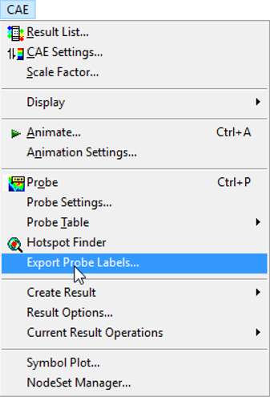

Export Probe Labels
===================

VCollab Pro users can export labels data into CSV (comma separated
values) file using **Export Probe Labels** option.

The following values are exported with a header row.

1. Model Name

2. Part Name

3. Node ID

4. Element ID

5. Position Coordinates (x, y, z)

6. Instance Name

7. CAE result name

8. Derived result name and

9. Result value

Example:

+------------------------------------------------------------------------+
| **Model,Part,NodeID,ElementID,Xpos,Ypos,Zpos,Instance,Result,Value**   |
|                                                                        |
| beam,1,248,396,80,9,10,L1M1,Displacement:Translational                 |
| Magnitude,8.57873                                                      |
|                                                                        |
| beam,1,364,282,28,12,5,L1M1,Displacement:Translational                 |
| Magnitude,1.40889                                                      |
|                                                                        |
| beam,1,182,379,16,12,10,L1M1,Displacement:Translational                |
| Magnitude,0.546442                                                     |
+------------------------------------------------------------------------+
                                               

**Steps to Export Probe Labels**

1. Load a CAX file

2. Find hotspots or probe the results manually

3. Click **CAE \| Export Probe Labels**...

|image1|

1. A file save dialog box opens. Enter a **filename** for the CSV file.

2. Click **Save**.

