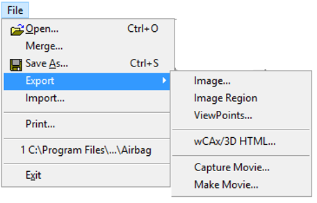
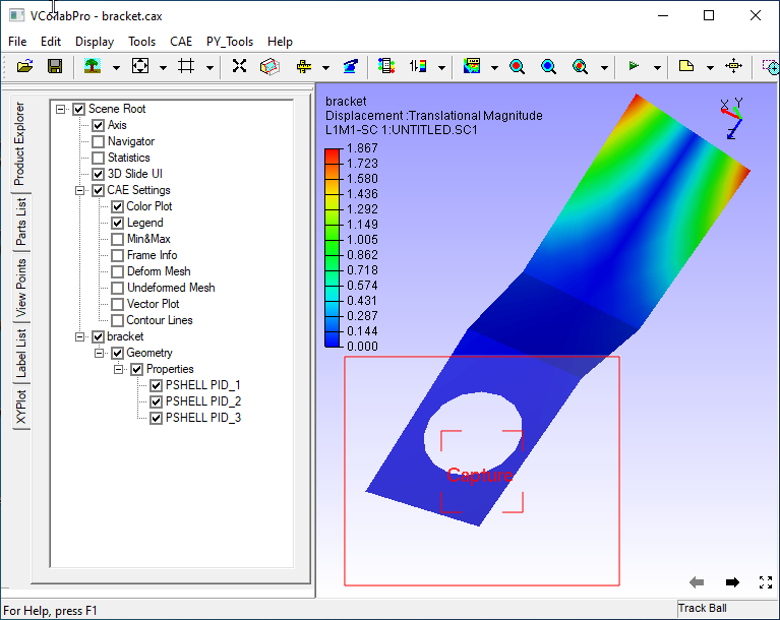
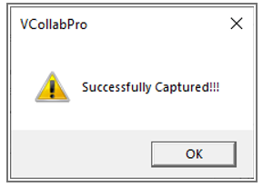
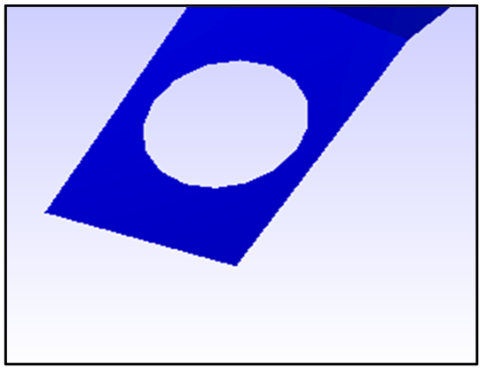
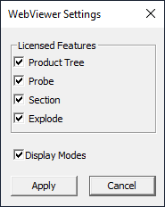
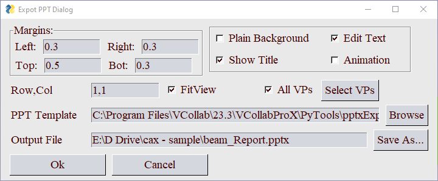

Exporting Images and Videos using Export
========================================

The various export options available in VCollab Pro are given below.

**Export Options**

                 |image0|

#.  **Export | Image:** Saves current view as an image in the following formats.

     -  Bitmap Image (\*.bmp)
     -  JPEG Image (\*.jpg, \*.jpeg)
     -  TIFF Image (\*.tiff, \*.tif)
     -  PNG Image (\*.png)

#.  **Export | Image Region:**  Allows users to select a portion of scene to be exported into image. 

    Users can resize the highlighted viewer portion using a mouse.

      **Window Selection**

                 |image1|

      **Exported Image**

                 |image2|

#. **Export | ViewPoints:** Users can export

     -  all viewpoints as images into a PPT(\*.ppt) file.
     -  all viewpoints in a vpt (\*.vpt) file.
     -  Filtered parts and results into a new cax (\*.cax) file.   

        - Parts or Geometry and Results available across all viewpoints will be saved into cax. 
        - Other parts and results will not be saved. 
     - Export to PPTx.

       |Export_PPTx|
             
       ========================================== =================================================================    
      
             **Left, Right, Top, Bot**            Left, Right, Top and Bottom margins to be set in PPT slide.
                                                                                
             **Plain Banckground**                A flag, used to change the background to plain before capturing the image.
      
             **Edit Text**                        Labels copied to PPT can be editable if the flag is checked.
      
             **Show Title**                       A flag, used to set title visibility in the PPT slide.
      
             **Animation**                        A flag, used to capture the animation as gif or a static image.
                                                                                
                                                                                
            **PPT Template**                      Powerpoint template (\*.pot) file path as an optional use.   
                                                                                
                                                                                
            **Output File**                          Output PPTx file path.          
                                                                                 
                                                                                
            **OK**                                 Creates PPTx file with the above attributes.              
                                                                                
          
                                                                                
           **Cancel**                             Cancels the process. 
       
       ========================================== =================================================================           
                                                         
It exports all viewpoints as images into Microsoft PowerPoint   
file, with viewpoint title. User can control the position and   
size of image.                                                  

#. **Export | wCAx/3D HTML:** Exports geometry with current scalar result and viewpoints data(selected by the user)  into a wCAX / 3D HTML file format. wCAX is compressed and filtered data for the web. Visible parts and used results across all viewpoints are exported into wCAX/3D HTML file.

                  |image3|

    The fields that appear in the Export wCAX/3D HTML panel are explained below

    +-----------------------------------+-----------------------------------+
    | **File Path**                     | Output *wCAX/3D HTML* file path   |
    +-----------------------------------+-----------------------------------+
    | **Viewpoints**                    | Allows user to select following   |
    |                                   | viewpoint export options,         |
    |                                   |                                   |
    |                                   | #. All Viewpaths                  |
    |                                   | #. Current Viewpath               |
    |                                   | #. Current Viewpoint              |
    |                                   | #. Current Display.               |
    |                                   | #. Selected Elements              |
    +-----------------------------------+-----------------------------------+
    | **Select**                        | This option is enabled only for   |
    |                                   | selected elements option. Allows  |
    |                                   | user to define a rectanglein the  |
    |                                   | viewer.                           |
    +-----------------------------------+-----------------------------------+
    | **Set Export Mode**               | This option is enabled only for   |
    |                                   | Current Viewpath option. Allows   |
    |                                   | user to set export mode 2D / 3D   |
    |                                   | for each viewpoint.               |
    +-----------------------------------+-----------------------------------+
    | **Thumbnail**                     | Stores thumbnail image for each   |
    |                                   | viewpoint.                        |
    +-----------------------------------+-----------------------------------+
    | **Store Normal**                  | Exports vertex normals into WCAX  |
    |                                   | file. It may increase the file    |
    |                                   | size.                             |
    +-----------------------------------+-----------------------------------+
    | **Password**                      | Enables password setup to WCAX    |
    |                                   | file.                             |
    +-----------------------------------+-----------------------------------+
    | **Compact**                       | Filters out duplicate data before |
    |                                   | exporting. This may take more time|
    |                                   | but will result in reduced file   |
    |                                   | size.                             |
    +-----------------------------------+-----------------------------------+
    | **Advanced Settings**             | This function pops up web viewer  |
    |                                   | options dialog. It contains       |
    |                                   | generic and premium feature On/Off|
    |                                   | functions. Based on that features |
    |                                   | enabled here, web viewer will     |
    |                                   | diplay relevant interfaces.       |
    +-----------------------------------+-----------------------------------+
    | **Save**                          | Saves wCAX / 3D HTML file         |
    +-----------------------------------+-----------------------------------+
    
    
    **Web Viewer Options**
    
    |image21|
    
    +--------------------+---------------------------------------------+
    | **Product Tree**   | If this option is checked, Product tree     |
    |                    | interface will be displayed in web viewer,  |
    |                    | otherwise not.                              |
    +--------------------+---------------------------------------------+
    | **Probe**          | If this option is checked, Probe            |
    |                    | interface will be displayed in web viewer,  |
    |                    | otherwise not.                              |
    +--------------------+---------------------------------------------+
    | **Section**        | If this option is checked, Section          |
    |                    | interface will be displayed in web viewer,  |
    |                    | otherwise not.                              |
    +--------------------+---------------------------------------------+
    | **Explode**        | If this option is checked, Explode          |
    |                    | interface will be displayed in web viewer,  |
    |                    | otherwise not.                              |
    +--------------------+---------------------------------------------+
    | **DisplayModes**   | If this option is checked, Display Modes    |
    |                    | interface will be displayed in web viewer,  |
    |                    | otherwise not.                              |
    +--------------------+---------------------------------------------+
    | **Apply**          | Sets these options to be carried out.       |
    +--------------------+---------------------------------------------+
    

    .. note::

      - Deletion of results will affect existing viewpoints. Those affected viewpoints will be ignored while 
        exporting into wCAX / 3D HTML. Users need to be sure before deleting any result. 
      - Animation state will be ignored if the **Current Display** option is selected.
      - In the **Current Display** option, unchecking **Thumbnail** option helps to reduce wCAX/HTML file 
        size significantly.
      - In "WebViewer Settings" dialog, Premium features *Product Tree*, *Probe*, *Section* and *Explode* options will be disabled as below, if corresponding licenses are not available.
      
        |image22|
        

5. **Export | Capture Movie:** Captures all frames from viewer between start recording and stop recording. It exports them into an animated gif/avi/mp4 file.

    *Capture Movie panel*

      |image4|

   
    The fields that appear in Capture Movie Panel are explained below

        +--------------------+---------------------------------------------+
        | **File Name**      | Output movie file name with path.           |
        +--------------------+---------------------------------------------+
        | **Video Settings   |  Control the speed by specifying            |  
        | Speed Slider**     |  number of frames per second                |
        +--------------------+---------------------------------------------+
        | **Capture**        | Buttons to start and stop recording         |
        |                    | the movie.                                  |
        +--------------------+---------------------------------------------+
        | **Close**          | Closes panel.                               |
        +--------------------+---------------------------------------------+

6. **Export | Make Movie:** This additional feature creates a single animated gif/avi/mp4 file from a set of external images.

      *Make Movie panel*

                 |image5|

      The fields appearing in the Make Movie Panel are explained below

      +---------------------------+-----------------------------------+
      | **Input**                 | Input path for the folder that    |
      |                           | contains set of images..          |
      +---------------------------+-----------------------------------+
      | **Output File**           | Output path and file name.        |
      +---------------------------+-----------------------------------+
      | **Video Settings**        | Allows user to control the        |
      |                           | speed.                            |
      +---------------------------+-----------------------------------+
      | **Create**                | Creates the movie.                |
      +---------------------------+-----------------------------------+
      | **Close**                 | Closes panel                      |
      +---------------------------+-----------------------------------+

      .. note::

          Before making a movie, make sure that the following constraints are met:

          -  All images in the folder should be of same format.
          -  The image folder should contain images for one dataset.
          -  Filename of images should have two string parts,

             - One part is common name for all images
             - The other part should be of numerical index. This unique string plays the role of arranging the 
                frames in a proper order.
             - This index part should be either first part or the last part of the file name.

**Steps to export as Image**

-  Click **File | Export | Image,** which opens Save As dialog box as below.

                   |image6|

-  Choose a file type.
-  Provide a file name and click **Save.**

**Steps to export using  Capture Movie**

-  Click **File | Export | Capture Movie...**
-  Provide file path and name in the  Capture Movie dialog box. 

                   |image7|

-  Click Record  |icon1| to start capturing. .
-  Record your actions on the model. 
-  Click Stop |icon2| . 
-  Wait for the “Successfully Captured”  message box to appear. 

                   |image8|

-  Click **OK** to finish the process. 
-  Below is a sample movie created in VCollab Pro.

                   |image9|

 .. note::
 
    If output file type is of image, all frames will be saved as image files.

**Steps to make a movie from external images**

-  Click **File | Export | Make Movie...** which opens up the Make Movie From External Images panel. 

                   |image10|

-  Select the input folder that contains a set of images. 
-  Provide output file name. 
-  Modify  speed if necessary. 
-  Click **Create** and expect a message box as below.

                    |image11|

-  Click 'OK' to finish the process.

**Steps to export Viewpoints to PPT**

                    |image12|

-  Click **File | Export | ViewPoints** to open **Save file** dialog box
-  Select the file type as* **.ppt.**
-  Enter a file name.
-  Click **Save,** which opens up a dialog which asks for a PowerPoint template (\*.pot)
-  Click **Yes** to provide a template.
-  Click **No** to continue without template.

Now all the viewpoint states are inserted as images into PowerPoint. First slide is left as an empty page for the title of the presentation. If a viewpoint contains CAE Animation state, animation will be captured as an animated gif in the ppt file.

**Steps to save viewpoints data into a new CAX file**

-  Click **File | Export | ViewPoints**  
-  Select file type as \* **.cax**
-  Enter a filename.
-  Click **Save.**

Necessary geometry and results will be stored into the new CAX file.

**Steps to export a portion of scene using Image Region**

- Click **File | Export | Image Region**
- Viewers will be highlighted with a semi transparent editable window.

                     |image13|

- Move the cursor to the borders of the window to find Resize and Move cursor icons 
- Resize and position the window as required.
- Click **Capture,** in the centre of the window.
- File browser dialog will open up.

The captured portion of the scene is exported as an image.

                     |image14|

**Steps to export selected elements using wCAx/ 3D HTML option**

- Click **File | Export|wCAx / 3D HTML** to open the panel as shown below

                      |image15|

- Browse and select the output wcax or html file path 
- Click **Selected Elements** in the drop down list.

  This enables **Select** button which can be used to define a rectangular region in the viewer.

                       |image16|

- Click **Select**
- Define a rectangular region in the viewer using mouse left button drag.

                      |image17|

- Elements inside the box region will be considered for export.

                      |image18|

- Orient the model to visualize the depth of box.

                      |image19|

- The box can be resized by clicking on the side planes and dragging with the mouse left button.

  .. raw:: html

    <video width="320" height="240" controls >
     <source src="JPGImages/Selected_Elements.mp4" type="video/webm">
     Your browser does not support the video tag.
     </video>

- Enable **Thumbnail** option to capture the region selection as thumbnail image.
- Click **Save.**

.. |image2| image:: JPGImages/Exportimage_zoom.png

.. |image20| image:: JPGImages/Selected_Elements.mp4

.. |icon1| image:: icons/Animator_09.jpg
.. |icon2| image:: icons/Animator_06.jpg

             
     
