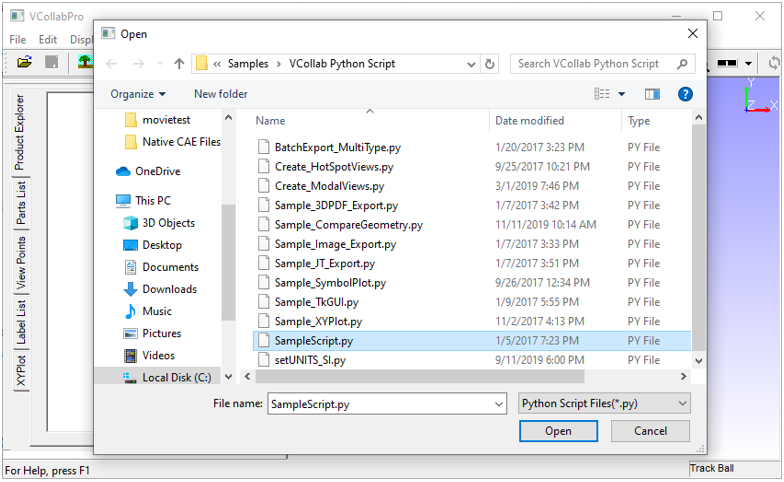

Import
======

VCollab users can import the following file types using the **Import** option:

**Supported files and data**

-  \*.py (python script file to run set of commands)

-  \*.csv (User defined result file )

-  \*.vpt (Viewpoints file)

-  \*.cax (Result data from cax file)

**Importing Python script file**

#. Launch **VCollabPro** application.
#. Click **File | Import** option.
#. Under *Files of Type*, select Python Script Files (* **.py**).

             |image1|
#. Select a python script file. 
#. Click **Open** to run the script.

  
**Importing viewpoints**

#. Launch **VCollabPro** application.
#. Load a CAX (\*.cax) file
#. Click **File \| Import** option.
#. Select **Files of Type** as VCollab Files (**\*.vpt**) or
   VCollab Files (**\*.cax**).
#. Select a file.
#. Click **Open** to import all view paths from the external file.

**Importing CAE Results**

  VCollab Pro supports importing of external CAE results from CSV files. These  results are added as new results or instances of existing results. VCollab Pro imports results only for the *visible parts* based on node or element numbers

   Sample CSV File

   +----------------------------------------------------------------------------------------------------+
   |     #VCOLLAB_RESULTS                                                                               |
   |                                                                                                    |
   |     Node,Displacement,Stress,                                                                      |
   |                                                                                                    |
   |     Vector,Tensor,                                                                                 |
   |                                                                                                    |
   |                                                                                                    |
   |     #INSTANCE,L1M1,Label:Step1,Time:0.1                                                            |
   |                                                                                                    |
   |     1818,0.000000,0.000000,0.000000,0.401617,-0.543105,-0.496605, 0.016011,1.541499,-0.090037,     |
   |                                                                                                    |
   |     1848,0.000000,0.000000,0.000000,-0.330866,-0.389335,-0.527343,-0.010698,1.284187,-0.019899,    |
   |                                                                                                    |
   |     1845,0.000000,0.000000,0.000000,-0.486035,-0.668757,-0.667392,-0.024487,1.603551,-0.030750,    |
   |                                                                                                    |
   |                                                                                                    |
   |     #INSTANCE,L2M1,Label:Step2,Time:0.2                                                            |
   |                                                                                                    |
   |     1818,-0.543105,-0.496605, 0.016011,1.541499,0.000000,0.000000,0.000000,0.401617,-0.090037,     |
   |                                                                                                    |
   |     1848,-0.010698,1.284187,-0.0198990.000000,0.000000,0.000000,-0.330866,-0.389335,-0.527343,     |
   |                                                                                                    |
   |     1845,0.000000,0.000000,-0.486035,-0.6687570.000000,0.000000,0.000000,-0.486035,-0.668757,      |
   |                                                                                                    |
   +----------------------------------------------------------------------------------------------------+

   
   CSV File Format

   +-------------+----------------------------------------+---------------------------------------------+
   | **Line No** | **Description**                        | **Example**                                 |
   +-------------+----------------------------------------+---------------------------------------------+
   |    1        | #VCOLLAB_RESULTS                       | Header line to identify VCollab CSV format. |
   +-------------+----------------------------------------+---------------------------------------------+
   |    2        | Node/Element, Result1, Result2,....    | Use Node for nodal result and Element for   |
   |             |                                        | elemental result. All results should be of  |
   |             |                                        | same type.                                  |
   +-------------+----------------------------------------+---------------------------------------------+
   |    3        | Result Types for each result.          | Scalar / Vector / SixDof / Tensor           |
   |             |                                        | For complex results:                        |
   |             |                                        | Scalr_RI / Vector_RI / SixDof_RI / Tensor_RI|
   +-------------+----------------------------------------+---------------------------------------------+
   |    4        | #INSTANCE,                             | Each attribute should have key and value    |
   |             | [Instance_name1],                      | separated by ':'                            |
   |             | Instance attributes                    | For example,                                |
   |             |                                        | Time: 1.0, Label:Step-1,                    |
   +-------------+----------------------------------------+---------------------------------------------+
   |    5        | node/element ID                        |                                             |
   |             | value1, value2,                        |                                             |
   |             | value3,....                            |                                             |
   |             |                                        |                                             |
   +-------------+----------------------------------------+---------------------------------------------+
   |    6        | node/element ID                        |                                             |
   |             | value1, value2,                        |                                             |
   |             | value3,....                            |                                             |
   |             |                                        |                                             |
   +-------------+----------------------------------------+---------------------------------------------+
   |    7        | node/element ID                        |                                             |
   |             | value1, value2,                        |                                             |
   |             | value3,....                            |                                             |
   |             |                                        |                                             |
   +-------------+----------------------------------------+---------------------------------------------+
   |             |   #INSTANCE,                           |                                             |
   |             |   [Instance_name2],Instance            |    Multiple instances are supported         |
   |    ...      |   attributes                           |                                             |
   |             |                                        |                                             |
   +-------------+----------------------------------------+---------------------------------------------+
   |             |                                        |                                             |
   |             |                                        |                                             |
   |    ...      |       ...                              |             ...                             |
   |             |                                        |                                             |
   +-------------+----------------------------------------+---------------------------------------------+
   |             | node/element ID                        |                                             |
   |    ...      | value1, value2,                        |                                             |
   |             | value3,....                            |                                             |
   |             |                                        |                                             |
   +-------------+----------------------------------------+---------------------------------------------+
   |             | node/element ID                        |                                             |
   |    ...      | value1, value2,                        |                                             |
   |             | value3,....                            |                                             |
   |             |                                        |                                             |
   +-------------+----------------------------------------+---------------------------------------------+
   |             | node/element ID                        |                                             |
   |    ...      | value1, value2,                        |                                             |
   |             | value3,....                            |                                             |
   |             |                                        |                                             |
   +-------------+----------------------------------------+---------------------------------------------+
   |             |                                        |                                             |
   |    ...      |                                        |                                             |
   |             |                                        |                                             |
   |             |                                        |                                             |
   +-------------+----------------------------------------+---------------------------------------------+

  .. note::
      From VCollab Pro 19.0, CSV format is modified to support multiple instances and complex results. Old format is also supported.

  **Result Types**

  Number of columns in the CSV file is based on the result type. For example, Vector result is expected to have 3 columns. Refer to the table below for the different result 
  types and their corresponding number of columns.
 
 
     +--------------------------------------+---------------------------------------+
     |                                      |   Number of Columns                   |
     |     Supported Result Types           |   (Components)                        |
     +--------------------------------------+---------------------------------------+
     |     Scalar                           |       1                               |
     +--------------------------------------+---------------------------------------+
     |     Vector                           |       3                               |
     +--------------------------------------+---------------------------------------+
     |      SixDof                          |       6                               |
     +--------------------------------------+---------------------------------------+
     |      Tensor                          |       6                               |
     +--------------------------------------+---------------------------------------+
     |     Scalar_RI                        |       2                               |
     +--------------------------------------+---------------------------------------+
     |     Vector_RI                        |       6                               |
     +--------------------------------------+---------------------------------------+
     |     SixDof_RI                        |       12                              |
     +--------------------------------------+---------------------------------------+
     |     Tensor_RI                        |       12                              |
     +--------------------------------------+---------------------------------------+
     |   \*For complex results first set    |                                       |
     |   is real, followed by imaginary set.|                                       |
     +--------------------------------------+---------------------------------------+

    
   .. note::
      Import CSV results may not work for features like cut section, iso-surface, etc.

  **Python API Support**

    VCollab Pro provides the following methods to export and import result instances.

     #. xExportCAEResult(ouput_file_path, result_list,instance_list, precision, scientific_format);
     #. xImportCAEResult(csv_file_path);

    Refer to VCollab Pro API manual available in the local installation folder for usage and syntax.

  **Steps to import CAE result files**                                                                        
   
    #. Launch VCollab Pro application.
    #. Load a CAX (\*.cax) file
    #. Click File | Import option which opens a file browser dialog box
    #. Under Files of Type select Result Files (\*.csv)
    #. Select a VCollab Pro supported CSV file.
    #. Click Open to import all CAE results.
    #. Check CAE | Results List for the result name / instance name.

 
                                                     
                      
