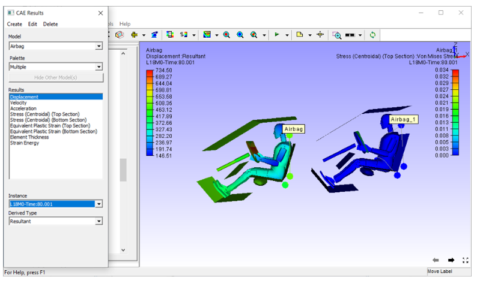

Merging 
=======

The **Merge** option enables the user to merge another CAX model in the existing scene.  
Using the **Merge** option, users can:
           
- Merge any CAD / CAE data and compare the geometry or the CAE information 
- View CAE information for one model at a time
- Select and apply corresponding CAE information for each model using the Result List panel.
- Have a better view (if both the models’ dimension range is same)
- Use transparency or Hide/Show option if any model is hidden behind or inside the other model.

..  `Steps for merging a CAX model into the existing scene`_

..  `How to Merge Hotspot files?`_

..  `CAE Information`_

  
By default, CAE Legend is displayed for the latest merged model. Users can select and apply CAE Information to any other existing model.

**Steps for merging a CAX model into the existing scene**

- Go to *File|Open* and load an input CAX file as the initial model. This example uses the 'Airbag.CAX' 
  model from the sample folder.    

              |image1|

- Click *File | Merge* to select and open  'Airbag.CAX' model from the samples folder.  

- The selected model can be seen merged in the scene as shown below.    

               |image2|

File types supported in **Merge**
                                                                                                             
-  CAX files                                                          
                                                                      
   -  extension *(*.cax)*
                                                                      
-  vpt files                                                          
                                                                      
   -  vpt file contains viewpoints and its states only                
   -  extension *(*.vpt)*                                              
                                                                      
-  hotspot files                                                      
                                                                      
   -  hotspot file contains list of IDs only.                         
   -  extension *(*.hotspot)*   

.. note::

 - If any geometry is hidden or coincides with another geometry, use the below options:

   - *Transform* option in Product Explorer context menu.

   - *Transparency* or *Wire Frame* in Edit | Display mode.

 - Users can set and customize some properties for merging a file. Click merge settings to know more.

**How to Merge Hotspot files?**

 A hotspot file contains IDs and Results in a tabular format. It is mandatory for hotspot files to have an ID field. It can have more result fields in addition.

 Typical format of hotspot file:

  +-----+------------------+-----------------+-----------+ 
  | ID  | "Reaction Force" | "Displacement"  | "Stress"  |
  +-----+------------------+-----------------+-----------+
  | 217 |  23              |  0 .6           |  41672    |
  +-----+------------------+-----------------+-----------+
  | 123 |  29              |  1.2            |  34567    |
  +-----+------------------+-----------------+-----------+
  | 51  |  54              |  0.7            |  43252    |
  +-----+------------------+-----------------+-----------+ 
 If the hotspot file has result fields, VCollab Pro opens up Merge Hotspot dialog to select required results.

 The steps for Merging hotspot files are explained below

 - Click *File | Merge*

 - The file browser dialog box opens up. Select a hotspot file (*.hotspot). If it contains result fields in addition to the ID field, it opens up a Merge Hotspot dialog box.

               |image3|

 - Filter the results by moving unwanted results to the right side using the arrow buttons and Click OK. Hotspot IDs are displayed as labels with result information.         

        |image4|
                                                                                                                         
                                                                      
**Steps to select and set current CAE Model**

- Click **CAE | Result List**  
- Select **Airbag_1** as below. 

              |image5|

- The CAE information corresponding to the current model is applied.

              |image6|
                                                        

