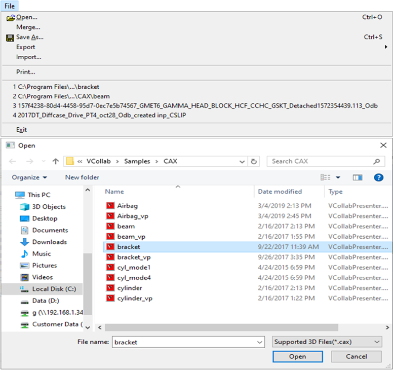
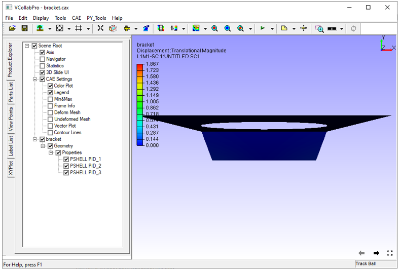

Loading CAX File
================

The command *File | Open* allows  to load a CAX file in VCollab Pro.

**Steps for loading a CAX file**

 - Click **File | Open,** which opens up the file open dialog box. 
 - Browse and Select a CAX file. Click **Open.**

               |opendialogbox|

 -  On loading, the CAX model appears as shown below

               |loadmodel|

.. note::

    The file is loaded with following defaults,

  - First CAE result if it is a CAX model
  - First user defined viewpoint if CAX model contains viewpoints.
  - Otherwise loads according to profile.

  

