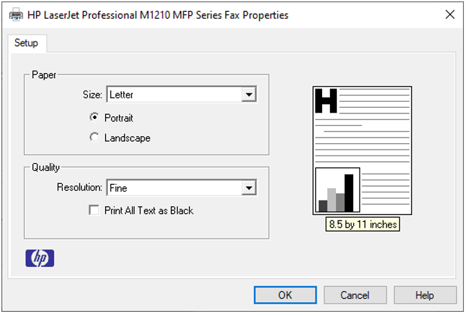

Print Setup
===========

The Print Setup option allows users to set the paper size, orientation, etc. before printing.

- Click **File | Print Setup** to open the  Print Setup dialog.

       |image1|

- Select a paper size, from the drop down list 
- Select orientation as either **Portrait** or **Landscape** 
- Click **OK** to proceed with printing. 

