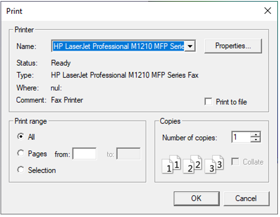

Print
=====

To print a document in VCollab, follow the steps below:

-  Click **File | Print**

    |image1|

- Select **Name** of the printer which needs to print the document.
- Set **printer properties** if needed
- To print the document into a file check **Print to file.**
- Specify the **page** numbers or the entire document that needs to be printed
- Specify the number of **copies** that needs to be printed.
- Click **OK.**

