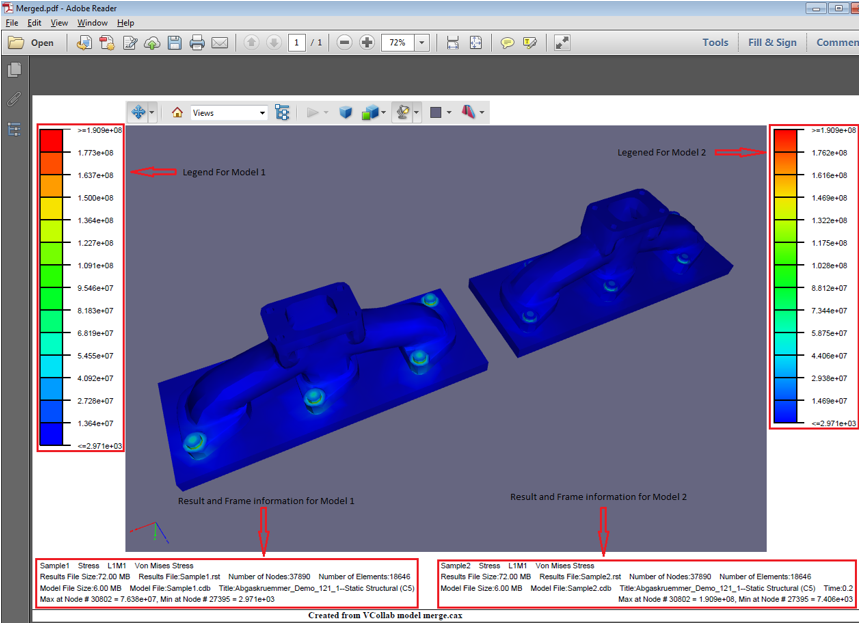

Save As
=======
VCollab users can save the existing files into one of the following 3D file formats:

-  VCollab file (\*.cax)
-  VRML 2.0 file (\*.wrl)
-  STL files (\*.stl)
-  Hotspot files (\*.hotspot)
-  MS Power Point Presentation (\*.ppt)
-  3DPDF(\*.pdf)
-  JT (\*.jt)

**Limitations**

    +-----------------------------------+-----------------------------------+
    | **Format**                        | **Limitation**                    |
    +-----------------------------------+-----------------------------------+
    | **CAX**                           |    Saving of adaptive shared      |
    |                                   |    meshes is not supported in     |
    |                                   |    this version.                  |
    +-----------------------------------+-----------------------------------+
    | **3DPDF**                         |    Color is not supported for     |
    |                                   |    Points.                        |
    +-----------------------------------+-----------------------------------+
    | **JT**                            |    Points are not supported.      |
    +-----------------------------------+-----------------------------------+
    | **FBX**                           |Points and lines are not supported.|
    +-----------------------------------+-----------------------------------+

.. note:: 

    - User can save the contents into a new cax file, but not in the same (loaded) file.
    - VCollab Pro saves viewpoints data into CAX format.
    - Saving 3DPDF and JT formats are license based options.
    - User can delete some parts or groups of parts and save the file in the above formats.
    - VRML, JT, 3DPDF and STL files are saved with deformed geometry if deformation is applied.

**Steps for saving as a new CAX file**

    -  Click **File| Open** to load a file

    -  Click **File | Save As.**

          |saveas|

    -  Select VCollab CAX Files(\*.CAX) from the **Save as type** drop down list
    -  Enter a new file name.
    -  Click **Save**.
    -  The following message appears once the file is saved..

          |filesavemsg| 

**Other file types supported for Saving in VCollab Pro**

 -  **VRML 2.0 file (\*.wrl) :** Saves the file as a vrml file.  

 -  **STL file (.stl) :** Saves the file as a STereoLithography Ascii file. It only contains a 
    triangulated surface geometry.  

 -  **Hotspot file (.hotspot):** Saves the probed or hotspot found nodal or elemental IDs into an ASCII 
    format. This file can be imported to another CAX file. 

 -  **MS Power Point Presentation (.ppt) file :** Saves the file as a CAX embedded PPT file. The PPT will contain the CAX file link, not the CAX file. When sharing this PPT file, the CAX file will also need to be sent along.

 -  **3DPDF file (.pdf) :**
    Saves the current scene as a 3DPDF file. 
    
    VCollab Pro writes the following data

         -  Geometry,
         -  Material Color / CAE Color
         -  CAE Legend
         -  Frame Info
         -  Probed Labels (Current Result-Derived Type is only supported.Other types are ignored.)
    The Legend, Result and Frame Information are shown in 3DPDF for   merged models as below,

          |legendandframe| 

    While exporting into 3DPDF, the number of legends allowed is 2 . If more than 2 CAE models are merged, then users can select **Combined** or **Active Model** as the **Palette** in CAE Results dialog box as shown below.

           |CAE| 

    .. note::
 
        Adobe Reader XI or above is required to view these 3DPDF files.

 - **FBX :** Saves the file in a * .fbx (Flimbox file format)

 -  **JT:** Exports JT 9.5 (*.jt) files and saves the 3D model with the derived result color plot as a JT file. In case of CAD files, VCollab Pro saves the current scene as JT.
 
        The Result Information is added in the Product Tree of JT models as   shown below,

            |jtmodel|

        While exporting into JT, the number of legends allowed is 1 . If more than 1 CAE models are merged, then users can select **Combined** or **Active Model** as the **Palette** in CAE Results dialog box as shown below,

           |CAE1| 

        .. note::
            
            JT2Go 10.1.2 or above is required to view these JT files

.. |filesavemsg| image:: JPGImages/filesaved_dialogbox.png

.. |CAE| image:: JPGImages/saveAS_CAE_dialogbox.png

.. |CAE1| image:: JPGImages/saveAS_CAE_dialogbox.png
