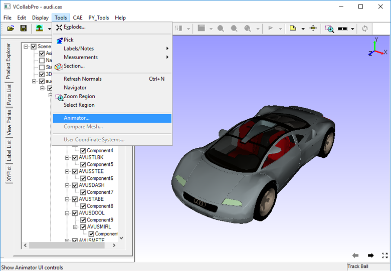
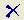
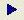
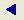
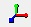
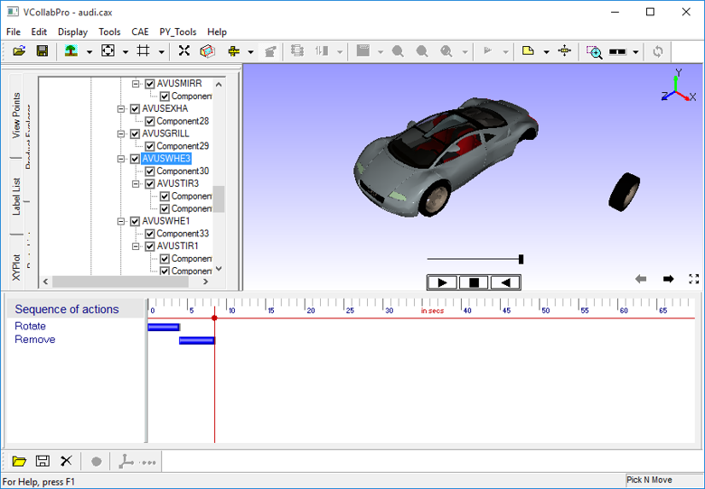
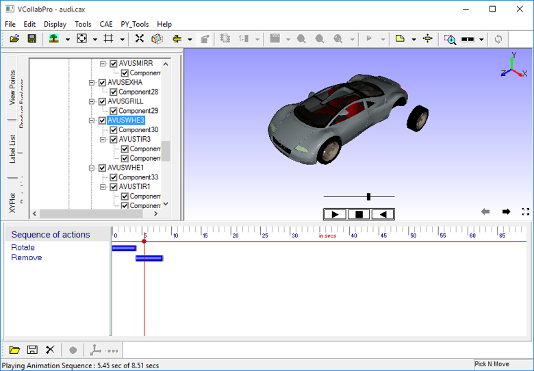

Animator
=========

VCollab Pro users can create animations to show component or design
functions like assembly, disassembly, etc using the **Animator** tool.

The Animator tool needs a separate license file to get activated.

**Steps to open animator window**

1. Load any model in VCollab Pro

2. Click **Tools \| Animator** to open the Animator player and toolbar

|image1|

|image2|

**Steps to hide Animator Player control display**

-  Right click inside the viewer window to open the context menu.

-  Click **Animator Player** to hide or show.

Animator Toolbar
----------------

|image3|

Animator tools:

 |image4| - Open animator file.  
 
 |image5| - Save Animator File                                       
                                                                      
 |image6| - Clear the sequence                                        
                                                                      
 |image7| - Play the sequence                                         
                                                                      
 |image8| - Stop the sequence                                         
                                                                      
 |image9| - Reverse play sequence                                     
                                                                      
 |image10| - Pause the sequence                                        
                                                                      
 |image11| - Capture action from pick and move                         
                                                                      
 |image12| - Show axis for pick and move part                          
                                                                      
 |image13| - Open authoring action dialog (authoring through GUI)      
                                                                     
 
Animator viewer window
----------------------
                                                                      
 |image14|                                                            
                                                                      
Author Action Dialog
--------------------
                                                                      
 |image15|                                                            
                                                                      
 The various fields and controls available in the Author Action       
 dialog box are explained below.

+-----------------------+---------------------------------------------+
| **Part/Assembly**     | Name of a part/assembly selected.           |
+-----------------------+---------------------------------------------+
| **Define New Action** | New action name (unique name).              |
+-----------------------+---------------------------------------------+
| **Defined Actions**   | List of actions defined for selected        |
|                       | part/assembly.                              |
+-----------------------+---------------------------------------------+
| **Pattern Use(d)**    | Pattern used for this particular action.    |
+-----------------------+---------------------------------------------+
| **Editor Window**     | Edit basic action (translation and          |
|                       | rotation) parameters to author a new        |
|                       | action.                                     |
+-----------------------+---------------------------------------------+
| **Preview**           | Preview the new or defined action.          |
+-----------------------+---------------------------------------------+
| **Reset**             | Reset to default values of current action.  |
+-----------------------+---------------------------------------------+
| **Apply**             | Assign the action to part/assembly          |
|                       | selected.                                   |
+-----------------------+---------------------------------------------+
| **Close**             | Close the dialog.                           |
+-----------------------+---------------------------------------------+

Author Action
-------------

 Authoring an action can be done in several ways:

  - Through pick and move

    - Not using axis control

    - Using axis control

  - Through GUI.

 **Steps for authoring an action through pick and move, not using axis control**

 - Pick a part or an assembly by clicking in the viewer window or from
   the product explorer.
   
 - Pan, rotate, or zoom using the left, right, or middle mouse button.
 
 - Click **Capture** |image16| to capture action.

 - Follow steps from 1 to 3 to continue capturing other actions.
   
   The below image shows authoring action without using axis control.

                     |image17|

 **Steps for authoring an action through pick and move, using axis control**

   - Pick a part or an assembly by clicking in the viewer window or from the product explorer.

   - Click to enable the axis at the picked part/assembly.

   - Move the mouse over the axis to highlight the axis.

   - Rotate or move parts by holding the left or right mouse button.

   - Offset axis using the middle mouse button.

   - Follow steps from 1 to 5 to continue capturing other actions.

   The below image shows authoring action using axis control.

                       |image18|

   The below image shows authoring through Pick and Move, using axis
   (selected axis is highlighted)

                       |image19|

 **Steps for authoring an action through GUI**

   - Pick a part or an assembly by clicking in the viewer window or from the product explorer.

   - Click **Show authoring action** |image20| button in the Animator  panel

   - Give a **name** to record new action

   - Select an action from the Pattern Use(d) drop down list.

   - Edit basic action axis and its value.

   - Preview the action using the Preview button.

   - **Apply** the action to a selected part/assembly.

   The below image shows authoring through GUI

                    |image21|

**Steps to do sequencing**

All authored actions are added to a sequence. Users can change the order
or change the time of action using the sequence viewer graphically.

   The image below shows a sequence with 2 actions, Move and Rotate part
   AVUSWHE1.

                   |image22|

The image below shows a Sequence in which order of actions are changed.

                   |image23|

The image below shows a Sequence in which duration of actions are
changed.

                    |image24|

**Steps to control a Sequence**

After creating the sequence, users can do several operations using
Player Control 

 |image25|

-  play

-  reverse play

-  pause and

-  stop

Reverse play enables the user to play animation in reverse without
authoring that animation.

For example, if user authors disassembly, then he can animate assembly
by reverse play.

**Steps to save and retrieve a sequence**

-  Once a sequence is ready click **Save**

                    |image26|

-  Enter a filename with extension .\ **seq** and click **Save**.

-  Click **Open** to retrieve or load a sequence.

                     |image27|

-  Select a file with extension **.seq** and click **Open**

.. |image25| image:: JPGImages/tools_Animator_controller.png

  
