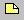
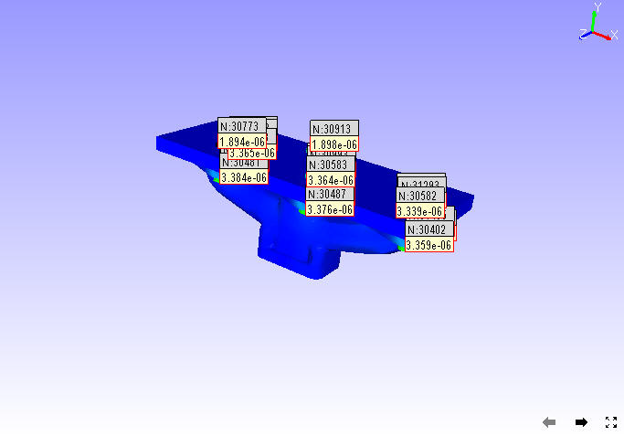
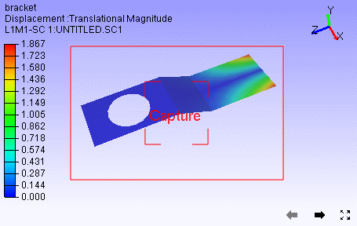
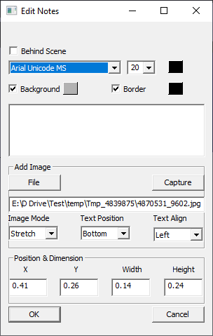
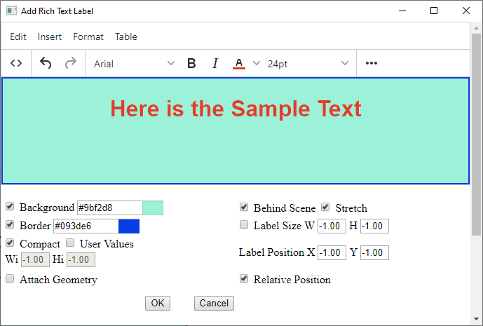
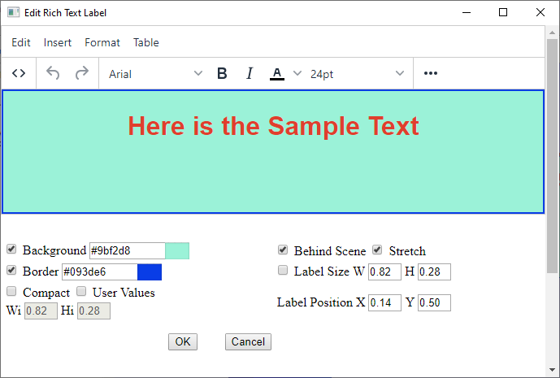

Label/Notes
============

Types of Labels:
----------------
                                      
                                                                          
    #. User Notes                                        
                                                                          
       -  Annotation to Geometry:                                         
                                                                          
          These labels are created by user as an observation which is     
          annotated to a particular part or element or node. A line       
          connects the label and geometry. Labels are moving according to 
          part or view transformation.    
          Image Labels have text as well as image data.
                                                                                                                                        
                                                                          
       -  Annotation to Scene:                                            
                                                                          
          These labels are created by user as an observation which is     
          annotated to the current view or scene. Labels are fixed in     
          screen either by absolute or relative to the viewport size.     
          Absolute position labels will be clipped if viewport is resized 
          down.                                                           
                                                                          
    #. Model Name Labels                                       
                                                                          
       These labels displays model name if more than one model is merged. 
                                                                          
    #. Part Property Labels                                      
                                                                          
       These labels displays part properties and user defined part        
       attributes. By default it displays Part Name.                      
                                                                          
    #. Probe Labels                                        
                                                                          
       These labels are generated to display result values on user probe  
       on Node or element IDs.                                            
                                                                          
    #. Measurement Labels                                       
                                                                          
       All measurement values are displayed in labels. These are          
       generated using `Measure <Measurement.html>`__ module.                                      
                                                                          
    #. Image Labels                                       
                                                                          
       Image labels function helps user to add relevant images to the scene or viewpoint and improves the reporting experience. 
   
    #. Rich Text Labels

       User can add rich texts, tables, images and links in Rich Text Labels. This can be considered as advanced Image labels.
       
Notes are added by users for better understanding of product features
and parts. VCollab Pro users can add a note or annotation to any part
using the **Label/Notes** option found under the Tools menu.

|image1|

The various options found under Labels/Notes are explained below

+------------------------------+--------------------------------------+
| **Add Notes...**             | Creates a new note                   |
+------------------------------+--------------------------------------+
| **Move Labels/Notes**        | Moves existing note or label in      |
|                              | viewer from one position to another  |
+------------------------------+--------------------------------------+
| **Delete Labels/Notes**      | Deletes the selected labels or notes |
+------------------------------+--------------------------------------+
| **Hide Labels/Notes**        | Hides the selected label or notes.   |
+------------------------------+--------------------------------------+
| **Show Visible Labels Only** | Displays visible labels only.        |
|                              | Applicable to probed labels and      |
|                              | annotated notes                      |
+------------------------------+--------------------------------------+
| **Auto Visible Labels**      | Shows visible labels only when the   |
|                              | user interacts. Applicable to probed |
|                              | labels and annotated notes           |
+------------------------------+--------------------------------------+
| **Show All Labels**          | Shows all labels independent of      |
|                              | attached position visibility         |
+------------------------------+--------------------------------------+
| **Hide All Labels**          | Hides all labels                     |
+------------------------------+--------------------------------------+
| **Delete All Labels**        | Deletes all existing labels          |
+------------------------------+--------------------------------------+
| **Delete All Hidden Labels** | Deletes all hidden labels            |
+------------------------------+--------------------------------------+
| **Invert Show Labels**       | Inverts labels visibility            |
+------------------------------+--------------------------------------+
| **Fit Labels**               | Fits all labels inside viewer        |
+------------------------------+--------------------------------------+
| **Auto Fit Labels**          | Fits all labels inside the viewer    |
|                              | during scene rotation, zoom and pan  |
+------------------------------+--------------------------------------+
| **Arrange Labels**           | Arranges all labels and tables in    |
|                              | multiple rows according to their     |
|                              | respective position in the model     |
+------------------------------+--------------------------------------+
| **Auto Arrange Labels**      | Arranges all labels automatically    |
|                              | whenever user modifies the label or  |
|                              | table dimensions                     |
+------------------------------+--------------------------------------+
| **Show Model Labels**        | Shows Model names which is useful    |
|                              | while merging models                 |
+------------------------------+--------------------------------------+
| **Show Probed Parts**        | Shows the parts which have probed    |
|                              | labels and hides other parts         |
+------------------------------+--------------------------------------+
| **Rank Probe Labels**        | Ranking the labels based on values   |
|                              | either in ascending or descending    |
|                              | order. Applicable only for current   |
|                              | derived probe type labels            |
+------------------------------+--------------------------------------+
| **Settings...**              | Opens up common label settings       |
|                              | dialog for users to modify font,     |
|                              | background, border and colors for    |
|                              | all types of labels.                 |
+------------------------------+--------------------------------------+

Label Settings Panel
--------------------

|image2|

The various tabs available in the Label settings panel are explained
below.

+-----------------+---------------------------------------------------+
| **Values tab**  | Applicable for CAE Probe label value cells.       |
+-----------------+---------------------------------------------------+
| **Headers tab** | Applicable for CAE Probe label header cells (Row  |
|                 | header, Column header and Header Legend table)    |
+-----------------+---------------------------------------------------+
| **Others tab**  | Applicable for measurement labels.                |
+-----------------+---------------------------------------------------+

|image3|

.. note::                                                          
                                                                          
   -  Modifications will be applied to **all** *Probe* labels and     
      *Measurement* labels.                                           
                                                                     
   -  To format individual probe label, use label context menu. 
   

**Steps to create a note for a specific part**

-  Click T\ **ools \| Labels/Notes \| Add Notes..** OR

-  Click **Add Notes** icon |image4|\ available in the toolbar.

-  The **Add Notes** dialog box opens up. Check the option **Attach Geometry**.

   |image5|

-  Enter your note in the edit text box provided

   |image6|

-  Select the font, size and color for the text.

-  Check or uncheck Background and Border options if necessary. Select
   the color for **Background**, **Border** and **Text** from the
   corresponding color window.

-  Click **OK**.

-  Click in the viewer window to place the label as required.

-  A connecting line is visible between label position and mouse
   pointer.

-  Click a point on the specific part. The label will be seen attached.

   |image7|
   
**Steps to add a note to the scene**

-  Click **Tools | Labels/Notes | Add Notes.**. OR

-  Click **Add Notes** icon |image8| available in the toolbar.

-  The **Add Notes** dialog box opens up.

   |image9|

-  Enter your note in the edit text box provided

-  Uncheck the option **Attach Geometry**

-  Relative Position option appears.It will keep the label relative to
   viewport margins.

-  Check **Relative Position** if necessary.

   |image10|

-  If not selected, a constant distance between label position and top
   left corner of view port will be maintained.

-  Click **OK**.

-  Click anywhere in the viewer window to place the label as required.

   |image11|

-  **Behind Scene** option sends the user notes behind the model.
   |image_behind_scene|
   
**Steps to edit user notes**

-  Double click on a label to open **Edit Notes** dialog box

   |image12|

-  Edit the contents and formats.

-  Click **OK**

   |image13|

   |image14|

**Steps to move an existing label**

-  Click **Tools \| Labels/Notes \| Move Labels/Notes** OR

-  Click **Move Labels/Notes** icon |image15| available in the toolbar
   to enable it.

-  Drag the concerned label or annotation in the viewer.

-  Release the mouse after label position is shifted.

-  Click the **Move Labels/Notes** icon |image16| again to disable it.

**Steps to delete a label**

-  Click **Tools | Labels/Notes | Delete Labels/Notes**

-  Click on a label to be deleted

-  Click **Tools | Labels/Notes | Delete All labels** to delete all
   labels at one go.

**Steps to Show/Hide a label**

-  Click **Tools | Labels/Notes | Hide Labels/Notes**

-  Click on a Label to hide it

**Steps to show the hidden Label visible again**

-  Go to Label list panel and select the label from the label list

-  Click the **Visibility** check box in the panel to show the label
   again.

**Difference between 'Show Visible Labels Only' and 'Auto Visible Labels'**

These options are applicable only for probed labels and annotated notes.
These labels contain two positions, one is label position and the other
is attached position in the geometry. Based on these attached positions'
visibility in the current view, labels can be classified as
**Observable** and **Non-Observable** labels.

-  The attached positions of **Observable Labels** are visible in the
   view.

-  The attached positions of **Non-Observable Labels** are hidden behind
   geometry surfaces in the view.

-  Users can hide the Non-Observable labels if necessary using the
   options **'Show Visible Labels Only'** and **'Auto Visible
   Labels'**.

-  **'Show Visible Labels Only'** hides the Non-Observable labels for
   the current view. This is a one time event.

-  **'Auto Visible Labels'** hides Non-Observable Labels and shows
   Observable Labels dynamically according to the view.

Methods of Arranging Labels
***************************

   -  **Near**                                                           
                                                                          
       Aligns Labels' bottom left corner positions with probed vertices.  
       **Overlapping** is unavoidable here. 

      |image17|

    -  **Top-Bottom**                                                     
                                                                          
       Distributes labels to top and bottom of the model evenly based on  
       its attached positions.

      |image18|

    -  **Compact**                                                        
                                                                          
       Places the label anywhere around the attached position without     
       overlapping.

      |image19|

    -  **Rectangular**                                                    
                                                                          
       Distributes labels either to left or right or top or bottom of the 
       model bound rectangle.

      |image22|
   
   -  **Circular**                                                       
                                                                          
       Distributes labels around the model bound circle. 

      |image20|

    -  **Silhouette**                                                     
                                                                          
       Distributes labels outside the silhouette edges of the model. 
   
      |image21|

  

**Steps to show the parts probed by user**

-  Load a model which shows all the parts and hotspot labels initially

   |image23|

-  Click **Tools | Labels/Notes | Show Probed Parts**

   |image24|

-  All other parts which are not probed are hidden

   |image25|

Ranking Probe Labels
********************

   Probe labels are ranked based on current contour scalar results in
   descending order by default. Users can reverse the ranking process
   and make it ascending, i.e., Lowest value will be ranked first.
   Labels having equal values are given the same rank.

   Note: Ranking is applicable only for current derived probe type
   labels.

-  Select probe type as **Current Result - Derived type.**

-  Probe a few values.

-  Click **Tools | Labels/Notes | Rank Probe Labels**.

   |image26|

-  All labels are ranked and displayed with rank number.

   |image27|

-  Click **CAE | Probe Settings ...**

-  Uncheck or check the **Rank Ascending Order** option to reverse the
   ranking process.

   |image28|

-  Rank numbers will be reversed.

   |image29|

Table Annotation
****************
 VCollab Pro helps user to create annotation table with multiple rows, column and a header.
 
 |image31|
 
 ================================== ===============================================================================================

 Attach Geometry                     Allows user to attach this table to a point on the model.

 Behind Scene                        Allows user to send the 2D table behind the model. This flag will be ignored if Attach Geometry is ON.

 Relative Position / Use Node ID     When **Attach Geometry** is checked, then **Relative Position** check is turned into **Use Node ID**. 
                                     **Relative Position** stores position of table relative to window and changes accordingly with window resize.
                                     **Use Node ID** allows user to enter node id in the Node ID text box, instead of picking node id in viewport.

 Model                               Displays model name if **Use Node ID** is enabled. 

 Part                                Displays Part Name if  Use Node ID is enabled.

 Node ID                             Enables if  **Use Node ID**  is enabled and allows user to enter node ID to be attached with.

 Rows, Columns                       Allows user to define table rows and columns size. 

 ================================== ===============================================================================================

 **Steps to add a table**
 
 -  Click the dropdown menu located next to **Add Notes** icon |image30|  in the tool bar.

 -  Click **Add Table** option to pop up Add Table dialog box.

    |image31|

 -  Define the number of rows and columns using given interfaces.

 -  Double click the cell to edit the contents. For example,

    |image32|

 -  Enter the texts and click OK. 

 -  Click on the viewport.

 -  User can find the table as below.

    |image33|

 -  **Relative Position** and **Attach Geometry** options functions same way as in the **Add Notes** annotations.

 -  Enabling Attach Geometry option displays Use Node ID options.

 -  It helps user to enter model, part and node ID to be attached with

   |image34|

 -  To edit a table,  double click on the specific table.

 -  It drops down Table context menu 

    |image35|

 -  **Edif Font**.. allows user to edit font name, size, background etc. same like in probe table, except the **Update All Viewpoints** option.

 -  **Edit Table**... popus up **Edit 2D Table** or **Edit 3D Table** dialog box based on **Attach Geometry** option.

 -  **Display** option allows user to transpose the table and to highlight the table.

 -  **Modify** option allows user to add, delete and insert columns or rows.

 -  Context menu for **3D Table** is slightly different from the **2D Table** context menu

    |image36|

 -  **Modify | Field Text...** allows to edit current cell text.

    |image37|

 -  **Focus Node** focuses the attached location of the label.
 
Image Annotation
****************

 User can add images into annotation labels using 'Add Image Labels' option.

 |image38|

====================== ==============================================================================================================================
Attach Geometry	        Allows user to attach this image label to a point on the model.
Behind Scene 	          Allows user to send the 2D Image Labels behind the model. This flag will be ignored if Attach Geometry is ON. 
Relative Position       When Attach Geometry is checked, then Relative Position check appears.
                        Relative Position stores position of label relative to window and changes accordingly with window resize.
Font and Text   	      Allows user to select font name, font size and text color for label text. User can enter the text in the box if required.
Background and Border	  Allows user to choose to apply background and border colors.
File	                  Allows user to pick an image file from the disk.
Capture	                Allows user to capture image from the viewer window.
Image Mode	            Allows user to select image mode from the list Center, Stretch and Fit View options.
Text Position	          Allows user to place text in the top or bottom of label (above or below the image)
Text Align	            Allows user to align the text horizontallly from left, center and right optios.
Position                Allows user to set position directly using normalised screen coordinages i.e. position (x,y) values varies between 0 and 1.
Dimension               Allows user to set the dimension of the image label panel using normalized width and height.
Add	                    Adds the image lable in viewer accordingly.
Cancel	                Cancels all settings and closes the panel.
====================== ==============================================================================================================================

**Normalized Position and Dimension**

|image51|

**Steps to add Image labels**

    - Click the dropdown menu located at the end of Labels tool bar.
    - Click "Add Image Labels..." option to pop up Add Image Label dialog. 
    
    |image38|
    
    - Enter text if required.
    - Click 'File' button to select an image file from the computer.
    - Click 'OK' in the file browser dialog. Or
    - Click 'Capture' button to get the image from the viewer.
    - Panel disappears and a rectangular window appears in the viewer.
    
    |image39|
    
    - User can resize and move the window as required.
    
    |image40|
    
    - Click 'Capture' zone in the window.
    - Add Image panel appears again.
    - Image file path should appear in the text box below 'File' button.
    - Change Image Mode, Text Position and Text Align options if required.
    - Click 'Add'
    - Click on the model if 'Attach Geometry' was checked.
    - Click on the viewer anywhere if 'Attach Geometry was unchecked.
    - Now label with image will be displayed.
    
    |image41|

**Steps to edit Image label**

    - Double click the Image label.
    - Edit Image Label panel pops up.
    
    |image42|
    
    - User can modify the image using 'File' and 'Capture' options.
    - Click 'Update' button to apply the modifications.
    
    |image43|

Rich Text Labels
****************

Using Rich Text labels, User can format the content in a html editor. Interface for this option is provided in the drop down menu under the User notes toolbar as below,

|image44|

**Rich Text Panel**
  
|image45|

====================== ===========================================================================================================================
Background and Border	  Allows user to choose to apply background and border colors.
Compact                 Crops the Image to fit the text.
User Values             A flag to be used to enable image width and height options for user values.
Wi and Hi               Wi and Hi are width and height of the image to be captured.
Behind Scene 	          Allows user to send the 2D Rich Text Labels behind the model. This flag will be ignored if Attach Geometry is ON.
Stretch                 By default all the rich table content as Image with stretch option. If unchecked, Fit View mode is considered with fixed aspect ratio.
Attach Geometry	        Allows user to attach this label to a part/model.
Relative Position       When Attach Geometry is checked, then Relative Position check appears.
                        Relative Position stores position of label relative to window and changes accordingly with window resize.
Label Size              Allows user to control the dimension of the rich text label window to be updated with user given W,H values or not.
W,H                     User defined width and height of the rich text label (not the image width and height)
X,Y                     User defined position of the rich text label. Valid values are between 0 to 1 (normalized).
OK	                    Adds the image lable in viewer accordingly.
Cancel	                Cancels all settings and closes the panel.
====================== ===========================================================================================================================

**Steps to Rich Text Labels**

- Click User Notes drop down menu and click *Add Rich Text Labels*

  |image44|

- It pops up *Add Rich Text Label* dialog, with Rich Text Editor.

  |image45|

- All the menu and toolbar options in the dialog are self explanatory to format the content.
- Modify Background and Border using the popup windows if required.
- Click OK and wait for a status bar message in the main window.
- Follow the instruction appears in the status bar.
- Click on the screen where ever user wants.
- Label will be positioned there.
   
  |image46|
- Double Click on the label to be edited.
- Edit Rich Text Label dialog will pop up.

  |image47|

- Check *Behind Scene* option to send the label behind the model.

  |image48|

- Check *Compact* to make the content compact.

  |image49|

- UnCheck *Background* and *Border* options.

  |image50|

.. |image1| image:: JPGImages/edit_LabelList_Panel.png

.. |image2| image:: JPGImages/edit_LabelList_Settings.jpg

.. |image3| image:: JPGImages/edit_LabelList_HeaderCells.png

.. |image5| image:: JPGImages/edit_LabelList_AddNotes_Panel.png

.. |image6| image:: JPGImages/edit_LabelList_Example.png

.. |image9| image:: JPGImages/edit_LabelList_AddNotes_Panel.png

.. |image13| image:: JPGImages/edit_LabelList_EditNotes_Example.png

.. |image14| image:: JPGImages/edit_LabelList_Bracket_EditNotes.jpg

.. |image15| image:: icons/MoveLabel.JPG

.. |image16| image:: icons/MoveLabel.JPG

.. |image18| image:: JPGImages/edit_LabelList_Top-Bottom.png

.. |image19| image:: JPGImages/edit_LabelList_Compact.png

.. |image20| image:: JPGImages/edit_LabelList_Circular.png

.. |image21| image:: JPGImages/edit_LabelList_Silhouette.png

.. |image22| image:: JPGImages/edit_LabelList_Rectangle.png

.. |image23| image:: JPGImages/edit_LabelList_Airbag.png

.. |image26| image:: JPGImages/edit_LabelList_RankProbeLabels.png

.. |image31| image:: JPGImages/AddTable_Dialogue.png

.. |image33| image:: JPGImages/AddTable_Table_Example.png

.. |image34| image:: JPGImages/AddTable_Model_Part.png

.. |image35| image:: JPGImages/AddTable_Context_Menu.png

.. |image37| image:: JPGImages/AddTable_EditLabelText.png

.. |image40| image:: JPGImages/Add_Image_Label_Capture_Resize.png

.. |image_behind_scene| image:: JPGImages/Label_Behind_Scene.png
.. |image44| image:: JPGImages/rich_text_interface.png

.. |image46| image:: JPGImages/rich_text_non_compact.png

.. |image48| image:: JPGImages/rich_text_non_compact_behind_scene.png
.. |image49| image:: JPGImages/rich_text_compact.png
.. |image50| image:: JPGImages/rich_text_no_border_background.png
.. |image51| image:: JPGImages/Image_Label_Position_Dimension_Sketch.png
 

