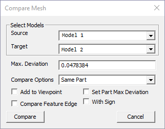
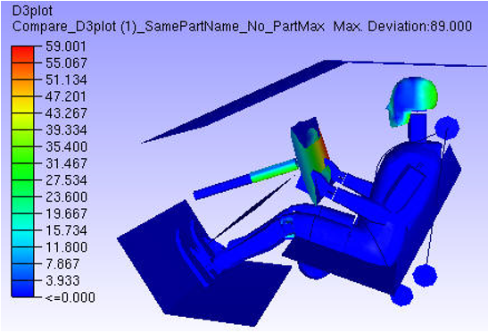
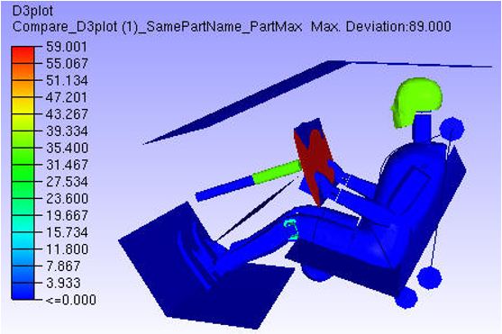
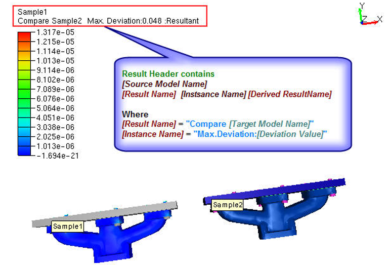
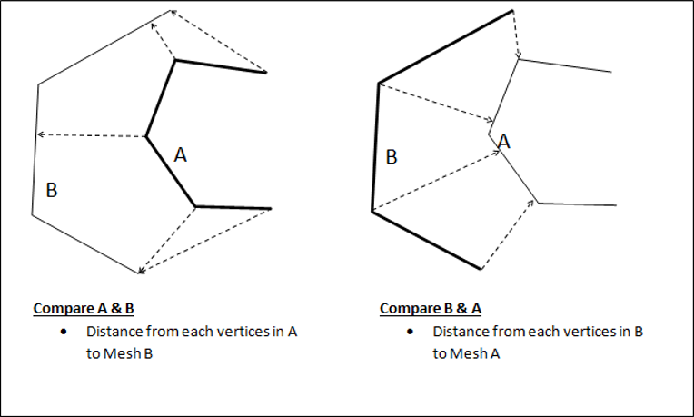
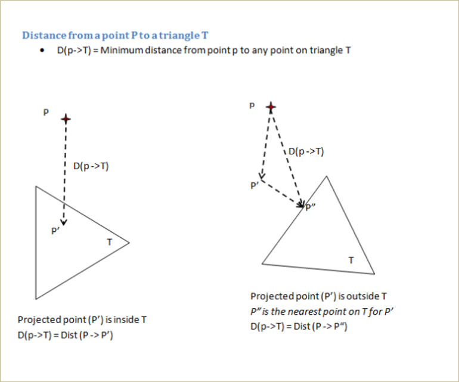

Compare Mesh
============

The **Compare Mesh** tool helps to compare mesh geometry of two merged
models.

The two models are identified as source and target models. For each
vertex on the source model, the nearest point on the target model is
computed and the shortest distance value is stored as a CAE result for
the source model. This new result can be displayed like any other CAE
result.

**Compare Mesh Panel**

Click **Tools\| Compare Mesh**

        |image1|

The various fields and options available on the Compare Mesh panel are
explained below.

+----------------------------+----------------------------------------+
| **Source**                 | Select source model.                   |
+----------------------------+----------------------------------------+
| **Target**                 | Select target model.                   |
+----------------------------+----------------------------------------+
| **Max. Deviation**         | Specify maximum deviation of interest. |
|                            | This value is used as a bound to       |
|                            | select target mesh geometry. Default   |
|                            | value is computed based on the source  |
|                            | model bounding radius.                 |
+----------------------------+----------------------------------------+
| **Compare Options**        | Select compare mode.                   |
|                            |                                        |
|                            | 1. Same Part: Parts with the same name |
|                            | are compared.                          |
|                            |                                        |
|                            | 2. Visible Parts: Each source part is  |
|                            | compared with all visible target       |
|                            | parts.                                 |
|                            |                                        |
|                            | 3. All Parts: Each source part is      |
|                            | compared with all target parts         |
+----------------------------+----------------------------------------+
| **Add to Viewpoint**       | New results will be displayed and      |
|                            | added as a viewpoint.                  |
+----------------------------+----------------------------------------+
| **Set Part Max Deviation** | All nodes of the part are set with one |
|                            | maximum distance value. This will      |
|                            | highlight modified parts.              |
+----------------------------+----------------------------------------+
| **Compare Featue Edge**    | Compares feature edges of models in    |
|                            | addition to usual comparison.          |
|                            |                                        |
+----------------------------+----------------------------------------+
| **With Sign**              | Based on the surface normal of the     |
|                            | target model, this function determines |
|                            |  whether the sign is positive or       |
|                            |  negative.                             |
+----------------------------+----------------------------------------+
| **Compare**                | Computes and displays deviation        |
|                            | result.                                |
|                            |                                        |
|                            | New result (or instance) is added to   |
|                            | the CAE result list.                   |
+----------------------------+----------------------------------------+

**Note:**

-  If the **Add to Viewpoint** option is enabled/ON, a viewpoint with a
   name'[sourcemodel]_Vs_[targetmodel]_[maxDistanceValue]_[compareMode]'
   will be created under the viewpath 'Compare_Mesh'.

   Users cannot compare same models again with same dialog parameters

-  **Max. Deviation:**

      Max. Deviation is used to filter the number of triangles in
      the target model used for finding the shortest distance for
      comparison. When Max. Deviation is a large value, more number of
      triangles are considered and computation can be slow. When no
      triangles are found within this limit, a large value is set as
      distance. The default value for the maximum deviation is set based
      on the source model bounding box. User has to specify Max.
      Deviation based on the distance that needs to be measured. For
      quick analysis, users can set a small value based on the size of
      triangles.

-  **Model/Part Transformation:**

      All the model and part transformations (Pick & Move, Explode)
      are considered while computing the deviation.

-  **Set Part Max Deviation:**

       First deviation for each node in a part is computed.
       If the option is unchecked, the deviation for each node is
       stored as CAE result.
       If the option is checked, then all nodes of the part are set
       with the same maximum part deviation. This way a part will have
       the same result or color. The parts with deviation will get
       highlighted due to this option.

Contour without Part Max Deviation

       |image2|

Contour with Part Max Deviation

       |image3|

**Steps to Compare Mesh**

1.  Load and Merge at least two models. This enables the Compare mesh
    option in Tool menu

2.  Click **Tools \| Compare Mesh** to open Compare Mesh panel

3.  Select **Source Model**.

4.  Select **Target Model**.

5.  Specify **Max.Deviation** if necessary.

6.  Select Compare Mode from **Compare Options**.

7.  Click **Compare**.

8.  New CAE result with name "Compare [Target Model Name]" will be
    created with a new instance name "Max.Deviation: [Deviation
    Value]" to Source Model.

9.  New comparisons of the same models can be created by changing
    Max.Deviation value. It will be appended to the same result as
    another instance or iteration.

10. The same result is selected and applied for color plot.

11. Users can handle this result as any other CAE result.

12. Check **Add to Viewpoint** to add the scene with deviation contour
    to viewpoints.

            |image4|

**Compare Mode Selection**

-  Select compare mode carefully, otherwise it leads to N/A or no
   results.

-  If both the models contain parts with the same name, then select
   **Same Parts** mode.

-  When part names are different, the options are:

   -  If there are many parts, to compare specific parts, hide
      unnecessary parts in source model as well as in target model.
      Then select mode as **Visible parts**.

   -  To compare all the parts, select mode as **All parts**. This is a
      time consuming option.

**Steps to compare meshes**

-  Select appropriate parts in each model for comparison.

-  A vertex set from the first (reference) model is compared with all
   the triangles in the second model. The nearest distance from each
   vertex in the first model to all the triangles in the second model
   is computed and stored as a new result in the first model. This
   result is displayed as a color plot. A distance limit specified by
   the user is used to filter triangles from the second model.

               |image5|

Note:

-  It is recommended to use a model with higher mesh density as the
   first model.

-  The models used for the comparison can come from CAD or CAE models.

-  Distance from a vertex to a triangle is computed as follows:

              |image6|

