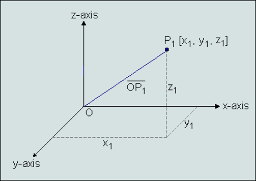
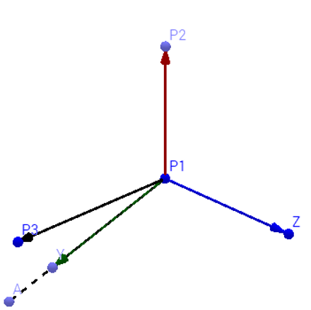

User Coordinate System

VCollab Pro provides different types of interfaces for users to define
their own coordinate system to visualize CAE results .

**Coordinate System Manager Panel**

Click **Tools|User Coordinate System**

|image1|

The various fields and controls available on the Coordinate System
Manager Panel are explained below:

+----------------+----------------------------------------------------+
| **Name**       | New Coordinate system name.                        |
+================+====================================================+
| **Type**       | Coordinate system type. i.e.,                      |
|                | Rectangular/Cylindrical/Spherical.                 |
+----------------+----------------------------------------------------+
| **Definition** | Allows users to select an interface method to      |
|                | define coordinate system.                          |
+----------------+----------------------------------------------------+
| **Origin**     | Allows users to pick vertex in model or enter new  |
|                | origin coordinates separated by commas.            |
+----------------+----------------------------------------------------+
| **X Axis**     | Defines X axis vector.                             |
+----------------+----------------------------------------------------+
| **XY Plane**   | Defines Y axis vector.                             |
+----------------+----------------------------------------------------+
| **Create**     | Creates new coordinate system and adds to the list |
|                | box.                                               |
+----------------+----------------------------------------------------+
| **Delete**     | Deletes selected coordinate systems by names.      |
+----------------+----------------------------------------------------+

**Types of Coordinate Systems**

VCollab Pro supports following coordinate system types,

**1.Rectangular**

A cartesian coordinate system represented as (X, Y, Z) .

..

   |image2|

**2.Cylindrical**

A Polar coordinate system represented as **(r, ??, Z)** where,

**r** is the radial distance from the coordinate to Z axis.

**??** is the angle of deviation from the X axis to projection of OP into
XY plane (OQ).

**Z** is the same as in the Cartesian coordinate system.

   |image3|

**3. Spherical**

A Polar coordinate system represented as **(r,?? ,??)** where,

**r** is the distance from origin to the coordinate.

**??** is the angle of deviation from the X axis to projection of OP into
XY plane (OQ).

**??** is the angle of deviation from Z axis to the coordinate positional
vector OP.

   |image4|

**Definition of Coordinate System**

   Independent of types, any new coordinate system requires a new origin
   and orientation relative to the global or current coordinate system.

   VCollab Pro provides different ways for users to define a new
   coordinate system. Origin is a common input for all methods. Users
   can pick a vertex in the model to define as new origin.

-  **X Axis and XY Plane**
   User has to provide 3 points. Pick option can be used to
   select vertices from the model.

   | Origin : First Point (P1)
   | X axis : Second point - Origin (P2-P1)
   | Z axis : Cross product of (P3-P1) and (P2-P1)
   | Y axis : Cross product of Z and X axes.

|image5|

-  **X Axis and the Y Axis**
   Pick option is enabled only for origin.

   | Origin : Picked or Entered point.
   | X Axis : Entered by user.
   | Y Axis : Entered by user.

-  | **Arbitrary Axis and Angle**
     Pick option is enabled only for origin.

   | Orientation of new coordinate system is defined by the axis of
     rotation and angle in degrees.
   | Origin : Picked or Entered point.
   | X Axis : Derived from Orientation.
   | Y Axis : Derived from Orientation.

-  | **3 Points Circular**
     User has to pick or enter three non collinear
     points(P1,P2,P3). Points are considered in the periphery of a
     circle.

   | Origin : Center of circle.
   | X Axis : Origin to P1.
   | Z Axis : Normal of plane formed by circle.
   | Y axis : Derived from X and Z axes.

|image6|

**Steps to create a new user defined coordinate system (UCS)**

-  Enter a new Coordinate system **name**.

-  Select coordinate **type**

-  Select a **method** to define a new coordinate system.

-  Enter or **Pick** coordinates to define origin, X and Y axes.

-  Click **Create** to create a new UCS.

-  The newly created UCS will be listed in the list box with check
   boxes.

-  Users can turn ON/OFF UCS visibility in the viewer using
   corresponding checkboxes.

-  Users can select multiple coordinate systems and delete them.

