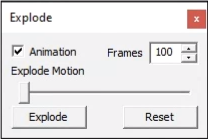

Explode
=============
The **Explode** tool helps users to understand the detailed assembly design of product or model by bringing apart the parts of a model.

**Explode panel**

   |image1|

The various controls in the Explode panel are explained below

==================================== ===============================================================
**Animation**                         Animates the Explosion.

**Frames**                            User can select or enter number of frames for animation. 

**Explode Motion**                    Slider indicates the position or intensity of 
                                      explosion. 

**Explode**                           Explodes the model in the viewer

**Reset**                             Resets the model to initial view.

==================================== ===============================================================

**Steps to explode a model**

- Click **Tools | Explode** to open the Explode dialog box.

   |image2|

- Check  Animation if you want to view the explosion with animation.
- Click **Explode** and view exploding part with animation
- Further Explodes can be initiated to get a clear visibility of a specific part.

**Before Explode**

   |image3|

**After Explode**
 
   |image4|
  

