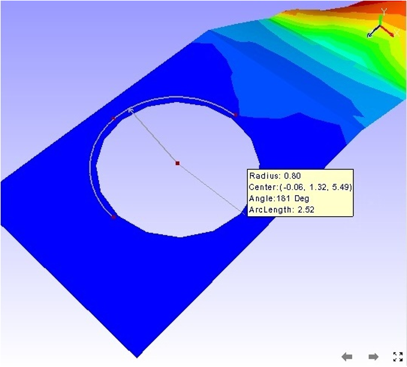

Measuring 3 Point Arc
======================

VCollab Pro users can measure the length of curve/ arc by selecting 3
points on the model.

**Steps to measure an Arc:**

-  Click **Tools \| Measurements \| 3 Point Arc.**

-  Identify the arc to be measured by selecting 3 points on the model

-  An arc is drawn from start point to end point passing through the
   second point.

-  All three points are highlighted in red color.

-  An arrow is drawn from the center of the arc to the curve to denote
   the radius.

-  An annotated label with arc information is attached to the center of
   the arc.

-  Curve hidden behind the model is drawn with dashed lines.

      |image1|

