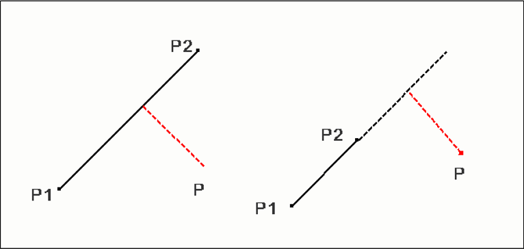
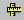

Measuring 3D distance
======================

VCollab Pro users can measure the shortest 3D distance in a model
between two points, point to edge and point to face. Annotation labels
with measured value will be attached to the dimension lines.

1. **Point to Point**: Measures distance between two points.

2. **Point to Edge:** Measures shortest distance between a point and an
   edge picked by the user.

   |image1|

3. **Point to Face:** Measures shortest distance between a point and a
   triangle picked by the user.

   |image2|

**Steps to measure the distance between two points in the model**

-  Click **Tools \| Measurements \| 3D Distance** or the 3D
   icon\ |image3| from the toolbar

-  Click 2 points of interest on the model to measure the distance

-  The points clicked are highlighted in red and a line is drawn between
   the endpoints

-  An annotated label with distance value is attached to the middle
   point of the line drawn.

   |image4|
       
- Double clicking on the label pops up a measure label dialog box

- User can edit the measure name and its attributes.

**Steps to measure distance between a point and an edge**

-  Click **Tools \| Measurements \| Point to Edge**.

-  Click a point on the model and click on the closest triangle edge.

-  The point and the closest edge will be highlighted in red. Edge is
   extended if end point of the perpendicular does not lie on the
   edge segment.

-  An annotated label with distance value is attached to the middle point of the line drawn.
   

   |image5|

**Steps to measure distance between point and a face**               
                                                                      
-  Click **Tools \| Measurements \| Point to Face**.                 
                                                                      
-  Click a point on a model and click on a model triangle.           
                                                                      
-  The point and triangle points will be highlighted in red.  
      
-  An annotated label with distance value is attached to the middle  point of the line 
   drawn.                                       

   |image6|

.. |image2| image:: JPGImages/tools_Measurement_3D_Distance_PointtoFace.png

.. |image4| image:: JPGImages/tools_Measurement_3D_Distance_TwoPoints.png
.. |image5| image:: JPGImages/tools_Measurement_3D_Distance_PointtoEdge_Example.png
.. |image6| image:: JPGImages/tools_Measurement_3D_Distance_PointtoFace_Example.png

