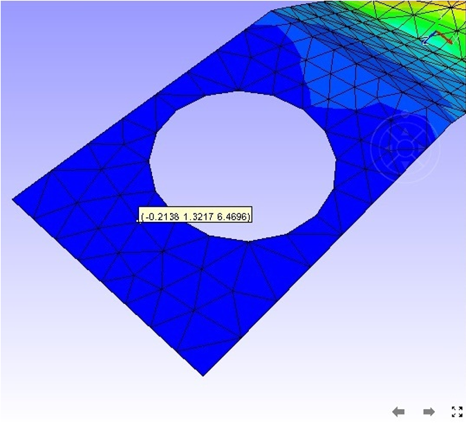

Vertex Info
===========

By enabling **Vertex Info,** VCollab Pro users can see a label with X,
Y, Z coordinates of an existing vertex by moving the mouse over the
model.

**Vertex Info** helps users to know the position of parts by providing
its nodal coordinate values. It also helps in:

-  Defining Section:

   -  Users can define a custom section plane through three known
      coordinate points.

-  Measurement:

   -  Computing the shortest distance between two nodes rather than two
      points.

   -  Computing an arc passing through three exact nodes.

               |image1|

