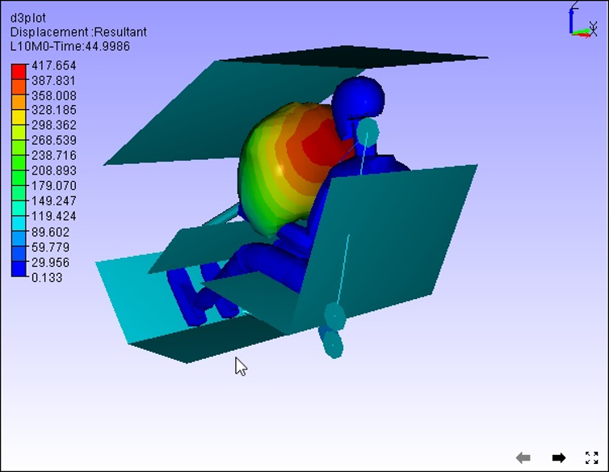

Refresh Normals
================

 The **Refresh Normal** option in the Tools menu re-computes vertex   
 normals and sets proper lighting for the model.                      
                                                                      
 Click **Tools|Refresh Normal** or use the shortcut key, **Ctrl + N** 
                                                                      
 **Example**                                                          
                                                                     
 Before Refresh Normals                                               

   |image1|

 After Refresh Normals

   |image2|

.. |image1| image:: JPGImages/tools_Before_RefreshNormals.png

