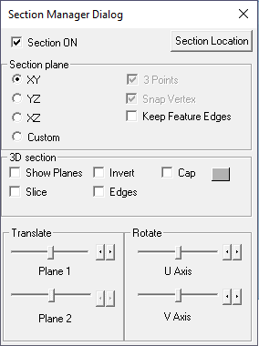
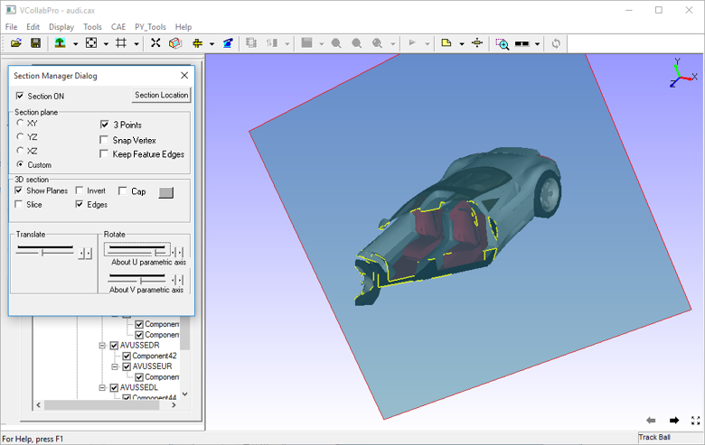
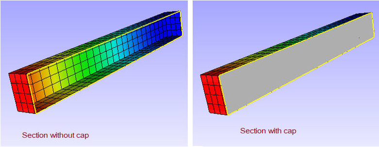

Section
=========

The Section tool found in the Tools menu is used to create sections on a
model and view the sectional part.

**Section Manager Dialog Panel**

Click **Tools|Section…** to open the Section Manager Dialog box

         |image1|

The various fields and controls seen in the Section Manager Dialog are
explained below

+--------------------------------+------------------------------------+
| **Section ON**                 | Enables section plane.             |
+--------------------------------+------------------------------------+
| **Section Location**           | Displays primary cut section plane |
|                                | data and allows to edit and apply  |
+--------------------------------+------------------------------------+
| **XY**                         | Displays plane parallel to the XY  |
|                                | Plane                              |
+--------------------------------+------------------------------------+
| **YZ**                         | Displays plane parallel to the YZ  |
|                                | Plane                              |
+--------------------------------+------------------------------------+
| **XZ**                         | Displays plane parallel to the XZ  |
|                                | Plane                              |
+--------------------------------+------------------------------------+
| **Custom**                     | Enables custom options like 3      |
|                                | Points.                            |
+--------------------------------+------------------------------------+
| **3 Points**                   | Enables mouse mode to select 3     |
|                                | points to define and display a     |
|                                | plane.                             |
+--------------------------------+------------------------------------+
| **Snap Vertex**                | Allows users to select a vertex    |
|                                | nearest to the mouse hit.          |
+--------------------------------+------------------------------------+
| **Show Planes**                | Shows section planes.              |
+--------------------------------+------------------------------------+
| **Invert**                     | Toggles in clipping either side of |
|                                | prime section of the plane         |
+--------------------------------+------------------------------------+
| **Slice**                      | Allows users to create a secondary |
|                                | section plane which cuts the model |
|                                | on the other side.                 |
+--------------------------------+------------------------------------+
| **Edges**                      | Displays intersection lines of the |
|                                | model with the section plane.      |
+--------------------------------+------------------------------------+
| **Cap**                        | Fills a hollow closed region to    |
|                                | appear as solid. Capping can be    |
|                                | controlled using the Closed Parts  |
|                                | option.                            |
|                                |                                    |
|                                | Section capping is not supported   |
|                                | in OPENGL mode (OpenGL version <   |
|                                | 1.2)                               |
+--------------------------------+------------------------------------+
| **Closed Parts**               | Closed Parts option is related to  |
|                                | the Cap option. If this option is  |
|                                | on, the closed part will be        |
|                                | capped. If this option is off,     |
|                                | capping is attempted for open      |
|                                | parts also. The result may not     |
|                                | always be valid.                   |
+--------------------------------+------------------------------------+
| **Translation Slider Control** | Controls the translation of the    |
|                                | prime section plane.               |
+--------------------------------+------------------------------------+
| **Rotation - U axis**          | Rotates the prime and secondary    |
|                                | planes about the U parametric      |
|                                | axis.                              |
+--------------------------------+------------------------------------+
| **Rotation - V axis**          | Rotates the prime and secondary    |
|                                | planes about the V parametric      |
|                                | axis.                              |
+--------------------------------+------------------------------------+

Note:

-  Section Cap can be used in shaded mode only and not in other display
   modes.

-  Picking / Probing does not work properly in Section Cap mode

-  Section Cap does not work in Remote Desktop or OpenGL Mode.

**Section Plane Location Panel**

|image2|

+----------------------------------------------------------------------+
| The various fields and controls seen in the Section Plane Location   |
| panel are explained below.                                           |
|                                                                      |
| +---------------------------+-----------------------------------+    |
| | **Section Equation**      | Displays current section plane    |    |
| |                           | equation. Users can edit the      |    |
| |                           | equation and apply.               |    |
| +---------------------------+-----------------------------------+    |
| | **Pass Through**          | Allows users to provide point     |    |
| |                           | coordinates through which the     |    |
| |                           | plane should pass through. Users  |    |
| |                           | can either pick a vertex in the   |    |
| |                           | model or specify it in the text   |    |
| |                           | box. (coordinates separated by    |    |
| |                           | comma). These point coordinates   |    |
| |                           | will be cleared when the equation |    |
| |                           | is modified.                      |    |
| +---------------------------+-----------------------------------+    |
| | **Pick**                  | Sets mouse mode to pick a vertex  |    |
| |                           | in the model.                     |    |
| +---------------------------+-----------------------------------+    |
| | **Translation step size** | By default it is 1 with the       |    |
| |                           | slider having 100 tick marks. If  |    |
| |                           | the step size is 2 , then the     |    |
| |                           | slider will have 50 tick marks.   |    |
| |                           | The step size can be specified    |    |
| |                           | from 0 to 100.                    |    |
| +---------------------------+-----------------------------------+    |
| | **Rotation step size**    | Rotation step size can have any   |    |
| |                           | value between 0 to 180 degrees.   |    |
| |                           | By default it is 1 degree.        |    |
| +---------------------------+-----------------------------------+    |
| | **Apply**                 | Applies the step sizes to the     |    |
| |                           | controls.                         |    |
| +---------------------------+-----------------------------------+    |
+----------------------------------------------------------------------+

**Steps to cut or clip model and view the cut section**

-  Click **File \| Open** to load a model.

-  Click **Tools \| Section** to open the Section Manager dialog box.

-  To view cut sections of prime planes, click the corresponding options
   provided for XY, YZ & XZ planes . For example, YZ is selected in
   the image below.

|image3|

-  Check **Show Planes** to view the semi transparent section plane.

|image4|

-  Check **Edges** to view intersecting edges on the plane.

|image5|

-  Check **Invert** to change the clipping side.

|image6|

-  Check **Slice** to add one more cutting plane opposite to the
   existing one.

**Steps to define a custom cutting section or clipping plane**

-  Click **Custom** option in the Section Manager Dialog panel

-  Check **3 Points**.

-  Click at 3 different points anywhere in the model.

-  Vertex Info option can be used to know the coordinate values of
   points before clicking.

-  A section plane, passing through the clicked points, is defined and
   clipped as below.

|image7|

 -  The points selected for clipping are highlighted in red.          
                                                                     
 -  **Snap Vertex** can be used to toggle between selection of exact  
    mouse position or nearest vertex.                              

**Steps to translate or rotate the cutting section plane**           
                                                                      
 -  Use corresponding control sliders to rotate section planes about  
    U and V parametric axes.                                       

    |image8|

    |image9|

 -  Use translation slider control to translate prime plane along the
    plane’s normal axis.

|image10|

**Steps to get and edit section plane data**

-  Click **Section Plane location** in the Section Manager dialog panel.

-  It pops up 'Section Plane Location' dialog. 

-  It displays current primary section plane equation in the form of aX+bY+cZ+d=0. where (a,b,c) is unit normal of th eplane and d refers to the perpendicular distance of the plane from origin.

|image11|

-  User can enter any point coordinates or pick a vertex using **Pick** button if user want to move the plane to a particular point. 

**Steps to set unit increment or step size for translation and rotation
sliders**

-  Click **Section Plane Location** in the Section Manager dialog.

-  It pops up **Section Plane Location** dialog.

-  Change Translation and Rotation step sizes provided. 

-  Click **Apply** button to set values and reset the slider positions and notice the slider ticks and positions.

-  By default, translation slider is split into 100 ticks. 

-  User can change translation step size from 1 to 100. 

-  By default, rotation sliders are split into 180 ticks, means each tick refers to one degree. 

-  User can change rotation step size from 1 to 180. 

|image12|

**Section Cap**

This option helps to fill the hollow closed region in a model to appear
as solid. Enabling **Closed parts** option applies capping to solid
parts only, not to shell models.

|image13|

.. |image2| image:: JPGImages/tools_Section_SectionPlaneLocationPanel.png

.. |image3| image:: JPGImages/tools_Section_SectionManagerdialog_Example.png

.. |image5| image:: JPGImages/tools_Section_Edges.png

.. |image6| image:: JPGImages/tools_Section_invert.png

.. |image10| image:: JPGImages/tools_Section_translationslider.png

.. |image11| image:: JPGImages/tools_Section_SectionPlaneXYZ.png

.. |image12| image:: JPGImages/tools_Section_TranslationAndRotation.png

