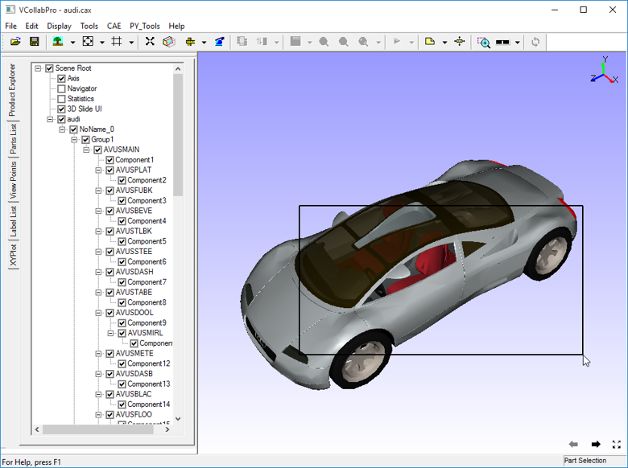
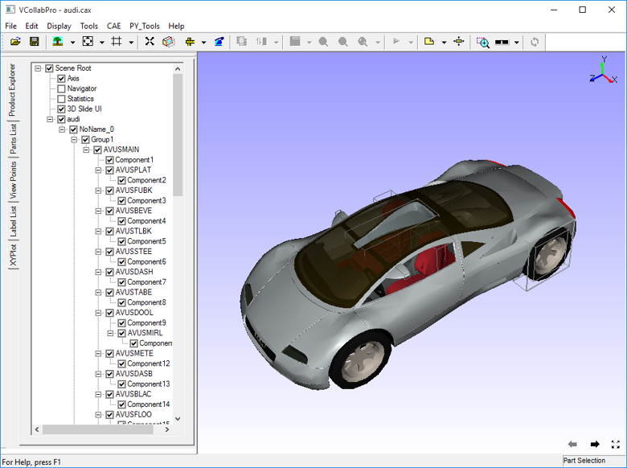

Select Region
=============

The **Select Region** command allows users to select parts inside a
specific region.

**Steps to select or highlight parts**

-  Click **Tools \| Select Region** to enable mouse mode for window
   selection.

-  Left click and drag the mouse to make a window rectangle.

-  Drag until the parts you want to select are completely inside the
   window.

|image1|

-  Release the mouse button.

-  The parts covered by the window are selected and highlighted by part
   bounding boxes.

|image2|

