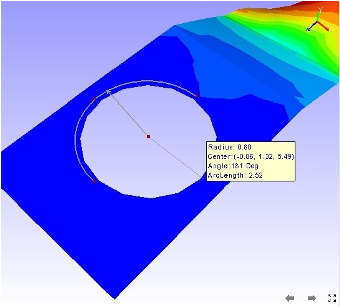
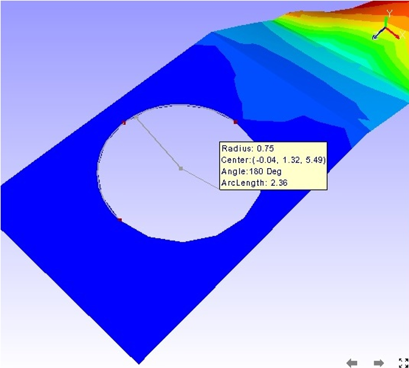

Measuring Snap Vertex
=======================

Snap vertex enables users to select the nearest vertex of a model to 
measure distance or an arc. With Snap vertex the users can be        
assured that the arc computed and drawn is passing through actual    
arc points of model.                                                 
                                                                      
**Step to measure Snap vertex**                                      
                                                                      
-  Click **Tools \|Measurements \| Snap Vertex**   
                  
**Measuring an arc without Snap Vertex Enabled**                     

                   |image1|

**Measuring an arc with Snap Vertex Enabled**

                   |image2|

